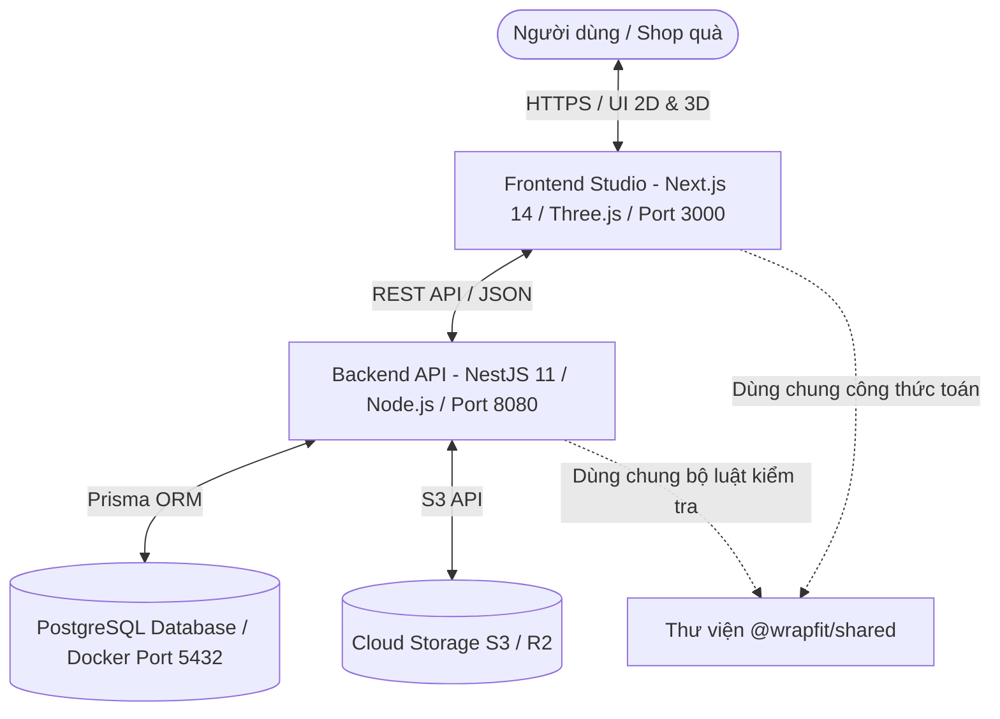

# 🎁 TỔNG QUAN DỰ ÁN (PROJECT OVERVIEW) — WrapFit Platform

> **Khóa học**: EXE101 — Khởi nghiệp đổi mới sáng tạo (FPT University)  
> **Định vị**: Nền tảng Đóng gói Quà tặng Thông minh & Cá nhân hóa (Packaging Personalization & Intelligence Platform)  
> **Slogan**: *"Make Every Present, Present."*  
> **Quy mô đội ngũ**: 6 thành viên (3 IT, 2 Kinh Tế, 1 Marketing)

---

## 1. Triết Lý & Nguồn Cảm Hứng

- **Insight cốt lõi**: *"The gift is personal. Why shouldn't its packaging be?"* (Món quà là thứ mang đậm dấu ấn cá nhân, tại sao bao bì của nó lại rập khuôn công nghiệp?).
- **Vấn đề thực tế**: Khi mua quà tinh tế, người dùng hoặc shop đồ thủ công thường phải mua hộp carton sản xuất sẵn không vừa vặn, nhét đầy rơm giấy hoặc xốp vụn. Nếu muốn đặt hộp riêng, các xưởng in yêu cầu số lượng tối thiểu (MOQ) từ 500 - 1.000 hộp và chi phí làm khuôn dao bế riêng từ 1.000.000đ - 3.000.000đ.
- **Tuyên ngôn định vị**: WrapFit không phải là một Canva tiếp theo. WrapFit là một quy trình làm việc chuyên biệt cho ngành bao bì (*Packaging-specific workflow*).

---

## 2. Luồng Trải Nghiệm Khách Hàng (4 Giai Đoạn)

$$\text{GIFT (Khai báo món quà)} \longrightarrow \text{DESIGN (Thiết kế cá nhân)} \longrightarrow \text{FIT (Kiểm định in ấn)} \longrightarrow \text{PRESENT (Trao quà ý nghĩa)}$$

1. **Bước 1 — Khai báo kích thước**: Người dùng nhập Chiều Dài ($L$) x Rộng ($W$) x Cao ($H$) của món quà.
2. **Bước 2 — Đề xuất cấu trúc**: Nền tảng tự động tính toán dung sai và đề xuất kiểu hộp tối ưu (Hộp nắp gài, Hộp bao diêm, Hộp âm dương, Hộp gối).
3. **Bước 3 — Gợi ý hoa văn AI**: AI tự động tạo hoa văn lặp (Seamless pattern) theo chủ đề (Noel, Pastel, Vintage).
4. **Bước 4 — Tùy biến trực quan**: Kéo thả logo, nhập lời chúc, mô phỏng gập 3D trực quan.
5. **Bước 5 — Kiểm duyệt FitCheck™**: Tự động rà soát vi phạm in ấn (Lề an toàn $\ge 3\text{mm}$, Tràn lề $\ge 2\text{mm}$, DPI $\ge 200$).
6. **Bước 6 — Xuất bản vẽ bế**: Tải file vector chuẩn in (PDF, SVG, DXF) mang ra xưởng in bất kỳ.

---

## 3. Kiến Trúc Phân Lớp Toàn Diện

