# 🗄️ THIẾT KẾ CƠ SỞ DỮ LIỆU (DATABASE DESIGN) — PostgreSQL & Prisma

> **Phụ trách**: 👤 **IT 3** (Backend & Data Infrastructure)  
> **Nguồn sự thật**: [`be/prisma/schema.prisma`](../be/prisma/schema.prisma) (Schema v2.1). Lý do thiết kế chi tiết: [`07_SYSTEM_BLUEPRINT_AND_TASK_BREAKDOWN.md`, Mục 4.1](07_SYSTEM_BLUEPRINT_AND_TASK_BREAKDOWN.md).  
> Thay đổi schema luôn đi qua migration: sửa `schema.prisma` rồi chạy `npm run db:migrate -- --name <ten>` trong `be/` (không dùng `prisma db push`).

---

## 1. Sơ Đồ Thực Thể Quan Hệ (ERD Diagram)

```mermaid
erDiagram
    User ||--o{ RefreshToken : "đăng nhập trên"
    User ||--o{ PackagingProject : "sở hữu"
    User ||--o{ ProjectCollection : "tạo"
    User ||--o{ ProjectLike : "thả tim"
    User ||--o{ SocialMockup : "render"
    User |o--o{ User : "giới thiệu (referral)"
    ProjectCollection |o--o{ PackagingProject : "chứa"
    BoxTemplate ||--o{ PackagingProject : "làm mẫu cho"
    BoxTemplate ||--o{ DesignTemplate : "cấu trúc của"
    PackagingProject |o--o{ PackagingProject : "remix (forkedFrom)"
    PackagingProject ||--o{ ProjectSnapshot : "lưu phiên bản"
    PackagingProject ||--o{ ProjectLike : "được thả tim"
    PackagingProject ||--o| UnboxingExperience : "mở hộp 3D qua QR"
    PackagingProject ||--o{ SocialMockup : "ảnh mockup"
    PackagingProject ||--o{ ExportJob : "xuất file in"
    User ||--o{ StoredFile : "tải lên"
    User ||--o{ AiGeneration : "gọi AI"
    PackagingProject |o--o{ StoredFile : "đính kèm"

    User {
        uuid id PK
        string email UK
        string password_hash "null nếu chỉ đăng nhập Google"
        string google_id UK
        string full_name
        string shop_name
        enum role "MAKER | PRO_ARTISAN | PRINT_SHOP | ADMIN"
        enum subscription_tier "FREE | STARTER | PRO_BUSINESS"
        jsonb brand_kit "{ logoUrl, colors, fonts, slogan }"
        boolean is_active
    }

    RefreshToken {
        uuid id PK "= jti của JWT"
        uuid user_id FK
        datetime expires_at
        datetime revoked_at
    }

    BoxTemplate {
        string id PK "tuck-top | sleeve-drawer | lid-base | pillow"
        string name
        string category
        jsonb formula_schema
        boolean is_curated
        boolean is_active
    }

    DesignTemplate {
        uuid id PK
        string box_template_id FK
        string title
        enum occasion "TET | CHRISTMAS | WEDDING | VALENTINE | BIRTHDAY | MINIMAL"
        enum industry "COSMETICS | CANDLES | BAKERY | JEWELRY | TEA_AGRI"
        jsonb dimensions
        jsonb material_spec
        jsonb canvas_state
        string_array tags
        int uses_count
        int sort_order
        boolean is_active
    }

    ProjectCollection {
        uuid id PK
        uuid user_id FK
        string title
        string color_tag
    }

    PackagingProject {
        uuid id PK
        uuid user_id FK
        string template_id FK
        uuid collection_id FK
        uuid forked_from_id FK
        string slug UK "link công khai /p/[slug]"
        enum status "ACTIVE | ARCHIVED | DELETED"
        enum visibility "PRIVATE | UNLISTED | PUBLIC"
        boolean allow_fork
        jsonb dimensions "{ length, width, height, paperThickness }"
        jsonb material_spec "{ type, gsm, caliper, finish }"
        jsonb canvas_state "{ elements: [...] }"
        jsonb fitcheck_state "{ isValid, score, violations }"
        int fitcheck_score "FitCheck phía server, Thư viện cộng đồng >= 90"
        string_array tags
        enum occasion "bộ lọc Thư viện cộng đồng"
        enum industry
        int views_count
        int likes_count
        datetime deleted_at "vào thùng rác, xóa vĩnh viễn sau 30 ngày"
    }

    ProjectSnapshot {
        uuid id PK
        uuid project_id FK
        string name
        jsonb canvas_state
        jsonb dimensions
        boolean is_automatic "xuất in / sao lưu khôi phục"
    }

    ProjectLike {
        uuid id PK
        uuid user_id FK "unique cùng project_id"
        uuid project_id FK
    }

    UnboxingExperience {
        uuid id PK
        uuid project_id FK "unique"
        string slug UK
        string recipient_name
        text gift_note
        string qr_code_url
    }

    SocialMockup {
        uuid id PK
        uuid user_id FK
        uuid project_id FK
        string preset_name
        string render_url
    }

    StoredFile {
        uuid id PK
        uuid user_id FK
        uuid project_id FK "null = không thuộc dự án (avatar, logo Brand Kit)"
        string key UK "users/<userId>/<purpose>/<uuid>.<ext>"
        enum purpose "LOGO | IMAGE | THUMBNAIL | AVATAR | QR_CODE"
        string content_type
        int size "byte, tính hạn mức theo gói"
    }

    AiGeneration {
        uuid id PK
        uuid user_id FK
        string theme
        string model
        int input_tokens
        int output_tokens
        datetime created_at "đếm lượt trong 24 giờ"
    }

    ExportJob {
        uuid id PK
        uuid project_id FK
        enum file_type "PDF_CMYK | SVG | DXF"
        enum status "PENDING | PROCESSING | COMPLETED | FAILED"
        string storage_key "key trên S3/R2"
        datetime completed_at
    }
```

---

## 2. Chi Tiết Các Bảng Dữ Liệu

1. **`users`**: Hồ sơ người dùng / chủ shop handmade, vai trò (RBAC), gói thuê bao, Brand Kit, mã giới thiệu. `is_active = false` khi Admin khóa tài khoản.
2. **`refresh_tokens`**: Mỗi phiên đăng nhập (thiết bị) là một dòng; hỗ trợ xoay vòng token, đăng xuất từng thiết bị và phát hiện token bị đánh cắp.
3. **`box_templates`**: 4 cấu trúc hộp MVP cùng công thức tham số (seed tự động khi khởi động backend).
4. **`project_collections`**: Bộ sưu tập / thư mục nhóm dự án theo chiến dịch.
5. **`packaging_projects`**: Toàn bộ thông số hộp, vật liệu, phần tử thiết kế trên từng mặt hộp, trạng thái lưu trữ, quyền riêng tư và thống kê cộng đồng.
6. **`project_snapshots`**: Các mốc phiên bản thiết kế để khôi phục (UC-07).
7. **`project_likes`**: Lượt thả tim dự án công khai (mỗi người 1 lần / dự án).
8. **`unboxing_experiences`**: Cấu hình trải nghiệm mở hộp 3D qua mã QR.
9. **`social_mockups`**: Ảnh mockup đã render để đăng mạng xã hội.
10. **`export_jobs`**: Job xuất file in bất đồng bộ (hàng đợi BullMQ); link tải là pre-signed URL sinh lúc yêu cầu.
11. **`design_templates`** (thêm ở IT3-07): Mẫu thiết kế "WrapFit Curated" của Thư viện mẫu — cấu trúc hộp + kích thước + chất liệu + canvas dựng sẵn, gắn dịp lễ / ngành hàng, đếm số lần "Dùng mẫu này". Seed 6 mẫu khi khởi động. Mẫu cộng đồng không nằm ở bảng này mà là các `packaging_projects` `PUBLIC` (có thêm cột `occasion`, `industry` để lọc).
12. **`stored_files`** (thêm ở IT3-08): Mỗi file người dùng tải lên S3 / R2 qua pre-signed URL — dùng để tính hạn mức lưu trữ theo gói và xóa file khỏi bucket khi dự án bị xóa vĩnh viễn.
13. **`ai_generations`** (thêm ở IT3-09): Mỗi lần gọi Claude sinh hoa văn — để giới hạn số lượt trong 24 giờ theo gói và theo dõi số token (chi phí).
