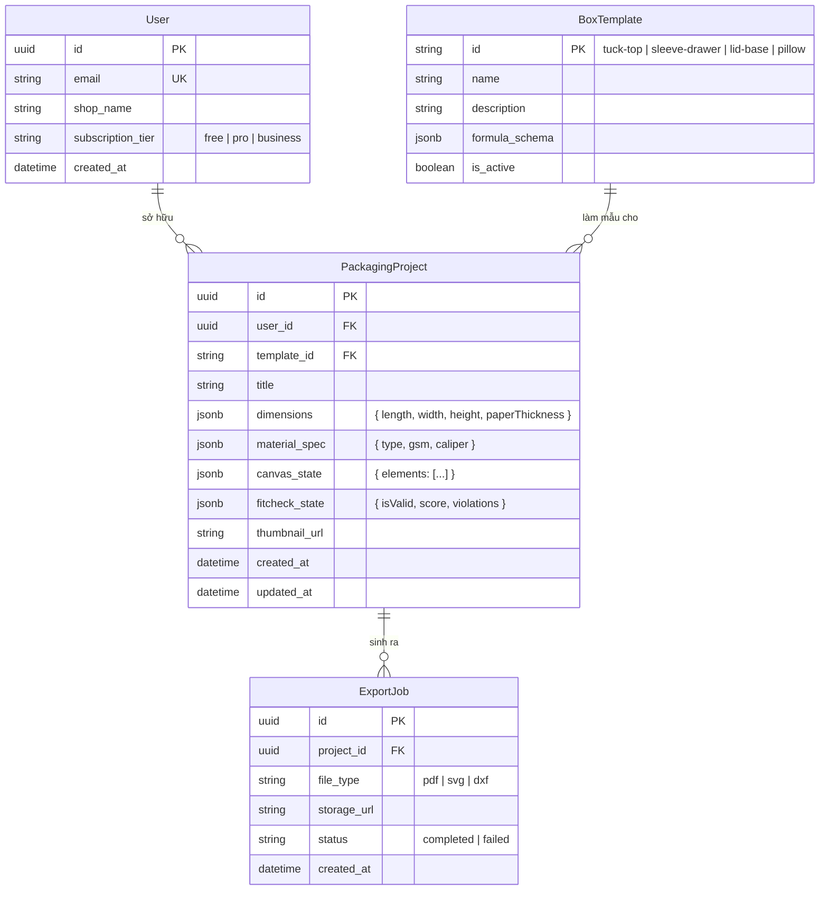

# 🗄️ THIẾT KẾ CƠ SỞ DỮ LIỆU (DATABASE DESIGN) — PostgreSQL & Prisma

> **Phụ trách**: 👤 **IT 3** (Backend & Data Infrastructure)

---

## 1. Sơ Đồ Thực Thể Quan Hệ (ERD Diagram)

---

## 2. Chi Tiết Các Bảng Dữ Liệu

1. **Bảng `users`**: Quản lý hồ sơ người dùng cá nhân hoặc chủ shop handmade.
2. **Bảng `box_templates`**: Định nghĩa 4 mẫu cấu trúc bao bì MVP cùng công thức toán học tham số.
3. **Bảng `packaging_projects`**: Lưu toàn bộ thông số hộp, kích thước, và các phần tử thiết kế (chữ, logo, hoa văn) trên từng mặt hộp.
4. **Bảng `export_jobs`**: Lưu vết các lần xuất file in chuẩn vector và đường link tải về từ S3.
