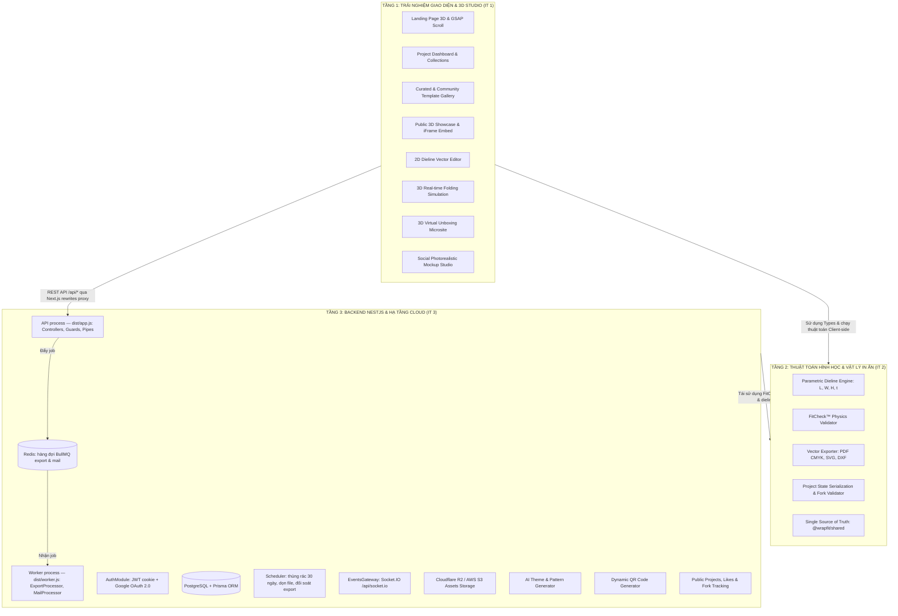
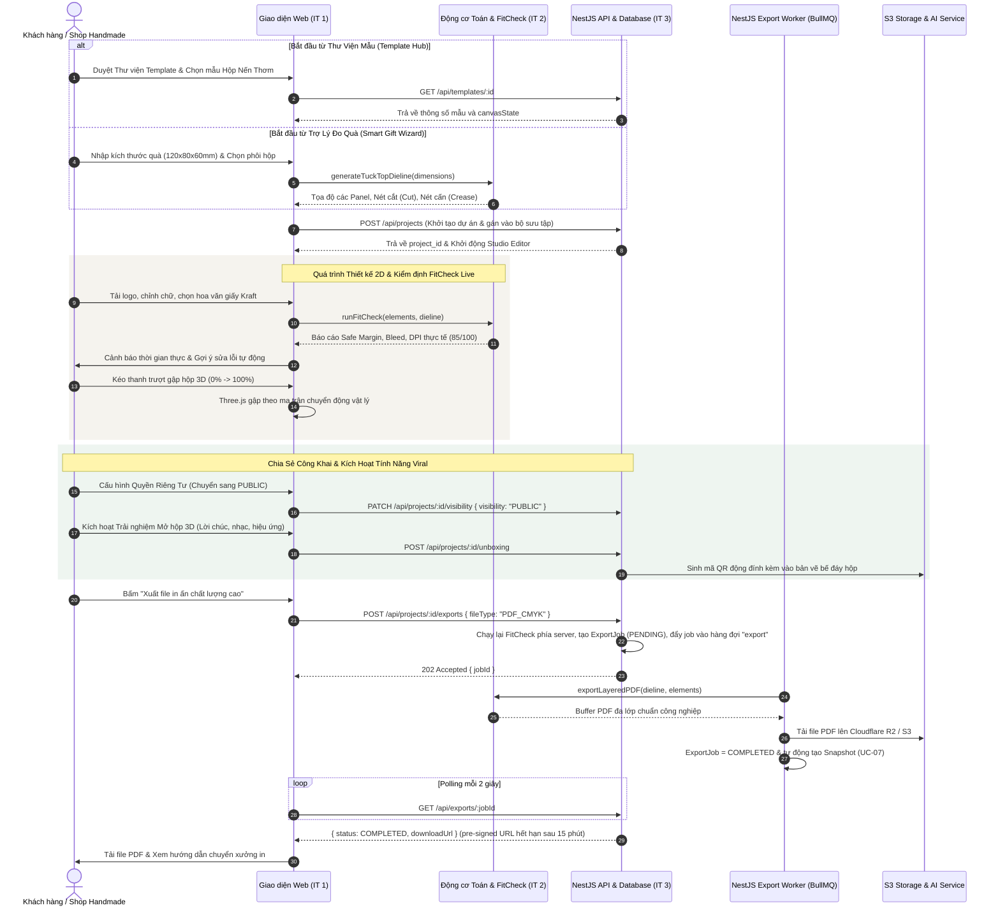
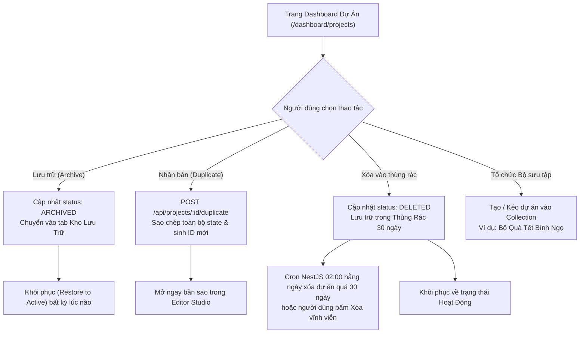
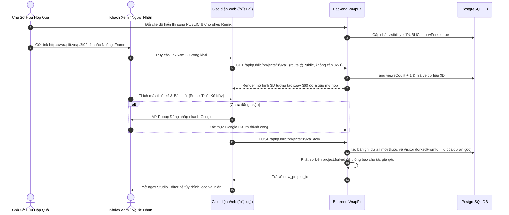
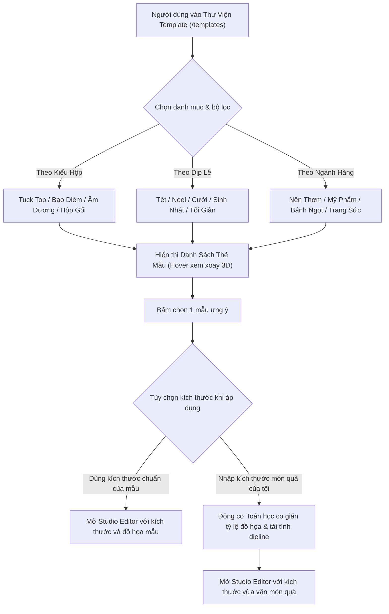

# 📦 WRAPFIT PLATFORM — BẢN THIẾT KẾ KIẾN TRÚC TOÀN DIỆN, ĐẶC TẢ USE CASES & PHÂN CHIA NHIỆM VỤ IT (WBS)

> **Dự án**: WrapFit Platform (Nền tảng Đóng gói Quà tặng Cá nhân hóa & Thông minh)  
> **Khóa học**: EXE101 — Trải nghiệm Khởi nghiệp Đổi mới Sáng tạo (FPT University)  
> **Slogan**: *"Make Every Present, Present."*  
> **Phiên bản**: v2.1 (Chuyển Backend sang **NestJS** — tách REST API độc lập khỏi Next.js; bổ sung hàng đợi xuất file BullMQ, Cron dọn thùng rác, Refresh Token)  
> **v2.2 (09/10/2026)**: Mã nguồn `be/` tổ chức lại theo skeleton *nestjs-project-structure*: module nằm thẳng dưới `src/`, hạ tầng ở `common/` + `shared/`, cấu hình lồng nhau có kiểu, barrel `index.ts` (Mục 1.3 – 1.5).  
> *v2.0: Bổ sung Quản lý Lưu trữ Project, Chia sẻ Public 3D, Thư viện Template & Tiện ích Người dùng*

---

## MỤC LỤC TÀI LIỆU
1. [Tổng Quan Kiến Trúc & Ngăn Xếp Công Nghệ (System Architecture)](#1-tổng-quan-kiến-trúc--ngăn-xếp-công-nghệ)
   - 1.1. Ngăn xếp công nghệ Backend NestJS
   - 1.2. Nguyên tắc giao tiếp Frontend (Next.js) ↔ Backend (NestJS)
   - 1.3. Cấu trúc thư mục Backend NestJS (`be/`)
   - 1.4. Quy ước module & phụ thuộc (barrel `index.ts`, không vòng import)
   - 1.5. Cấu hình & biến môi trường (`ConfigService` có kiểu)
2. [Hệ Thống Use Cases Toàn Diện (Detailed Use Cases Specifications)](#2-hệ-thống-use-cases-toàn-diện)
   - 2.1. Phân hệ 1: Quản trị Tài khoản, Xác thực & Brand Kit (Auth & Identity)
   - 2.2. Phân hệ 2: Quản lý Dự án, Lưu trữ & Lịch sử Phiên bản (Project Lifecycle, Archive & Versioning)
   - 2.3. Phân hệ 3: Chia sẻ Công Khai, Nhúng 3D & Cộng Đồng Remix (Public Showcase, 3D Embed & Fork)
   - 2.4. Phân hệ 4: Thư Viện Mẫu Bao Bì Chuẩn Hóa & Cộng Đồng (Curated & Community Template Hub)
   - 2.5. Phân hệ 5: Phòng thu Thiết kế 2D Dieline Đa Lớp (2D Vector Canvas Studio)
   - 2.6. Phân hệ 6: Mô phỏng Gập & Vật liệu 3D Thời Gian Thực (3D Folding & Material Physics)
   - 2.7. Phân hệ 7: Động cơ Thẩm định Vật lý & In ấn FitCheck™ (Physics & Preflight Engine)
   - 2.8. Phân hệ 8: Độc Đáo Phục Vụ Marketing & Viral Growth (Marketing & Viral Engine)
   - 2.9. Phân hệ 9: Xuất Bản In Ấn Chuẩn Công Nghiệp (Vector Prepress & Export)
3. [Thiết Kế Toàn Bộ Luồng Tương Tác Hệ Thống (End-to-End System & User Flows)](#3-thiết-kế-toàn-bộ-luồng-tương-tác-hệ-thống)
   - 3.1. Luồng hành trình người dùng xuyên suốt (Core User Journey)
   - 3.2. Luồng quản lý lưu trữ, nhân bản & lịch sử phiên bản dự án
   - 3.3. Luồng chia sẻ công khai, xem 3D không cần đăng nhập & 1-Click Remix
   - 3.4. Luồng khám phá & áp dụng mẫu từ Thư viện Template (Template Discovery Flow)
   - 3.5. Luồng đồng bộ dữ liệu thời gian thực 2D sang 3D (2D-to-3D Live Sync)
   - 3.6. Luồng thẩm định lỗi vật lý FitCheck™ thời gian thực
   - 3.7. Luồng Marketing: Mở hộp 3D tương tác qua mã QR (Viral 3D Unboxing & Referral)
4. [Mở Rộng Mô Hình Cơ Sở Dữ Liệu & Hợp Đồng Dữ Liệu (Extended Database & API Contracts)](#4-mở-rộng-mô-hình-cơ-sở-dữ-liệu--hợp-đồng-dữ-liệu)
   - 4.1. Lược đồ Prisma PostgreSQL mở rộng (Schema v2.1)
   - 4.2. Danh sách Endpoints API RESTful (NestJS)
   - 4.3. Quy ước API chung (Phân trang, Lỗi, Xác thực)
5. [Ma Trận Phân Chia Nhiệm Vụ IT Chi Tiết (Work Breakdown Structure - WBS)](#5-ma-trận-phân-chia-nhiệm-vụ-it-chi-tiết-wbs)
   - 5.1. Phân bổ IT 1: Frontend Lead & 2D/3D Packaging Studio (11 Tasks)
   - 5.2. Phân bổ IT 2: Core Math, Physics & Print Engine Lead (10 Tasks)
   - 5.3. Phân bổ IT 3: Backend NestJS, Data Infrastructure & Cloud Lead (11 Tasks)
6. [Kế Hoạch Triển Khai Theo Sprint & Tiêu Chí Nghiệm Thu (Sprint Roadmap & DoD)](#6-kế-hoạch-triển-khai-theo-sprint--tiêu-chí-nghiệm-thu)

---

## 1. TỔNG QUAN KIẾN TRÚC & NGĂN XẾP CÔNG NGHỆ

Hệ thống được thiết kế theo mô hình **Modular Monorepo (npm workspaces)** gồm 3 workspace độc lập, đảm bảo 3 IT phát triển song song:

| Workspace | Công nghệ | Phụ trách | Vai trò |
| :--- | :--- | :--- | :--- |
| `fe/` | **Next.js 14 App Router** + Three.js / R3F | **IT 1** | Giao diện, Studio 2D/3D, trang Public 3D. Chỉ hiển thị & gọi API, **không truy cập CSDL trực tiếp**. |
| `be/` | **NestJS 11** + Prisma + PostgreSQL + Redis | **IT 3** | REST API (toàn bộ nghiệp vụ, xác thực, phân quyền, lưu trữ, tác vụ định kỳ) và process **worker** xử lý hàng đợi (xuất file in, gửi email). |
| `shared/` | TypeScript thuần — package **`@wrapfit/shared`** | **IT 2** | Kiểu dữ liệu dùng chung + thuật toán Parametric / FitCheck / Exporter, được cả `fe` và `be` import. |



### 1.1. Ngăn xếp công nghệ Backend NestJS

| Hạng mục | Công nghệ | Ghi chú triển khai |
| :--- | :--- | :--- |
| Runtime & Framework | Node.js 22 LTS, **NestJS 11** (TypeScript `strict`) | Express adapter, `app.setGlobalPrefix('api')`. Cấu trúc mã nguồn theo skeleton [nestjs-project-structure](https://github.com/CatsMiaow/nestjs-project-structure) — Mục 1.3 |
| ORM & CSDL | **Prisma ORM 6** + PostgreSQL 16 | Một `PrismaService` duy nhất, cung cấp qua `PrismaModule` (`@Global()`) tại `src/shared/prisma/` |
| Xác thực | `@nestjs/passport`, `passport-google-oauth20`, `passport-jwt`, `@nestjs/jwt`, `bcryptjs` | Access Token 15 phút + Refresh Token 7 ngày (xoay vòng), cả hai trong **HttpOnly Cookie**; email xác minh & đặt lại mật khẩu gửi qua hàng đợi `mail` |
| Phân quyền | `JwtAuthGuard` (toàn cục, `src/auth/guards/`) + `@Public()`, `RolesGuard` + `@Roles()` (`src/common/`) | Mặc định mọi route đều yêu cầu đăng nhập, route công khai phải khai báo rõ |
| Validation | `class-validator`, `class-transformer`, `ValidationPipe` toàn cục | `whitelist: true, forbidNonWhitelisted: true, transform: true` |
| Tài liệu API | `@nestjs/swagger` | OpenAPI tại `/api/docs` — IT 1 dùng để tra cứu / sinh client có kiểu |
| Cấu hình | `@nestjs/config` + `class-validator`, `ConfigService` có kiểu của `CommonModule` | Kiểm tra `.env` khi khởi động (thiếu biến là dừng ngay), gom thành cấu hình lồng nhau theo `NODE_ENV` — Mục 1.5 |
| Hàng đợi bất đồng bộ | `@nestjs/bullmq` + Redis | Hàng đợi `export` (PDF CMYK / SVG / DXF) và `mail`; chỉ process `worker` xử lý job |
| Tác vụ định kỳ | `@nestjs/schedule` | Xóa vĩnh viễn dự án trong thùng rác quá 30 ngày, dọn file mồ côi trên storage, đối soát export bị kẹt, dọn token hết hạn — chỉ chạy trong process API |
| Sự kiện nội bộ | `@nestjs/event-emitter` | `project.forked`, `export.completed` |
| Realtime | `@nestjs/websockets` + Socket.IO | `EventsGateway` (namespace `events`, path `/api/socket.io`), xác thực bằng cookie ngay lúc handshake |
| Chống lạm dụng | `@nestjs/throttler` (`HttpThrottlerGuard`), `helmet` | Giới hạn tần suất đăng nhập, like, fork, gọi AI |
| Lưu trữ file | `@aws-sdk/client-s3` + `@aws-sdk/s3-request-presigner` | Tương thích Cloudflare R2, AWS S3 và SeaweedFS (local); CSDL chỉ lưu key, URL dựng lúc đọc |
| QR | `qrcode` | QR PNG 1200 px + SVG, mức sửa lỗi H; nén thumbnail bằng `sharp` chưa làm |
| Logging | `AppLogger` (mở rộng `ConsoleLogger` của Nest) | Mỗi dòng log mang `requestId` của request (hoặc của job trong worker); JSON một dòng ở production |
| Kiểm thử & Lint | Jest + Supertest, ESLint (`typescript-eslint`, `import/no-cycle`) | Unit test `*.spec.ts` đặt cạnh file; e2e trong `be/test/e2e/` (cần PostgreSQL, Redis, SeaweedFS) |
| Triển khai | Docker multi-stage, GitHub Actions | 1 image, 2 process: API `node dist/app.js` và worker `node dist/worker.js` |

### 1.2. Nguyên tắc giao tiếp Frontend (Next.js) ↔ Backend (NestJS)

1. **Next.js không truy cập CSDL**: Không dùng Server Actions / Route Handlers để đọc ghi Prisma. Mọi nghiệp vụ đều đi qua REST API của NestJS (nguồn sự thật duy nhất).
2. **Proxy cùng domain (khuyến nghị)**: IT 1 cấu hình `rewrites` trong `next.config.js` chuyển `/api/:path*` → `http://be:8080/api/:path*` (Backend chạy cổng 8080; cổng 3000 dành cho Next.js, dải quanh 4000 thường bị Hyper-V/WSL giữ trên Windows). Nhờ vậy Cookie HttpOnly là **same-origin** (không cần `SameSite=None`/CORS phức tạp), Google OAuth callback `https://wrapfit.vn/api/auth/google/callback` hoạt động trực tiếp, và toàn bộ đường dẫn `/api/...` trong tài liệu được giữ nguyên.
   - *Phương án thay thế khi deploy tách domain `api.wrapfit.vn`*: đặt cookie `Domain=.wrapfit.vn; SameSite=Lax; Secure` và bật CORS `credentials: true` cho `https://wrapfit.vn` (biến `CORS_ORIGINS`).
3. **Server Component gọi API**: Khi render phía server (RSC), Next.js phải chuyển tiếp cookie của người dùng: `fetch(API_URL + '/projects', { headers: { cookie: cookies().toString() } })`.
4. **Hợp đồng dữ liệu**: DTO request/response của NestJS `implements` interface tương ứng trong `@wrapfit/shared` (ví dụ `CanvasStateDto implements CanvasState`, `UpdateBrandKitDto implements BrandKit`) để không lệch pha giữa 3 tầng. Swagger `/api/docs` là hợp đồng HTTP luôn khớp code.
5. **Cách dùng `@wrapfit/shared`**: `shared/` biên dịch bằng `tsc` ra CommonJS (`shared/dist/`, một entry `@wrapfit/shared`) — phải build trước khi chạy hay build backend (`npm --workspace=shared run build`). Mã trong `shared/` phải chạy được cả trình duyệt lẫn Node: tuyệt đối không import `three`, `window`, `document`.

### 1.3. Cấu trúc thư mục Backend NestJS (`be/`)

Mã nguồn backend theo skeleton **[CatsMiaow/nestjs-project-structure](https://github.com/CatsMiaow/nestjs-project-structure)**: mỗi module nghiệp vụ nằm thẳng dưới `src/`, hạ tầng dùng chung tách ra `common/` (Nest module toàn cục) và `shared/` (các Nest module hạ tầng), cấu hình ở `config/`.

```
be/
├── prisma/
│   ├── schema.prisma            # Schema v2.1 (nguồn sự thật của CSDL)
│   ├── migrations/              # SQL migration; CHECK constraint chỉ nằm ở đây
│   └── seed.ts                  # 4 mẫu hộp + admin + dữ liệu mẫu (idempotent)
├── src/
│   ├── app.ts                   # Khởi động API HTTP (dist/app.js)
│   ├── worker.ts                # Khởi động worker BullMQ, không mở cổng HTTP (dist/worker.js)
│   ├── repl.ts                  # Shell tương tác trên module API: npm run start:repl
│   ├── mail-test.ts             # Gửi thử 1 email bằng cấu hình SMTP hiện tại
│   ├── app.module.ts            # Ghép module + guard / filter / interceptor toàn cục
│   ├── app.middleware.ts        # Request id, helmet, cookie-parser, CORS, prefix /api, ValidationPipe, Socket.IO adapter
│   ├── swagger.ts               # OpenAPI /api/docs
│   ├── config/
│   │   ├── env.validation.ts    # Kiểm tra + giá trị mặc định của biến môi trường (class-validator)
│   │   ├── envs/                # default.ts (cấu hình lồng nhau) + development.ts / production.ts / test.ts
│   │   ├── configuration.ts     # default + file của NODE_ENV, nạp bằng ConfigModule.forRoot({ load })
│   │   └── logger.config.ts     # AppLogger
│   ├── common/                  # CommonModule (@Global): ConfigService có kiểu
│   │   ├── decorators/          # @Public(), @OptionalAuth(), @Roles(), @CurrentUser()
│   │   ├── guards/              # RolesGuard, HttpThrottlerGuard
│   │   ├── filters/             # AllExceptionsFilter (chuẩn hóa định dạng lỗi)
│   │   ├── interceptors/        # LoggingInterceptor
│   │   ├── dto/                 # PaginationQueryDto, Paginated<T>, ErrorResponseDto
│   │   ├── constants/ context/ events/ interfaces/ pipes/ providers/ utils/ adapters/
│   │   └── index.ts             # barrel: import { ... } from '../common'
│   ├── shared/
│   │   ├── prisma/              # PrismaModule (@Global) + PrismaService
│   │   └── queue/               # Kết nối BullMQ tới Redis (vai trò producer / worker)
│   ├── auth/                    # Đăng ký, xác minh email, đăng nhập, refresh, Google OAuth, JwtAuthGuard
│   ├── users/                   # Hồ sơ người dùng, Brand Kit, quản trị user (ADMIN)
│   ├── projects/                # CRUD, trạng thái, nhân bản, snapshot, cron thùng rác — 4 tầng Clean Architecture
│   ├── collections/             # Bộ sưu tập / thư mục dự án
│   ├── public-showcase/         # Xem công khai, like, 1-Click Remix (fork)
│   ├── templates/               # Thư viện mẫu Curated & Community
│   ├── storage/                 # Pre-signed upload S3 / R2, hạn mức, dọn file (@Global)
│   ├── ai/                      # Sinh bảng màu & hoa văn (Claude hoặc thuật toán dự phòng)
│   ├── unboxing/                # Trải nghiệm mở hộp 3D & sinh QR
│   ├── export/                  # ExportModule (API, hàng đợi) + ExportWorkerModule (ExportProcessor) + rendering/
│   ├── mail/                    # MailModule (đưa email vào hàng đợi) + MailWorkerModule (gửi SMTP)
│   ├── events/                  # EventsGateway (WebSocket)
│   └── base/                    # HealthController: GET /api/health
├── test/
│   └── e2e/                     # *.e2e-spec.ts (Supertest) + helpers/
├── Dockerfile                   # 1 image cho cả API và worker
└── package.json
```

### 1.4. Quy ước module & phụ thuộc

**Hướng phụ thuộc một chiều** (mũi tên = "được import bởi"):

```
config/ + common/  ──▶  shared/  ──▶  module nghiệp vụ  ──▶  app.module.ts, worker.ts
                                      (auth, users, projects, export, ...)
```

`config/` và `common/` là tầng nền, dùng lẫn nhau: `ConfigService` (`common/providers/`) lấy kiểu `Config` từ `config/`, `AppLogger` (`config/logger.config.ts`) lấy request id từ `common/context/`.

- `config/`, `common/`, `shared/` **không bao giờ** import module nghiệp vụ. Hằng số mà nhiều module cùng cần thì đặt ở `common/` (ví dụ tên cookie `ACCESS_COOKIE` ở `common/constants/cookies.constants.ts`, không ở `auth/`).
- Module nghiệp vụ được phép import nhau (ví dụ `export` dùng `projects` và `storage`), miễn **không tạo vòng**. ESLint `import/no-cycle` chặn vòng khi chạy `npm --workspace=be run lint` (CI có bước này); một vòng giữa hai Nest module có thể làm class module bị `undefined` lúc decorator chạy.

**Barrel `index.ts`**:

- Mỗi module (`src/<tên>/`), `config/`, `common/` (và từng thư mục con của nó), `shared/prisma/`, `shared/queue/` có `index.ts` export class module và các thành phần module khác được dùng.
- Import module khác qua thư mục: `import { PrismaService } from '../shared/prisma'`, `import { ConfigService, Public } from '../common'`, `import { UsersModule } from '../users'`.
- Trong cùng một module, import thẳng file (`./dto/create-project.dto`), không đi qua barrel của chính nó và không bao giờ import `'.'` hay `'..'`.
- Thứ tự import: package trước, file local sau.

**Cấu trúc bên trong một module** — thêm thư mục theo quy mô:

- **Module nhỏ** (`collections`, `templates`, `unboxing`, `users`...): phẳng gồm `<tên>.module.ts`, `<tên>.controller.ts`, `<tên>.service.ts`, `dto/`, `index.ts` — Service dùng thẳng `PrismaService`.
- **Module có nhiều thành phần** (`auth`, `export`, `ai`): vẫn phẳng, thêm thư mục con theo vai trò: `auth/guards/`, `auth/strategies/`, `export/rendering/`, `ai/pattern/`.
- **Module nghiệp vụ phức tạp** (`projects`): chia 4 thư mục `presentation/`, `application/`, `domain/`, `infrastructure/` theo Clean Architecture, Port + injection token — xem tài liệu **08 — Mục 1.1 đến 1.4**.
- **Module có phần chạy trong worker** khai báo 2 class: `ExportModule` / `ExportWorkerModule`, `MailModule` / `MailWorkerModule`. API chỉ import bản thường (đẩy job), `worker.ts` chỉ import bản `*WorkerModule` (xử lý job). Tác vụ `@Cron` chỉ đăng ký trong process API (ví dụ `StorageMaintenanceModule`) để không chạy hai lần.

**Đặt tên file**: `kebab-case.<loại>.ts` (`project-owner.guard.ts`, `export.processor.ts`, `query-projects.dto.ts`, `export.constants.ts`); unit test `<file>.spec.ts` đặt cạnh file được test.

### 1.5. Cấu hình & biến môi trường

```
.env / biến môi trường
   └─▶ config/env.validation.ts   validateEnv(): kiểm tra kiểu, giá trị mặc định, ràng buộc chéo
         └─▶ config/envs/default.ts      gom thành cấu hình lồng nhau: app, auth, throttle, storage, ai, redis, export, mail
               └─▶ config/envs/<NODE_ENV>.ts   ghi đè theo môi trường (production: cookie Secure mặc định bật)
                     └─▶ ConfigService.get('auth.jwt.accessTtlSeconds')   → number (có kiểu, sai đường dẫn là lỗi)
```

```typescript
import { Injectable } from '@nestjs/common';
import { ConfigService } from '../common'; // không dùng ConfigService của @nestjs/config

@Injectable()
export class StorageService {
  constructor(config: ConfigService) {
    const bucket = config.get('storage.bucket');                 // string
    const forcePathStyle = config.get('storage.forcePathStyle'); // boolean, không phải 'true'
  }
}
```

- `ConfigModule.forRoot({ validate: validateEnv, load: [configuration] })` chạy ở cả API (`app.module.ts`) và worker (`worker.ts`): thiếu `DATABASE_URL` hay secret JWT ngắn hơn 32 ký tự thì process dừng ngay khi khởi động.
- **Thêm một biến môi trường**: (1) khai báo + giá trị mặc định trong `config/env.validation.ts`; (2) đặt vào đúng nhóm trong `config/envs/default.ts` (chuỗi `'true'|'false'` đổi thành boolean tại đây); (3) nếu production cần giá trị mặc định khác thì ghi đè trong `config/envs/production.ts`; (4) thêm vào `be/.env.example` và bảng biến môi trường của `be/README.md`.
- Chỉ `config/` được đọc `process.env`. Logger là ngoại lệ có chủ đích: nó được tạo trước khi `.env` được nạp nên đọc `LOG_FORMAT` trực tiếp.

---

## 2. HỆ THỐNG USE CASES TOÀN DIỆN

### 2.1. Phân hệ 1: Quản trị Tài khoản, Xác thực & Brand Kit (Auth & Identity)

#### UC-01: Đăng ký & Đăng nhập Tài khoản Đa phương thức
- **Actor**: Khách vãng lai (Guest Maker), Chủ shop handmade (Artisan), Đối tác xưởng in (Print Partner).
- **Mục tiêu**: Thiết lập tài khoản bảo mật để lưu trữ, quản lý và chia sẻ dự án bao bì.
- **Tiền điều kiện**: Người dùng truy cập hệ thống và chưa đăng nhập.
- **Luồng chính**:
  1. Người dùng chọn "Đăng nhập / Đăng ký" trên thanh điều hướng.
  2. Modal hiển thị: Đăng nhập nhanh bằng Google OAuth 2.0 hoặc Email & Mật khẩu.
  3. Chọn Google: Trình duyệt chuyển tới `GET /api/auth/google` (NestJS `GoogleStrategy`), Google gọi lại `GET /api/auth/google/callback`; hệ thống đồng bộ email, họ tên, avatar và liên kết theo `googleId`.
  4. Nếu là người dùng mới: Hệ thống tạo bản ghi `User` với gói mặc định `FREE`. Với mọi lần đăng nhập thành công, NestJS cấp cặp **Access Token (15 phút) + Refresh Token (7 ngày)** lưu tại HttpOnly Cookie; mỗi Refresh Token là một dòng trong bảng `refresh_tokens` (`id` = `jti` của JWT) để có thể xoay vòng, thu hồi khi đăng xuất và phát hiện token bị dùng lại.
  5. Chuyển hướng người dùng về trang Dashboard cá nhân `/dashboard` hoặc mở lại dự án đang thiết kế dở dang.

#### UC-02: Thiết lập Hồ sơ Thương hiệu Shop Handmade (Brand Kit Profile)
- **Actor**: Người dùng đã đăng nhập (Registered Artisan).
- **Mục tiêu**: Tải lên bộ nhận diện thương hiệu để tự động áp dụng nhanh vào các hộp quà.
- **Luồng chính**:
  1. Người dùng vào trang "Cài đặt Thương hiệu" (Brand Settings).
  2. Tải lên file Logo thương hiệu (SVG, PNG chất lượng cao $\ge 300\text{ DPI}$).
  3. Chọn 3-5 mã màu chủ đạo (Primary, Accent, Background), font chữ và slogan shop.
  4. Nhấn "Lưu hồ sơ thương hiệu" -> Hệ thống lưu vào trường `brandKit` của bảng `users`.
  5. Khi tạo hộp mới, các thông số này xuất hiện sẵn trên khay công cụ để gắn nhanh lên các mặt hộp chỉ bằng 1 cú nhấp chuột.

---

### 2.2. Phân hệ 2: Quản lý Dự án, Lưu trữ & Lịch sử Phiên bản (Project Lifecycle, Archive & Versioning)

#### UC-03: Trang Tổng quan Quản lý Dự án (Artisan Project Dashboard)
- **Actor**: Người dùng đã đăng nhập.
- **Mục tiêu**: Quản lý toàn bộ danh sách các hộp quà đã tạo, phân loại theo trạng thái và bộ sưu tập.
- **Luồng chính**:
  1. Người dùng truy cập `/dashboard/projects`.
  2. Màn hình hiển thị danh sách dự án trực quan dạng lưới (Grid Card với thumbnail render 3D) hoặc danh sách (List View).
  3. Bộ lọc & tìm kiếm thông minh:
     - Lọc theo Trạng thái: **Đang hoạt động (Active)**, **Lưu trữ (Archived)**, **Thùng rác (Trash)**.
     - Lọc theo Cấu trúc hộp: Tuck Top, Sleeve-Drawer, Lid-Base, Pillow.
     - Tìm kiếm theo tên dự án, tag hoặc ghi chú kích thước.
  4. Trên mỗi thẻ dự án hiển thị: Ảnh bìa 3D, Tên dự án, Kích thước $(L \times W \times H\text{ mm})$, Loại giấy (GSM), Trạng thái quyền riêng tư (Private/Public/Unlisted), và Điểm sẵn sàng in ấn FitCheck Score.

#### UC-04: Lưu trữ Dự án Cũ (Project Archiving & Soft Delete / Restore)
- **Actor**: Người dùng đã đăng nhập.
- **Mục tiêu**: Thu gọn không gian làm việc bằng cách lưu trữ các dự án mùa vụ cũ mà không làm mất dữ liệu.
- **Luồng chính**:
  1. Người dùng nhấp vào menu ba chấm (...) trên thẻ dự án.
  2. Chọn **"Lưu trữ dự án" (Archive)**:
     - Trạng thái chuyển thành `status: ARCHIVED`.
     - Dự án được đưa vào tab "Kho lưu trữ", ẩn khỏi danh sách làm việc chính nhưng vẫn giữ nguyên toàn bộ dữ liệu thiết kế và liên kết chia sẻ.
  3. Chọn **"Chuyển vào thùng rác" (Soft Delete)**:
     - Trạng thái chuyển thành `status: DELETED`, lưu timestamp xóa vào `deletedAt`.
     - Dự án lưu trong Thùng rác 30 ngày trước khi xóa vĩnh viễn (Cron job `@nestjs/schedule` chạy 02:00 hằng ngày, xóa các dự án có `deletedAt` quá 30 ngày cùng file trên S3/R2). Trong thời gian này, người dùng có thể bấm "Khôi phục" (Restore) bất cứ lúc nào.

#### UC-05: Tổ Chức Dự Án Theo Thư Mục / Bộ Sưu Tập (Project Collections & Folders)
- **Actor**: Chủ shop handmade (Artisan).
- **Mục tiêu**: Phân loại hộp quà theo chiến dịch, sự kiện hoặc danh mục sản phẩm của shop.
- **Luồng chính**:
  1. Người dùng bấm "Tạo Bộ sưu tập mới" (ví dụ: *"Bộ Hộp Quà Tết Bính Ngọ 2026"*, *"Hộp Nến Thơm Tinh Dầu Mùa Thu"*).
  2. Người dùng kéo thả (Drag & Drop) các dự án vào bộ sưu tập mong muốn.
  3. Bộ sưu tập hỗ trợ gắn thẻ màu sắc và ghi chú thời hạn chiến dịch kinh doanh.

#### UC-06: Nhân Bản Dự Án (Duplicate / Clone Project)
- **Actor**: Người dùng đã đăng nhập.
- **Mục tiêu**: Sao chép nguyên vẹn một dự án có sẵn để tạo phiên bản kích thước khác hoặc dịp khác mà không phá vỡ thiết kế gốc.
- **Luồng chính**:
  1. Người dùng chọn "Nhân bản" (Duplicate) trên dự án hiện có.
  2. Hệ thống tạo một bản sao mới với tiêu đề `[Bản sao] + Tên dự án gốc`, sao chép nguyên vẹn `dimensions`, `materialSpec`, `canvasState`, và sinh `id` mới.
  3. Người dùng có thể lập tức mở bản sao trong Studio để thay đổi kích thước hoặc màu sắc.

#### UC-07: Lưu Trữ Lịch Sử Phiên Bản & Điểm Phục Hồi (Version Snapshots & Rollback)
- **Actor**: Người dùng tại Editor.
- **Mục tiêu**: Tự động lưu vết các mốc thiết kế quan trọng và cho phép khôi phục lại khi cần.
- **Luồng chính**:
  1. Hệ thống tự động tạo Snapshot phiên bản mỗi khi:
     - Người dùng bấm "Xuất file in" (Export Preflight).
     - Người dùng bấm "Lưu mốc phiên bản" thủ công (ví dụ: *"Mốc 1: Logo vàng ép kim"*, *"Mốc 2: Đổi sang hoa văn hoa cúc"*).
  2. Người dùng mở panel "Lịch sử Phiên bản" (History Tree), xem thumbnail của từng mốc.
  3. Bấm "Khôi phục phiên bản này": Canvas 2D và mô hình 3D hoàn nguyên về trạng thái của mốc đã chọn.

---

### 2.3. Phân hệ 3: Chia sẻ Công Khai, Nhúng 3D & Cộng Đồng Remix (Public Showcase, 3D Embed & Fork)

#### UC-08: Cấu Hình Quyền Riêng Tư & Chia Sẻ Dự Án (Project Visibility & Privacy Modes)
- **Actor**: Chủ sở hữu dự án (Owner).
- **Mục tiêu**: Kiểm soát quyền xem và quyền sao chép dự án của mình.
- **Ba cấp độ quyền riêng tư**:
  1. 🔒 **Riêng tư (PRIVATE - Mặc định)**: Chỉ chủ sở hữu mới xem và chỉnh sửa được.
  2. 🔗 **Chia sẻ qua liên kết (UNLISTED)**: Bất kỳ ai có đường link bí mật `https://wrapfit.vn/p/[slug]` đều xem được mô hình 3D (thích hợp gửi khách hàng duyệt mẫu trước khi in hoặc gửi xưởng in thẩm định). Không xuất hiện trên công cụ tìm kiếm hoặc trang cộng đồng.
  3. 🌐 **Công khai (PUBLIC)**: Dự án xuất hiện trên Trang Khám Phá Cộng Đồng (Community Showcase), ai cũng có thể chiêm ngưỡng, thả tim và sao chép thiết kế.
- **Tùy chọn phụ**: Chủ sở hữu có thể tích chọn: *"Cho phép người khác Remix/Nhân bản thiết kế này"* hoặc *"Chỉ cho phép xem"*.

#### UC-09: Trang Xem 3D Công Khai Tương Tác (Read-Only Interactive 3D Showcase)
- **Actor**: Người xem bên ngoài (Khách hàng của shop, Người yêu thích bao bì, Xưởng in). Không yêu cầu đăng nhập.
- **Mục tiêu**: Trực quan hóa chiếc hộp dưới dạng 3D chân thực trên mọi trình duyệt mà không thể can thiệp làm hỏng bản gốc.
- **Luồng chính**:
  1. Người xem truy cập liên kết `https://wrapfit.vn/p/[slug]`.
  2. Màn hình tải mô hình 3D với ánh sáng studio chuyên nghiệp:
     - Cho phép xoay hộp $360^\circ$, kéo thanh trượt gập mở nắp hộp.
     - Xem thông số kỹ thuật: Kích thước thật $L \times W \times H$, Loại giấy (Kraft/Ivory/Duplex), Định lượng GSM, Tên tác giả/Shop handmade.
     - Nút "Thả tim" (Like) và bộ đếm lượt xem (Views Count).
  3. Nút CTA nổi bật: **[Remix / Dùng Mẫu Này]** và **[Tự Thiết Kế Hộp Quà Riêng]**.

#### UC-10: Nhúng Mô Hình Hộp 3D Vào Website Riêng (Embeddable 3D iFrame Widget)
- **Actor**: Chủ shop có website riêng (Shopify, WordPress/WooCommerce, Haravan, Webflow).
- **Mục tiêu**: Chèn mô hình 3D tương tác của hộp quà trực tiếp vào trang sản phẩm bán hàng để tăng tỷ lệ chốt đơn (Conversion Rate).
- **Luồng chính**:
  1. Trong trang dự án, người dùng bấm "Lấy mã nhúng" (Get Embed Code).
  2. Hệ thống sinh đoạn mã HTML iFrame an toàn:
     ```html
     <iframe src="https://wrapfit.vn/embed/p/8f92a1" width="100%" height="500px" frameborder="0" allow="camera; gyroscope"></iframe>
     ```
  3. Chủ shop dán vào website của họ. Khách hàng ghé shop có thể tự xoay hộp 3D xem bao bì trước khi đặt mua quà.

#### UC-11: Remix / Nhân Bản Thiết Kế Cộng Đồng (1-Click Remix / Fork to Workspace)
- **Actor**: Người dùng đã đăng nhập hoặc khách vãng lai.
- **Mục tiêu**: Sao chép một mẫu bao bì đẹp mắt của cộng đồng về làm của riêng để thay thế logo và tên shop.
- **Luồng chính**:
  1. Khi xem một dự án Public cho phép sao chép, người dùng bấm **[Remix Thiết Kế Này]**.
  2. Nếu chưa đăng nhập: Hệ thống gợi ý đăng nhập nhanh bằng Google (lưu lại trạng thái để chuyển tiếp sau khi auth).
  3. Hệ thống sao chép toàn bộ cấu trúc hình học, tọa độ hoa văn, font chữ vào tài khoản người dùng dưới dạng dự án mới, lưu vết `forkedFromId` để tri ân tác giả gốc.
  4. Mở ngay Studio Editor để người dùng chỉnh sửa theo ý mình.
  5. Tác giả gốc nhận được thông báo: *"Dự án của bạn vừa được Remix bởi [Tên người dùng]!"* (NestJS phát sự kiện `project.forked` — định nghĩa ở `be/src/common/events/`; `NotificationsModule` sẽ xử lý bất đồng bộ qua `@OnEvent`, chưa triển khai).

---

### 2.4. Phân hệ 4: Thư Viện Mẫu Bao Bì Chuẩn Hóa & Cộng Đồng (Curated & Community Template Hub)

#### UC-12: Khám Phá Thư Viện Mẫu Đa Tiêu Chí (Template Explorer & Discovery)
- **Actor**: Mọi người dùng.
- **Mục tiêu**: Tìm kiếm nhanh các mẫu bao bì chuẩn mực theo ngành hàng và dịp tặng quà để rút ngắn thời gian thiết kế xuống dưới 3 phút.
- **Luồng chính**:
  1. Người dùng bấm vào mục "Thư Viện Template" trên thanh menu chính.
  2. Giao diện hiển thị 2 phân khu lớn:
     - 🌟 **WrapFit Curated (Mẫu Tuyển Chọn)**: Các mẫu chuẩn xưởng in do đội ngũ WrapFit thiết kế, đảm bảo $100\%$ tính khả thi in ấn.
     - 🎨 **Community Showcase (Mẫu Cộng Đồng)**: Các thiết kế sáng tạo được cộng đồng nghệ nhân chia sẻ nhiều lượt tim nhất.
  3. Bộ lọc đa tiêu chí trực quan:
     - **Cấu trúc hộp**: Nắp gài đáy khóa, Bao diêm kéo, Hộp âm dương, Hộp gối.
     - **Dịp lễ / Sự kiện**: Tết Nguyên Đán, Giáng Sinh Noel, Ngày Cưới/Đính Hôn, Valentine Lễ Tình Nhân, Sinh Nhật, Tối Giản Thường Ngày.
     - **Ngành hàng**: Mỹ phẩm & Skincare, Nến thơm & Tinh dầu, Bánh ngọt & Bếp thủ công, Trang sức & Phụ kiện, Trà hoa & Nông sản cao cấp.
     - **Chất liệu giấy**: Giấy Kraft nâu mộc mạc, Giấy Ivory sang trọng, Giấy Mỹ thuật vân sần.
  4. Thẻ mẫu hiển thị: Xem trước xoay 3D trực tiếp khi di chuột (Hover 3D preview), Số lượt sử dụng, Đánh giá của cộng đồng.

#### UC-13: Áp Dụng Mẫu 1 Cú Nhấp Chuột (1-Click Apply Template)
- **Actor**: Người dùng.
- **Mục tiêu**: Khởi động phòng thu thiết kế ngay lập tức với các thông số mẫu đã định hình sẵn.
- **Luồng chính**:
  1. Người dùng nhấn nút "Dùng mẫu này" trên thẻ template.
  2. Modal mở ra hỏi: *"Bạn muốn giữ nguyên kích thước mẫu (120x80x60mm) hay nhập kích thước món quà của bạn?"*.
  3. Người dùng chọn:
     - Giữ nguyên: Chuyển thẳng vào Studio với đầy đủ đồ họa của mẫu.
     - Điều chỉnh: Nhập kích thước món quà mới -> Động cơ toán học tự động co giãn tỷ lệ đồ họa và tái tính toán dieline tương thích.
  4. Người dùng chỉ việc thay logo và lời chúc là có thể xuất file in ngay lập tức.

#### UC-14: Đóng Góp Mẫu Vào Thư Viện Cộng Đồng (Publish Design to Template Hub)
- **Actor**: Chủ shop / Nhà thiết kế đồ họa (Designer/Artisan).
- **Mục tiêu**: Chia sẻ tác phẩm xuất sắc lên thư viện để xây dựng uy tín thương hiệu cá nhân hoặc tham gia chương trình vinh danh nghệ nhân.
- **Luồng chính**:
  1. Trong Studio, người dùng bấm "Đăng lên Thư viện Mẫu".
  2. Điền thông tin: Tiêu đề mẫu, Mô tả nguồn cảm hứng, Chọn Dịp lễ, Chọn Ngành hàng, Gắn tag từ khóa.
  3. Động cơ FitCheck™ tự động chạy kiểm duyệt: Dự án bắt buộc phải đạt điểm sẵn sàng in ấn $\ge 90/100$ mới đủ điều kiện đăng lên thư viện tuyển chọn.
  4. Sau khi duyệt: Mẫu xuất hiện công khai trên Thư viện Cộng đồng với tên và link dẫn về shop của tác giả.

---

### 2.5. Phân hệ 5: Phòng thu Thiết kế 2D Dieline Đa Lớp (2D Vector Canvas Studio)
*(Chi tiết kỹ thuật: Bố cục đa panel, quản lý nét cắt `#E53E3E`, nét cấn `#3182CE` dashed, vùng an toàn $\ge 3\text{mm}$, tràn lề $\ge 2\text{mm}$, typographic layout - xem chi tiết tại Mục 2.4 bản v1.0)*

### 2.6. Phân hệ 6: Mô phỏng Gập & Vật liệu 3D Thời Gian Thực (3D Folding & Material Physics)
*(Chi tiết kỹ thuật: Khung cảnh Three.js/R3F, gập động học 0% - 100%, shaders vật liệu giấy Kraft thô mộc, Ivory trắng ngà và ép kim ánh vàng `#D4AF37` - xem chi tiết tại Mục 2.5 bản v1.0)*

### 2.7. Phân hệ 7: Động cơ Thẩm định Vật lý & In ấn FitCheck™ (Physics & Preflight Engine)
*(Chi tiết kỹ thuật: Quét va chạm AABB, phát hiện lỗi Safe Margin, Bleed, DPI raster $\ge 200$, bảo vệ Glue Tab không mực, tính điểm sẵn sàng in ấn 0-100% - xem chi tiết tại Mục 2.6 bản v1.0)*

### 2.8. Phân hệ 8: Độc Đáo Phục Vụ Marketing & Viral Growth (Marketing & Viral Engine)
*(Chi tiết kỹ thuật: Interactive 3D Virtual Unboxing qua mã QR in đáy hộp, Social Photorealistic Mockup Studio xuất ảnh 4K cho Instagram/Shopee, AI Gift Matcher - xem chi tiết tại Mục 2.7 bản v1.0)*

### 2.9. Phân hệ 9: Xuất Bản In Ấn Chuẩn Công Nghiệp (Vector Prepress & Export)
*(Chi tiết kỹ thuật: Xuất PDF tách lớp CMYK 300 DPI: Artworks, Crease Lines, Cut Lines; SVG chuẩn máy cắt phẳng Cricut/Laser; DXF cho máy bế CNC - xem chi tiết tại Mục 2.8 bản v1.0)*

---

## 3. THIẾT KẾ TOÀN BỘ LUỒNG TƯƠNG TÁC HỆ THỐNG

### 3.1. Luồng hành trình người dùng xuyên suốt (Core User Journey)



---

### 3.2. Luồng quản lý lưu trữ, nhân bản & lịch sử phiên bản dự án



---

### 3.3. Luồng chia sẻ công khai, xem 3D không cần đăng nhập & 1-Click Remix



---

### 3.4. Luồng khám phá & áp dụng mẫu từ Thư viện Template (Template Discovery Flow)



---

## 4. MỞ RỘNG MÔ HÌNH CƠ SỞ DỮ LIỆU & HỢP ĐỒNG DỮ LIỆU

### 4.1. Lược đồ Prisma PostgreSQL mở rộng (Schema v2.1)

> **Thay đổi so với v2.0** (phục vụ Backend NestJS): khóa chính `uuid` kiểu `@db.Uuid`, thêm `User.googleId`, `User.isActive` (Admin khóa tài khoản), quan hệ tự tham chiếu `referredBy` và `forkedFrom`, bảng `RefreshToken` (`id` = `jti`), `PackagingProject.deletedAt` (cho Cron dọn thùng rác), index cho truy vấn Dashboard, và chuẩn hóa `ExportJob` thành job bất đồng bộ (`ExportStatus`, `ExportFileType`).  
> **Bổ sung ở IT3-07** (migration `it3_07_template_hub`): bảng `DesignTemplate` cho mẫu "WrapFit Curated" của Thư viện mẫu (`BoxTemplate` chỉ là cấu trúc hộp, không có đồ họa), enum `Occasion` / `Industry`, và cột `occasion` / `industry` trên `PackagingProject` để lọc mẫu cộng đồng.  
> **Bổ sung ở IT3-08** (migration `it3_08_storage`): bảng `StoredFile` + enum `FilePurpose` — ghi lại mỗi file tải lên S3 / R2 để tính hạn mức theo gói và xóa file cùng dự án.  
> **Bổ sung ở IT3-09** (migration `it3_09_ai_generations`): bảng `AiGeneration` — đếm lượt gọi AI sinh hoa văn trong 24 giờ theo gói và lưu số token.  
> **Bổ sung ở IT3-10** (migration `it3_10_qr_code_files`): giá trị `QR_CODE` cho enum `FilePurpose` — file QR do backend sinh được ghi vào `StoredFile` để xóa cùng dự án.  
> **Bổ sung ở IT3-11** (migration `it3_11_export_files`): giá trị `EXPORT` cho `FilePurpose` — file in do worker xuất được ghi vào `StoredFile`.  
> **Bổ sung sau review** (migration `snapshot_is_automatic`): cột `ProjectSnapshot.isAutomatic` — mốc tự động (bản xuất in, sao lưu trước khi khôi phục) không tính vào giới hạn 50 mốc thủ công.  
> **Bổ sung sau review** (migration `project_fitcheck_score`): cột `PackagingProject.fitcheckScore` — điểm FitCheck phía server, hiển thị trên thẻ Dashboard (UC-03) và kiểm duyệt Thư viện cộng đồng ≥ 90 (UC-14).  
> Trong NestJS, Prisma Client chỉ được dùng thông qua `PrismaService` (`be/src/shared/prisma/prisma.service.ts`) — không tự khởi tạo `new PrismaClient()` ở nơi khác.

```prisma
// File: be/prisma/schema.prisma (đồng bộ với mã nguồn backend)
// WrapFit — Schema v2.1 (xem tài liệu 07, Mục 4.1).
// Chỉ truy cập qua PrismaService (src/shared/prisma/prisma.service.ts). Tên bảng/cột dạng snake_case.

generator client {
  provider = "prisma-client-js"
}

datasource db {
  provider = "postgresql"
  url      = env("DATABASE_URL")
}

enum Role {
  MAKER // Khách hàng cá nhân tự làm hộp quà
  PRO_ARTISAN // Chủ shop handmade bán quà chuyên nghiệp
  PRINT_SHOP // Đối tác xưởng in nhận đơn bế
  ADMIN // Quản trị viên hệ thống
}

enum SubscriptionTier {
  FREE
  STARTER
  PRO_BUSINESS
}

enum ProjectStatus {
  ACTIVE // Đang thiết kế / sử dụng
  ARCHIVED // Đã lưu trữ vào kho cũ
  DELETED // Đang nằm trong thùng rác (xóa vĩnh viễn sau 30 ngày)
}

enum ProjectVisibility {
  PRIVATE // Chỉ chủ sở hữu xem được
  UNLISTED // Ai có link bí mật đều xem được
  PUBLIC // Hiển thị công khai trên Thư viện Cộng đồng
}

// Bộ lọc Thư viện mẫu (UC-12). FE hiển thị nhãn tiếng Việt.
enum Occasion {
  TET // Tết Nguyên Đán
  CHRISTMAS // Giáng Sinh
  WEDDING // Cưới / Đính hôn
  VALENTINE // Lễ Tình Nhân
  BIRTHDAY // Sinh nhật
  MINIMAL // Tối giản thường ngày
}

enum Industry {
  COSMETICS // Mỹ phẩm & Skincare
  CANDLES // Nến thơm & Tinh dầu
  BAKERY // Bánh ngọt & Bếp thủ công
  JEWELRY // Trang sức & Phụ kiện
  TEA_AGRI // Trà hoa & Nông sản cao cấp
}

// Mục đích của file người dùng tải lên (IT3-08): quyết định định dạng và dung lượng tối đa được phép.
enum FilePurpose {
  LOGO // Logo / ảnh vector cho canvas (PNG, JPEG, WebP, SVG, PDF; tối đa 15 MB)
  IMAGE // Ảnh đặt lên mặt hộp (PNG, JPEG, WebP; tối đa 15 MB)
  THUMBNAIL // Ảnh xem trước dự án / mốc phiên bản (PNG, JPEG, WebP; tối đa 2 MB)
  AVATAR // Ảnh đại diện (PNG, JPEG, WebP; tối đa 2 MB)
  QR_CODE // Mã QR mở hộp do backend sinh (PNG + SVG), người dùng không upload được
  EXPORT // File in (PDF / SVG / DXF) do worker xuất (IT3-11)
}

enum ExportStatus {
  PENDING // Đã vào hàng đợi BullMQ
  PROCESSING // Worker đang xử lý
  COMPLETED // Đã tải lên S3/R2
  FAILED // Lỗi, xem errorLog
}

enum ExportFileType {
  PDF_CMYK // PDF tách lớp CMYK 300 DPI
  SVG // SVG cho máy cắt Cricut / Laser
  DXF // DXF cho máy bế CNC
}

model User {
  id               String           @id @default(uuid()) @db.Uuid
  email            String           @unique
  passwordHash     String?          @map("password_hash") // null nếu chỉ đăng nhập bằng Google
  googleId         String?          @unique @map("google_id")
  fullName         String?          @map("full_name")
  avatarUrl        String?          @map("avatar_url")
  shopName         String?          @map("shop_name")
  role             Role             @default(MAKER)
  subscriptionTier SubscriptionTier @default(FREE) @map("subscription_tier")
  brandKit         Json?            @map("brand_kit") // { logoUrl, colors, fonts, slogan }
  referralCode     String?          @unique @map("referral_code")
  referredById     String?          @map("referred_by_id") @db.Uuid
  isActive         Boolean          @default(true) @map("is_active") // Admin khóa tài khoản
  createdAt        DateTime         @default(now()) @map("created_at")
  updatedAt        DateTime         @updatedAt @map("updated_at")

  referredBy    User?               @relation("UserReferrals", fields: [referredById], references: [id], onDelete: SetNull)
  referrals     User[]              @relation("UserReferrals")
  refreshTokens RefreshToken[]
  projects      PackagingProject[]
  collections   ProjectCollection[]
  mockups       SocialMockup[]
  projectLikes  ProjectLike[]
  storedFiles   StoredFile[]
  aiGenerations AiGeneration[]

  @@map("users")
}

// Mỗi refresh token là một dòng; `id` chính là `jti` trong JWT -> hỗ trợ nhiều thiết bị, xoay vòng và thu hồi.
model RefreshToken {
  id        String    @id @default(uuid()) @db.Uuid
  userId    String    @map("user_id") @db.Uuid
  userAgent String?   @map("user_agent")
  ipAddress String?   @map("ip_address")
  expiresAt DateTime  @map("expires_at")
  revokedAt DateTime? @map("revoked_at")
  createdAt DateTime  @default(now()) @map("created_at")

  user User @relation(fields: [userId], references: [id], onDelete: Cascade)

  @@index([userId])
  @@map("refresh_tokens")
}

model ProjectCollection {
  id          String   @id @default(uuid()) @db.Uuid
  userId      String   @map("user_id") @db.Uuid
  title       String
  description String?
  colorTag    String?  @default("#D4A373") @map("color_tag")
  createdAt   DateTime @default(now()) @map("created_at")
  updatedAt   DateTime @updatedAt @map("updated_at")

  user     User               @relation(fields: [userId], references: [id], onDelete: Cascade)
  projects PackagingProject[]

  @@index([userId])
  @@map("project_collections")
}

model BoxTemplate {
  id            String  @id // tuck-top, sleeve-drawer, lid-base, pillow
  name          String
  category      String  @default("retail") // retail, luxury, food, accessories
  description   String?
  formulaSchema Json    @map("formula_schema")
  preview3dUrl  String? @map("preview_3d_url")
  isCurated     Boolean @default(true) @map("is_curated")
  isActive      Boolean @default(true) @map("is_active")

  projects        PackagingProject[]
  designTemplates DesignTemplate[]

  @@map("box_templates")
}

// Mẫu thiết kế "WrapFit Curated" trong Thư viện mẫu (UC-12, UC-13): cấu trúc hộp + kích thước + đồ họa dựng sẵn.
// Mẫu cộng đồng không nằm ở đây: đó là các PackagingProject PUBLIC.
model DesignTemplate {
  id            String    @id @default(uuid()) @db.Uuid
  boxTemplateId String    @map("box_template_id")
  title         String
  description   String?
  occasion      Occasion?
  industry      Industry?
  dimensions    Json // { length, width, height, paperThickness }
  materialSpec  Json      @map("material_spec") // { type, gsm, caliper, finish }
  canvasState   Json      @map("canvas_state") // { elements: [...] }
  thumbnailUrl  String?   @map("thumbnail_url")
  tags          String[]  @default([])
  usesCount     Int       @default(0) @map("uses_count") // Số lần "Dùng mẫu này"
  sortOrder     Int       @default(0) @map("sort_order") // Nhỏ hơn = hiển thị trước
  isActive      Boolean   @default(true) @map("is_active")
  createdAt     DateTime  @default(now()) @map("created_at")
  updatedAt     DateTime  @updatedAt @map("updated_at")

  boxTemplate BoxTemplate @relation(fields: [boxTemplateId], references: [id])

  @@index([isActive, sortOrder])
  @@map("design_templates")
}

model PackagingProject {
  id            String            @id @default(uuid()) @db.Uuid
  userId        String            @map("user_id") @db.Uuid
  templateId    String            @map("template_id")
  collectionId  String?           @map("collection_id") @db.Uuid
  title         String
  slug          String            @unique @default(nanoid(10)) // Link công khai /p/[slug]
  status        ProjectStatus     @default(ACTIVE)
  visibility    ProjectVisibility @default(PRIVATE)
  allowFork     Boolean           @default(true) @map("allow_fork")
  forkedFromId  String?           @map("forked_from_id") @db.Uuid
  dimensions    Json // { length, width, height, paperThickness }
  materialSpec  Json              @map("material_spec") // { type, gsm, caliper, finish }
  canvasState   Json              @map("canvas_state") // { elements: [...] }
  fitcheckState Json?             @map("fitcheck_state") // { isValid, score, violations }
  fitcheckScore Int?              @map("fitcheck_score") // = fitcheckState.score (UC-03, UC-14)
  thumbnailUrl  String?           @map("thumbnail_url")
  tags          String[]          @default([])
  occasion      Occasion? // Gắn khi chia sẻ lên Thư viện cộng đồng (bộ lọc UC-12)
  industry      Industry?
  viewsCount    Int               @default(0) @map("views_count")
  likesCount    Int               @default(0) @map("likes_count")
  deletedAt     DateTime?         @map("deleted_at") // Thời điểm vào thùng rác
  createdAt     DateTime          @default(now()) @map("created_at")
  updatedAt     DateTime          @updatedAt @map("updated_at")

  user           User                @relation(fields: [userId], references: [id], onDelete: Cascade)
  template       BoxTemplate         @relation(fields: [templateId], references: [id])
  collection     ProjectCollection?  @relation(fields: [collectionId], references: [id], onDelete: SetNull)
  forkedFrom     PackagingProject?   @relation("ProjectForks", fields: [forkedFromId], references: [id], onDelete: SetNull)
  forks          PackagingProject[]  @relation("ProjectForks")
  exportJobs     ExportJob[]
  unboxingConfig UnboxingExperience?
  socialMockups  SocialMockup[]
  snapshots      ProjectSnapshot[]
  likes          ProjectLike[]
  files          StoredFile[]

  @@index([userId, status]) // Dashboard: lọc dự án theo trạng thái
  @@index([visibility, status, likesCount]) // Thư viện cộng đồng: dự án PUBLIC, nhiều tim nhất trước
  @@index([status, deletedAt]) // Cron dọn thùng rác
  @@index([collectionId])
  @@map("packaging_projects")
}

model ProjectSnapshot {
  id          String   @id @default(uuid()) @db.Uuid
  projectId   String   @map("project_id") @db.Uuid
  name        String // "Trước khi đổi màu hoa văn", "Bản xuất in lần 1"
  canvasState Json     @map("canvas_state")
  dimensions  Json
  previewUrl  String?  @map("preview_url")
  isAutomatic Boolean  @default(false) @map("is_automatic") // Mốc tự động: không tính vào giới hạn 50 mốc thủ công
  createdAt   DateTime @default(now()) @map("created_at")

  project PackagingProject @relation(fields: [projectId], references: [id], onDelete: Cascade)

  @@index([projectId])
  @@map("project_snapshots")
}

model ProjectLike {
  id        String   @id @default(uuid()) @db.Uuid
  userId    String   @map("user_id") @db.Uuid
  projectId String   @map("project_id") @db.Uuid
  createdAt DateTime @default(now()) @map("created_at")

  user    User             @relation(fields: [userId], references: [id], onDelete: Cascade)
  project PackagingProject @relation(fields: [projectId], references: [id], onDelete: Cascade)

  @@unique([userId, projectId])
  @@index([projectId])
  @@map("project_likes")
}

model UnboxingExperience {
  id             String   @id @default(uuid()) @db.Uuid
  projectId      String   @unique @map("project_id") @db.Uuid
  slug           String   @unique @default(nanoid(12))
  recipientName  String   @map("recipient_name")
  giftNote       String   @map("gift_note") @db.Text
  audioTrackUrl  String?  @map("audio_track_url")
  particleEffect String   @default("confetti") @map("particle_effect")
  qrCodeUrl      String?  @map("qr_code_url")
  viewsCount     Int      @default(0) @map("views_count")
  createdAt      DateTime @default(now()) @map("created_at")

  project PackagingProject @relation(fields: [projectId], references: [id], onDelete: Cascade)

  @@map("unboxing_experiences")
}

model SocialMockup {
  id         String   @id @default(uuid()) @db.Uuid
  userId     String   @map("user_id") @db.Uuid
  projectId  String   @map("project_id") @db.Uuid
  presetName String   @map("preset_name")
  renderUrl  String   @map("render_url")
  createdAt  DateTime @default(now()) @map("created_at")

  user    User             @relation(fields: [userId], references: [id], onDelete: Cascade)
  project PackagingProject @relation(fields: [projectId], references: [id], onDelete: Cascade)

  @@index([projectId])
  @@map("social_mockups")
}

model ExportJob {
  id          String         @id @default(uuid()) @db.Uuid
  projectId   String         @map("project_id") @db.Uuid
  fileType    ExportFileType @map("file_type")
  status      ExportStatus   @default(PENDING)
  storageKey  String?        @map("storage_key") // Key trên S3/R2; link tải là pre-signed URL sinh lúc request
  errorLog    String?        @map("error_log")
  createdAt   DateTime       @default(now()) @map("created_at")
  completedAt DateTime?      @map("completed_at")

  project PackagingProject @relation(fields: [projectId], references: [id], onDelete: Cascade)

  @@index([projectId])
  @@map("export_jobs")
}

// File trên S3 / R2 (IT3-08). Ghi lại lúc cấp pre-signed URL: chữ ký khóa đúng dung lượng và định dạng,
// nên `size` dùng được để tính hạn mức theo gói. File gắn với dự án bị xóa khỏi bucket khi dự án bị xóa vĩnh viễn.
model StoredFile {
  id          String      @id @default(uuid()) @db.Uuid
  userId      String      @map("user_id") @db.Uuid
  projectId   String?     @map("project_id") @db.Uuid
  key         String      @unique // users/<userId>/<purpose>/<uuid>.<ext>
  purpose     FilePurpose
  contentType String      @map("content_type")
  size        Int // byte
  createdAt   DateTime    @default(now()) @map("created_at")

  user    User              @relation(fields: [userId], references: [id], onDelete: Cascade)
  project PackagingProject? @relation(fields: [projectId], references: [id], onDelete: Cascade)

  @@index([userId])
  @@index([projectId])
  @@map("stored_files")
}

// Mỗi lần gọi AI sinh hoa văn (IT3-09): dùng để giới hạn số lượt theo gói và theo dõi chi phí token.
// Lần sinh bằng thuật toán dự phòng (không gọi AI) không được ghi.
model AiGeneration {
  id           String   @id @default(uuid()) @db.Uuid
  userId       String   @map("user_id") @db.Uuid
  theme        String
  model        String // vd. claude-opus-5-5 (model thực sự trả lời, kể cả khi fallback)
  inputTokens  Int      @map("input_tokens")
  outputTokens Int      @map("output_tokens")
  createdAt    DateTime @default(now()) @map("created_at")

  user User @relation(fields: [userId], references: [id], onDelete: Cascade)

  @@index([userId, createdAt])
  @@map("ai_generations")
}
```

---

### 4.2. Danh sách Endpoints API RESTful (NestJS)

> Toàn bộ endpoint do **IT 3** phụ trách. Cột **Truy cập**: `Public` = gắn `@Public()` (không cần đăng nhập); `User` = qua `JwtAuthGuard`; `Owner` = thêm `ProjectOwnerGuard` (chỉ chủ dự án); `Admin` = `@Roles(Role.ADMIN)`.  
> **Lưu ý thay đổi so với v2.0**: các route công khai theo `slug` được gom về tiền tố `/api/public/projects/...` (thay cho `/api/projects/public/:slug` và `/api/projects/:slug/fork`) để không xung đột với route `/api/projects/:id` (`:id` được kiểm tra bằng `ParseUUIDPipe`).

| Phương thức | Đường dẫn API | Mục đích sử dụng | Controller (Module) | Truy cập |
| :--- | :--- | :--- | :--- | :--- |
| `GET` | `/api/auth/google` → `/api/auth/google/callback` | Đăng nhập Google OAuth 2.0, set cookie Access + Refresh | `AuthController` (auth) | Public |
| `POST` | `/api/auth/register` · `/api/auth/login` | Đăng ký / Đăng nhập bằng Email & Mật khẩu | `AuthController` (auth) | Public |
| `POST` | `/api/auth/refresh` · `/api/auth/logout` | Xoay vòng Refresh Token / Thu hồi token & xóa cookie | `AuthController` (auth) | Public / User |
| `GET` | `/api/auth/me` | Lấy thông tin người dùng hiện tại | `AuthController` (auth) | User |
| `PATCH` | `/api/users/me/brand-kit` | Cập nhật Brand Kit (logo, màu, font, slogan) | `UsersController` (users) | User |
| `POST` | `/api/projects` | Tạo dự án mới (từ wizard hoặc template) | `ProjectsController` (projects) | User |
| `GET` | `/api/projects?status=ACTIVE&collectionId=...&q=...&page=1&limit=20` | Danh sách dự án có phân trang, lọc trạng thái, thư mục, tìm kiếm | `ProjectsController` (projects) | User |
| `GET` · `PATCH` | `/api/projects/:id` | Xem / cập nhật dự án (tiêu đề, `dimensions`, `canvasState`, `collectionId`...) | `ProjectsController` (projects) | Owner |
| `DELETE` | `/api/projects/:id` | Xóa vĩnh viễn (chỉ khi đang ở thùng rác) | `ProjectsController` (projects) | Owner |
| `PATCH` | `/api/projects/:id/status` | Chuyển trạng thái dự án (`ACTIVE`, `ARCHIVED`, `DELETED`) | `ProjectsController` (projects) | Owner |
| `PATCH` | `/api/projects/:id/visibility` | Cấu hình quyền riêng tư (`PRIVATE`, `UNLISTED`, `PUBLIC`) và `allowFork` | `ProjectsController` (projects) | Owner |
| `POST` | `/api/projects/:id/duplicate` | Nhân bản dự án thành một bản sao mới độc lập | `ProjectsController` (projects) | Owner |
| `GET` · `POST` | `/api/projects/:id/snapshots` | Xem lịch sử / Tạo mốc phiên bản thiết kế | `SnapshotsController` (projects) | Owner |
| `POST` | `/api/projects/:id/snapshots/:snapshotId/restore` | Khôi phục dự án về một mốc phiên bản (tự lưu trạng thái hiện tại thành mốc dự phòng) | `SnapshotsController` (projects) | Owner |
| `DELETE` | `/api/projects/:id/snapshots/:snapshotId` | Xóa một mốc phiên bản (tối đa 50 mốc thủ công / dự án) | `SnapshotsController` (projects) | Owner |
| `GET` | `/api/public/projects/:slug` | Dữ liệu 3D & thông số hộp cho trang xem công khai, tăng `viewsCount` | `PublicProjectsController` (public-showcase) | Public |
| `POST` | `/api/public/projects/:slug/fork` | Sao chép dự án Public về tài khoản đang đăng nhập (1-Click Remix) | `PublicProjectsController` (public-showcase) | User |
| `POST` · `DELETE` | `/api/public/projects/:slug/like` | Thả tim / Bỏ thả tim dự án công khai | `PublicProjectsController` (public-showcase) | User |
| `GET` | `/api/templates/structures` | 4 cấu trúc hộp kèm giới hạn kích thước (cho wizard tạo dự án) | `TemplatesController` (templates) | Public |
| `GET` | `/api/templates/hub?section=curated\|community&structure=&occasion=&industry=&material=&q=` | Danh sách mẫu Curated & Community có bộ lọc đa tiêu chí | `TemplatesController` (templates) | Public |
| `GET` | `/api/templates/:id` | Chi tiết mẫu Curated kèm `canvasState` để áp dụng (mẫu cộng đồng dùng `/api/public/projects/:slug`) | `TemplatesController` (templates) | Public |
| `GET` · `POST` · `PATCH` · `DELETE` | `/api/collections` · `/api/collections/:id` | CRUD bộ sưu tập / thư mục dự án | `CollectionsController` (collections) | User |
| `POST` | `/api/storage/presigned-upload` | Xin pre-signed URL để FE upload logo/ảnh thẳng lên S3/R2 (≤ 15MB) | `StorageController` (storage) | User |
| `POST` | `/api/ai/pattern` | Sinh bảng màu & hoa văn SVG lặp theo chủ đề | `AiController` (ai) | User |
| `POST` · `GET` · `DELETE` | `/api/projects/:id/unboxing` | Tạo hoặc thay / xem / xóa cấu hình trải nghiệm mở hộp & mã QR | `UnboxingController` (unboxing) | Owner |
| `GET` | `/api/projects/:id/unboxing/qr?format=png\|svg` | Tải mã QR (PNG 1200 px / SVG) | `UnboxingController` (unboxing) | Owner |
| `GET` | `/api/public/unboxing/:slug` | Dữ liệu trang mở hộp 3D khi quét QR | `UnboxingController` (unboxing) | Public |
| `POST` | `/api/projects/:id/exports` | Yêu cầu xuất file (`PDF_CMYK`, `SVG`, `DXF`) — trả `202 { jobId }` | `ExportController` (export) | Owner |
| `GET` | `/api/exports/:jobId` | Trạng thái job xuất file & pre-signed `downloadUrl` khi hoàn tất | `ExportController` (export) | Owner |
| `GET` | `/api/projects/:id/exports` | Lịch sử 20 lần xuất file gần nhất | `ExportController` (export) | Owner |

### 4.3. Quy ước API chung (Phân trang, Lỗi, Xác thực)

- **Phân trang**: Query `?page=1&limit=20` (`limit` tối đa 100) qua `PaginationQueryDto`. Phản hồi:
  ```json
  { "items": [ ... ], "meta": { "page": 1, "limit": 20, "total": 134, "totalPages": 7 } }
  ```
- **Định dạng lỗi** (do `AllExceptionsFilter` chuẩn hóa):
  ```json
  { "statusCode": 400, "error": "Bad Request", "message": ["dimensions.length must not be less than 40"], "path": "/api/projects", "timestamp": "2026-10-01T08:00:00.000Z" }
  ```
- **Mã trạng thái**: `201` tạo mới, `202` job bất đồng bộ, `204` xóa, `401` chưa đăng nhập / token hết hạn (FE gọi `/api/auth/refresh` rồi thử lại), `403` không có quyền, `404` không tồn tại **hoặc không có quyền xem dự án PRIVATE** (tránh lộ sự tồn tại), `409` trùng dữ liệu, `429` vượt rate limit.
- **Cookie**: `wf_access` (path `/api`, 15 phút) và `wf_refresh` (path `/api/auth`, 7 ngày), đều `HttpOnly; Secure; SameSite=Lax`.

---

## 5. MA TRẬN PHÂN CHIA NHIỆM VỤ IT CHI TIẾT (WBS)

Đội ngũ IT triển khai End-to-End được phân bổ cụ thể theo 3 mốc Checkpoint môn EXE101:

---

### 5.1. Phân bổ IT 1: Frontend Lead & 2D/3D Packaging Studio (11 Tasks)

| Task ID | Tên Nhiệm Vụ | Module / File Mục Tiêu | Sản Phẩm Bàn Giao | Tiêu Chí Nghiệm Thu (DoD) | Milestone | SP / Giờ |
| :--- | :--- | :--- | :--- | :--- | :--- | :--- |
| **IT1-01** | Khung Giao Diện Studio 3 Cột | `fe/src/app/editor/[id]/page.tsx` | Layout Toolbar, Canvas, Inspector + `next.config.js` rewrites `/api/*` → NestJS | Responsive Desktop $\ge 1280\text{px}$, chuyển tab 2D/3D không re-render, gọi được API NestJS qua proxy cùng domain | **CP2** | 5 SP / 16h |
| **IT1-02** | Bộ Điều Khiển Kích Thước Hộp | `fe/src/features/studio/components/DimensionControls.tsx` | Form nhập $L, W, H, t$ với stepper | Chặn giá trị âm/dưới hạn ($L \ge 40, W \ge 30, H \ge 20$), cập nhật state mượt | **CP2** | 3 SP / 8h |
| **IT1-03** | Canvas 2D: Render Dieline Vector | `fe/src/features/studio/components/canvas/DielineCanvas2D.tsx` | Bản vẽ phẳng Nét Cắt, Nét Cấn | Hiển thị chuẩn màu `#E53E3E` (cut) và `#3182CE` (crease dashed), có thước đo mm | **CP3** | 8 SP / 24h |
| **IT1-04** | Canvas 2D: Kéo Thả Logo & Chữ | `fe/src/features/studio/components/canvas/` | Tool đặt typography & hình ảnh | Kéo thả tương đối theo từng Panel (`panelId`, `x`, `y`), hỗ trợ font Cormorant & Playfair | **CP3** | 8 SP / 28h |
| **IT1-05** | Three.js: Mô Phỏng Gập Hộp Động Học | `fe/src/features/studio/components/three/FoldingBox3D.tsx` | Khung cảnh 3D gập theo slider 0-100% | Duy trì 60 FPS, các nắp gập theo đúng chuỗi vật lý, không xuyên thủng mesh | **CP3** | 10 SP / 35h |
| **IT1-06** | Three.js: Đồng Bộ Texture 2D sang 3D | `fe/src/features/studio/components/three/` | `CanvasTexture` Real-time Generator | Thay đổi ở 2D phản ánh lên bề mặt 3D ngay lập tức (độ trễ $< 100\text{ms}$) | **CP3** | 8 SP / 26h |
| **IT1-07** | FitCheck Drawer & Preflight UI | `fe/src/features/studio/components/fitcheck/FitCheckDrawer.tsx` | Drawer báo lỗi & Thước đo điểm 0-100 | Nhấp vào lỗi tự động zoom đến phần tử vi phạm và hiển thị gợi ý sửa nhanh | **CP3** | 5 SP / 14h |
| **IT1-08** | Trang Dashboard Quản Lý & Lưu Trữ Dự Án | `fe/src/app/dashboard/projects/page.tsx` | Grid danh sách hộp, bộ lọc Active/Archive/Trash | Hiển thị thumbnail render 3D, thanh tìm kiếm, thao tác Archive & Duplicate tức thì | **CP3** | 8 SP / 26h |
| **IT1-09** | Giao Diện Khám Phá Thư Viện Template | `fe/src/app/templates/page.tsx` | Gallery lọc theo Dịp lễ, Hộp, Ngành hàng | Hover thẻ xem xoay 3D trực tiếp, nút "Dùng mẫu này" mở modal tùy chọn kích thước | **CP3** | 8 SP / 25h |
| **IT1-10** | Trang Xem 3D Công Khai & Nút 1-Click Remix | `fe/src/app/p/[slug]/page.tsx` | Public 3D Showcase & nút [Remix] | Tương thích Desktop & Mobile, xoay $360^\circ$, nút Remix copy dự án vào workspace cá nhân | **CP4** | 8 SP / 28h |
| **IT1-11** | Social Mockup Studio & Trang Mở Hộp 3D QR | `fe/src/app/unbox/[slug]/page.tsx` | Chụp ảnh mockup 2K & Trang unboxing | Hộp 3D mở nắp kèm nhạc chill, pháo hoa nổ, ảnh mockup có bóng đổ mềm mịn | **CP4** | 8 SP / 28h |

---

### 5.2. Phân bổ IT 2: Core Math, Physics & Print Engine Lead (10 Tasks)

| Task ID | Tên Nhiệm Vụ | Module / File Mục Tiêu | Sản Phẩm Bàn Giao | Tiêu Chí Nghiệm Thu (DoD) | Milestone | SP / Giờ |
| :--- | :--- | :--- | :--- | :--- | :--- | :--- |
| **IT2-01** | Thuật Toán Hộp Nắp Gài Đáy Khóa | `shared/src/parametric/tuck-top.ts` | Hàm `generateTuckTopDieline()` | Đầy đủ tai gài ma sát, tai dán vát $15^\circ$, dung sai độ dày giấy $t$, sai số $< 0.1\text{mm}$ | **CP2** | 8 SP / 24h |
| **IT2-02** | Thuật Toán Hộp Kéo Bao Diêm | `shared/src/parametric/sleeve-drawer.ts` | Phôi 2 mảnh: Vỏ ngoài & Khay kéo | Vỏ ngoài cộng dung sai trượt $2t + 0.5\text{mm}$, khay gập thành đôi cứng cáp | **CP3** | 8 SP / 22h |
| **IT2-03** | Thuật Toán Hộp Âm Dương | `shared/src/parametric/lid-base.ts` | Phôi 2 mảnh: Nắp (Lid) & Đáy (Base) | Nắp bao khít đáy với độ hở chuẩn, mép cuốn gập mép giấy bảo vệ | **CP3** | 5 SP / 16h |
| **IT2-04** | Thuật Toán Hộp Gối Bầu Cong | `shared/src/parametric/pillow.ts` | Hàm sinh thân hộp elip & cấn cong | Đường cong Bezier mượt mà, khi gập 3D hai đầu khóa khít tạo dáng gối phồng | **CP3** | 5 SP / 18h |
| **IT2-05** | FitCheck: Kiểm Tra Safe Margin & Bleed | `shared/src/fitcheck/validator.ts` | Thuật toán AABB quét va chạm nét vẽ | Bắt chính xác $100\%$ vi phạm $< 3\text{mm}$ nét gấp và thiếu tràn lề $< 2\text{mm}$ | **CP2** | 8 SP / 24h |
| **IT2-06** | FitCheck: Kiểm Tra DPI & Mực Dán Keo | `shared/src/fitcheck/validator.ts` | Kiểm duyệt ảnh raster & Glue Tab | Tính toán DPI thực tế theo mm bản in; cảnh báo mực in đè lên vùng dán keo | **CP3** | 5 SP / 15h |
| **IT2-07** | Động Cơ Xuất File Vector SVG Tách Lớp | `shared/src/exporter/svg-export.ts` | Hàm sinh mã nguồn SVG chuẩn bế | Tách biệt các thẻ `<g id="cut">`, `<g id="crease">`, tương thích máy cắt laser | **CP3** | 5 SP / 16h |
| **IT2-08** | Động Cơ Xuất File In Đa Lớp PDFKit CMYK | `shared/src/exporter/pdf-export.ts` | Module xuất PDF chuẩn 300 DPI CMYK | Tách riêng Layer Đồ họa, Nét Cấn, Nét Cắt; có chữ thập căn xén chuẩn xưởng in; chỉ dùng API Node, build ra CommonJS để `ExportProcessor` của NestJS import được | **CP4** | 10 SP / 35h |
| **IT2-09** | Thuật Toán Co Giãn Đồ Họa Khi Remix Template | `shared/src/parametric/scale-helper.ts` | Hàm `scaleCanvasElementsForNewDimensions()` | Tự động tính toán lại vị trí logo, chữ tương ứng theo tỷ lệ panel mới khi đổi kích thước | **CP3** | 5 SP / 16h |
| **IT2-10** | Tối Ưu Bù Trừ Độ Dày Giấy 250-350 GSM | `shared/src/parametric/` | Bảng Caliper Giấy & Bend Allowance | Bù trừ chính xác độ biến dạng nếp gấp theo từng định lượng GSM thực tế | **CP4** | 5 SP / 14h |

---

### 5.3. Phân bổ IT 3: Backend NestJS, Data Infrastructure & Cloud Lead (11 Tasks)

| Task ID | Tên Nhiệm Vụ | Module / File Mục Tiêu | Sản Phẩm Bàn Giao | Tiêu Chí Nghiệm Thu (DoD) | Milestone | SP / Giờ |
| :--- | :--- | :--- | :--- | :--- | :--- | :--- |
| **IT3-01** | Khởi Tạo NestJS, Hạ Tầng Chung & Schema Prisma v2.1 | `be/src/app.ts`, `be/src/app.module.ts`, `be/src/shared/prisma/`, `be/src/common/`, `be/prisma/schema.prisma` | Dự án NestJS chạy được: `ConfigModule` (class-validator), `PrismaModule`, `ValidationPipe`, `AllExceptionsFilter`, Swagger `/api/docs`, Docker Compose (Postgres + Redis) | Migration thành công, seed User / BoxTemplate / Collection mẫu; `GET /api/health` trả 200; thiếu biến `.env` thì app báo lỗi rõ ràng | **CP2** | 8 SP / 22h |
| **IT3-02** | Hệ Thống Xác Thực Auth: Google & JWT | `be/src/auth/` | `GoogleStrategy`, `JwtStrategy` (đọc cookie), `JwtAuthGuard` toàn cục + `@Public()`, `RolesGuard` + `@Roles()`, `@CurrentUser()`, Refresh Token xoay vòng | Access/Refresh Token qua HttpOnly Cookie, đăng xuất thu hồi token; rate limit đăng nhập (`@nestjs/throttler`); e2e test luồng đăng ký → đăng nhập → refresh → logout | **CP2** | 8 SP / 26h |
| **IT3-03** | API CRUD Dự Án, Bộ Lọc Trạng Thái & Thư Mục | `be/src/projects/` | `ProjectsController`, `ProjectsService`, `CreateProjectDto`, `QueryProjectsDto`, `ProjectOwnerGuard` | Phân trang, tìm kiếm theo tiêu đề/tags, validate `dimensions`/`canvasState` theo schema của `@wrapfit/shared`, phản hồi $< 150\text{ms}$ | **CP3** | 8 SP / 24h |
| **IT3-04** | API Quản Lý Trạng Thái (Archive, Trash, Duplicate) & Snapshot | `be/src/projects/` | Endpoints `/status`, `/duplicate`, `/snapshots`; `TrashPurgeTask` (`@Cron`) | Nhân bản trong $< 200\text{ms}$ (dùng `prisma.$transaction`), chuyển trạng thái đúng, Cron xóa dự án có `deletedAt` > 30 ngày kèm file trên S3/R2 | **CP3** | 5 SP / 18h |
| **IT3-05** | API Quản Lý Bộ Sưu Tập (Collections) | `be/src/collections/` | Endpoints `/api/collections` (CRUD) | Cho phép nhóm dự án theo chiến dịch, gán màu sắc và đếm số lượng dự án (`_count`); chỉ thao tác trên collection của chính mình | **CP3** | 5 SP / 14h |
| **IT3-06** | API Public Showcase & 1-Click Remix Engine | `be/src/public-showcase/` | `PublicProjectsController`: `/api/public/projects/:slug`, `.../fork`, `.../like` | Chỉ trả dự án `PUBLIC`/`UNLISTED`; tăng `viewsCount`; fork chỉ khi `allowFork = true`, lưu `forkedFromId`, phát sự kiện `project.forked`; like không trùng (`@@unique`) | **CP4** | 8 SP / 25h |
| **IT3-07** | API Thư Viện Mẫu (Template Hub Service) | `be/src/templates/` | `/api/templates/hub`, `/api/templates/:id` với bộ lọc đa tiêu chí | Trả về danh sách mẫu Curated & Community kèm thumbnail, số lượt dùng và tags; cache kết quả bằng `@nestjs/cache-manager` | **CP3** | 5 SP / 16h |
| **IT3-08** | Tích Hợp Cloud Storage (S3 / Cloudflare R2) | `be/src/storage/` | `StorageModule` (`@Global`), `StorageService`, `/api/storage/presigned-upload` | Upload logo vector tới $15\text{MB}$ thẳng từ FE lên R2/S3 (kiểm tra MIME & dung lượng), nén thumbnail bằng `sharp` | **CP3** | 5 SP / 16h |
| **IT3-09** | API Sinh Hoa Văn AI Theo Chủ Đề | `be/src/ai/` | `AiController` + `AiPatternService`, endpoint `/api/ai/pattern` | Tích hợp AI sinh bảng màu chuẩn và mã SVG họa tiết lặp (seamless pattern); sanitize SVG trả về; giới hạn số lượt theo `subscriptionTier` | **CP3** | 5 SP / 18h |
| **IT3-10** | Dịch Vụ Tạo Trải Nghiệm Mở Hộp 3D & Sinh QR | `be/src/unboxing/` | API `/api/projects/:id/unboxing`, `/api/public/unboxing/:slug` | Sinh slug ngẫu nhiên duy nhất, xuất ảnh QR độ phân giải cao (`qrcode`) lưu lên R2 để đính kèm vào đáy hộp | **CP4** | 8 SP / 25h |
| **IT3-11** | Pipeline Xuất File In Bất Đồng Bộ & CI/CD | `be/src/export/`, `be/src/worker.ts`, `be/Dockerfile`, `.github/workflows/` | `ExportController`, `ExportProcessor` (`@Processor('export')`, BullMQ + Redis), Dockerfile multi-stage, GitHub Actions | Xuất PDF CMYK chạy trong process `worker` riêng không nghẽn API; retry 3 lần khi lỗi; CI chạy lint + unit + e2e, tự động deploy lên Cloud có HTTPS | **CP4** | 8 SP / 28h |

---

## 6. KẾ HOẠCH TRIỂN KHAI THEO SPRINT & TIÊU CHÍ NGHIỆM THU

### 6.1. Chi tiết Lộ trình các Checkpoint (Milestone Timeline)

```
        THÁNG 1: NỀN TẢNG                   THÁNG 2: TÍNH NĂNG CỐT LÕI               THÁNG 3: VIRAL & BẢO VỆ
  [Tuần 1] ───► [Tuần 2] ───► [Tuần 3] ───► [Tuần 4] ───► [Tuần 5] ───► [Tuần 6] ───► [Tuần 7] ───► [Tuần 8] ───► [Tuần 9]
  └──────── CHECKPOINT 2 ────────────┘ └──────── CHECKPOINT 3 ────────────┘ └──────── CHECKPOINT 4 ────────────┘
   • Đặc tả Hệ thống & Kiến trúc v2.0   • Dashboard Dự án & Lưu trữ Archive   • Public 3D Showcase & iFrame Embed
   • Thuật toán Hộp Tuck Top            • Thư viện Template Đa Tiêu Chí       • 1-Click Remix Thiết Kế Cộng Đồng
   • Setup NestJS, Prisma & Auth        • Hoàn thiện Editor 2D + 3D Gập 60fps • Trải nghiệm Mở Hộp 3D qua mã QR
   • Báo cáo & Thuyết trình CP2         • FitCheck Live & Lưu Snapshot        • Xuất File In PDF CMYK & Pitching CP4
```

### 6.2. Tiêu chí Hoàn thành Chung (Definition of Done - DoD)

1. **Về Quản lý Dự án & Tiện ích Người dùng**:
   - Thao tác Archive / Duplicate / Soft Delete phản hồi tức thì trên UI trong vòng $< 200\text{ms}$.
   - Chế độ Public 3D Showcase tải mượt mà trên cả thiết bị di động trong vòng $< 2$ giây không cần đăng nhập.
   - Thư viện Template hỗ trợ lọc kết hợp mượt mà giữa Dịp lễ, Cấu trúc hộp và Ngành hàng.
2. **Về Mã Nguồn & Hợp Đồng Dữ Liệu**:
   - Tất cả các trường dữ liệu và hợp đồng giao tiếp giữa 3 tầng bắt buộc phải import từ thư mục dùng chung `@wrapfit/shared`. Tuyệt đối không tự ý định nghĩa kiểu dữ liệu rời rạc gây lệch pha.
3. **Về Tính Khả Thi Sản Xuất (100% Production Feasibility)**:
   - File PDF và SVG xuất ra phải được kiểm nghiệm trên Adobe Illustrator và tương thích trực tiếp với máy bế/cắt kỹ thuật số, đảm bảo nếp cấn và nét cắt khớp hoàn toàn với kích thước lọt lòng khai báo.
4. **Về Kiểm Thử & Tích Hợp**:
   - Nhánh tính năng phải được rebase cập nhật từ `main`, vượt qua toàn bộ Unit Test tự động trước khi tạo Pull Request và phải có ít nhất 1 thành viên IT khác phê duyệt (Approve) trước khi merge.
5. **Về Backend NestJS**:
   - Mọi endpoint có DTO validate bằng `class-validator` và được mô tả trên Swagger (`@ApiTags`, `@ApiResponse`); không endpoint nào nhận `any`.
   - Route công khai phải gắn `@Public()` một cách tường minh; mọi route còn lại mặc định yêu cầu JWT. Route thao tác trên dự án phải kiểm tra quyền sở hữu (`ProjectOwnerGuard`).
   - Không truy cập Prisma ngoài `PrismaService`; không đọc `process.env` ngoài `src/config/` mà dùng `ConfigService` của `common/` (`config.get('nhóm.khóa')`).
   - Đặt file đúng cấu trúc Mục 1.3 – 1.4: module mới có `index.ts`, import module khác qua barrel, `npm --workspace=be run lint` không báo `import/no-cycle`.
   - Tác vụ nặng (xuất file, render, gửi email) bắt buộc đi qua hàng đợi BullMQ, không xử lý đồng bộ trong request HTTP.
   - Service nghiệp vụ cốt lõi (`auth`, `projects`, `public-showcase`, `export`) có unit test; các luồng chính có e2e test bằng Supertest.
