# 🏛️ ĐẶC TẢ HỆ THỐNG CLASS DIAGRAM CHUẨN KIẾN TRÚC TOÀN DIỆN (PACDORA-GRADE ARCHITECTURE)

> **Dự án**: WrapFit Platform (Nền tảng Thiết kế & Đóng gói Bao bì Quà tặng Thông minh)  
> **Tham chiếu công nghiệp**: [Pacdora.com](https://www.pacdora.com/) — Nền tảng CAD & 3D Packaging Design số 1 thế giới  
> **Khóa học**: EXE101 — Trải nghiệm Khởi nghiệp Đổi mới Sáng tạo (FPT University)  
> **Kiến trúc chủ đạo**: **Clean Architecture kết hợp Domain-Driven Design (DDD)** & **GoF Design Patterns**  
> **Nền tảng Backend**: **NestJS 11** (TypeScript) + Prisma ORM + PostgreSQL — Frontend: Next.js 14 (xem tài liệu 07, Mục 1)  
> **Phiên bản tài liệu**: v7.1 (Hiện thực hóa kiến trúc trên NestJS: Module, Dependency Injection, Guards, BullMQ)  
> *v7.0: Master Enterprise Packaging & Full-Lifecycle Commercial Web Specification*

---

## MỤC LỤC TÀI LIỆU
1. [Tổng Quan Kiến Trúc 4 Tầng (Clean Architecture Overview)](#1-tổng-quan-kiến-trúc-4-tầng-clean-architecture-overview)
   - 1.1. Ánh xạ Clean Architecture sang NestJS
   - 1.2. Dependency Inversion với NestJS DI (Injection Token)
   - 1.3. Mức độ áp dụng theo từng Module (Pragmatic Clean Architecture)
2. [Sơ Đồ Lớp Kiến Trúc Tổng Thể (Master System Class Diagram)](#2-sơ-đồ-lớp-kiến-trúc-tổng-thể-master-system-class-diagram)
3. [Chi Tiết 26 Gói Phân Hệ Chuyên Sâu (Deep Domain Class Diagrams)](#3-chi-tiết-26-gói-phân-hệ-chuyên-sâu-deep-domain-class-diagrams)
   - 3.1. [Gói 1: Quản Trị Vòng Đời Dự Án & Aggregate Root (Domain Core & Lifecycle)](#31-gói-1-quản-trị-vòng-đời-dự-án--aggregate-root)
   - 3.2. [Gói 2: Động Cơ Toán Hình Học Tham Số CAD (Parametric Dieline Engine)](#32-gói-2-động-cơ-toán-hình-học-tham-số-cad)
   - 3.3. [Gói 3: Phòng Thu Vector 2D & Hệ Thống Phần Tử (2D Vector Canvas & Elements)](#33-gói-3-phòng-thu-vector-2d--hệ-thống-phần-tử)
   - 3.4. [Gói 4: Động Cơ WebGL 3D & Mô Phỏng Gập Động Học (3D Folding Kinematics & Materials)](#34-gói-4-động-cơ-webgl-3d--mô-phỏng-gập-động-học)
   - 3.5. [Gói 5: Động Cơ Thẩm Định Vật Lý & Tiền Kiểm In Ấn FitCheck™ (Preflight & Physics Engine)](#35-gói-5-động-cơ-thẩm-định-vật-lý--tiền-kiểm-in-ấn-fitcheck)
   - 3.6. [Gói 6: Đường Ống Xuất Bản Công Nghiệp & Render Đám Mây (Prepress Export & Cloud Rendering)](#36-gói-6-đường-ống-xuất-bản-công-nghiệp--render-đám-mây)
   - 3.7. [Gói 7: Trưng Bày Công Khai, Nhúng 3D & Trải Nghiệm Mở Hộp (Public Showcase & Viral Unboxing)](#37-gói-7-trưng-bày-công-khai-nhúng-3d--trải-nghiệm-mở-hộp)
   - 3.8. [Gói 8: Xác Thực, Đăng Ký & Phân Quyền IAM (Authentication, Identity & RBAC)](#38-gói-8-xác-thực-đăng-ký--phân-quyền-iam)
   - 3.9. [Gói 9: Danh Sách Yêu Thích & Quản Lý Bộ Sưu Tập (Wishlist & Custom Collections)](#39-gói-9-danh-sách-yêu-thích--quản-lý-bộ-sưu-tập)
   - 3.10. [Gói 10: Quản Lý Lưu Trữ, Thùng Rác 30 Ngày & Hạn Mức Quota S3 (Project Storage & Archival)](#310-gói-10-quản-lý-lưu-trữ-thùng-rác-30-ngày--hạn-mức-quota-s3)
   - 3.11. [Gói 11: Quản Trị Nền Tảng Toàn Diện & Nhật Ký Audit Log (Admin Platform Governance)](#311-gói-11-quản-trị-nền-tảng-toàn-diện--nhật-ký-audit-log)
   - 3.12. [Gói 12: Quản Trị Bảo Mật Tài Khoản & Vòng Đời Mật Khẩu (Password & Account Security)](#312-gói-12-quản-trị-bảo-mật-tài-khoản--vòng-đời-mật-khẩu)
   - 3.13. [Gói 13: Cổng Thanh Toán & Quản Lý Thuê Bao (Payment Gateway, Invoices & Subscriptions)](#313-gói-13-cổng-thanh-toán--quản-lý-thuê-bao)
   - 3.14. [Gói 14: Giỏ Hàng, Đặt Hàng & Vận Chuyển In Ấn (Cart, Checkout & Order Fulfillment)](#314-gói-14-giỏ-hàng-đặt-hàng--vận-chuyển-in-ấn)
   - 3.15. [Gói 15: Hệ Thống Thông Báo Đa Kênh (Multi-Channel Notification System)](#315-gói-15-hệ-thống-thông-báo-đa-kênh)
   - 3.16. [Gói 16: Hỗ Trợ Khách Hàng, Ticket & Đánh Giá (Support Ticketing & Customer Feedback)](#316-gói-16-hỗ-trợ-khách-hàng-ticket--đánh-giá)
   - 3.17. [Gói 17: Động Cơ Tìm Kiếm, Lọc Đa Tiêu Chí & Phân Trang (Search, Filter, Sort & Pagination)](#317-gói-17-động-cơ-tìm-kiếm-lọc-đa-tiêu-chí--phân-trang)
   - 3.18. [Gói 18: Mã Giảm Giá, Khuyến Mãi & Tiếp Thị Liên Kết (Coupons & Referral Affiliate)](#318-gói-18-mã-giảm-giá-khuyến-mãi--tiếp-thị-liên-kết)
   - 3.19. [Gói 19: Bảo Mật Nâng Cao, 2FA TOTP & Quản Lý Phiên Thiết Bị (Advanced Security & Sessions)](#319-gói-19-bảo-mật-nâng-cao-2fa-totp--quản-lý-phiên-thiết-bị)
   - 3.20. [Gói 20: Hệ Thống Đánh Giá Sản Phẩm, Blog CMS & SEO (Reviews, Blog & SEO Engine)](#320-gói-20-hệ-thống-đánh-giá-sản-phẩm-blog-cms--seo)
   - 3.21. [Gói 21: Kiểm Soát Lưu Lượng, Rate Limiting & Pháp Lý GDPR (Security Controls & GDPR)](#321-gói-21-kiểm-soát-lưu-lượng-rate-limiting--pháp-lý-gdpr)
   - 3.22. [Gói 22: Sổ Địa Chỉ & Vận Chuyển Đa Điểm (Address Book & Multi-Shipping Management)](#322-gói-22-sổ-địa-chỉ--vận-chuyển-đa-điểm)
   - 3.23. [Gói 23: Vòng Đời Đổi Trả, Hủy Đơn & Mua Lại (Order Cancellation, Refunds & Re-Order)](#323-gói-23-vòng-đời-đổi-trả-hủy-đơn--mua-lại)
   - 3.24. [Gói 24: Bản Tin Newsletter, Form Liên Hệ & Khách Vãng Lai (Newsletter & Guest Contact)](#324-gói-24-bản-tin-newsletter-form-liên-hệ--khách-vãng-lai)
   - 3.25. [Gói 25: Cộng Tác Thiết Kế & Phân Quyền Nhóm (Project Team Collaboration & Sharing)](#325-gói-25-cộng-tác-thiết-kế--phân-quyền-nhóm)
   - 3.26. [Gói 26: Quản Trị Banner Slider, Trang Tĩnh & Cấu Hình Web (CMS Banners & Web Config)](#326-gói-26-quản-trị-banner-slider-trang-tĩnh--cấu-hình-web)
4. [Đặc Tả 28 Luồng Nghiệp Vụ Xuyên Suốt Vòng Đời (End-to-End System & Sequence Flows)](#4-đặc-tả-28-luồng-nghiệp-vụ-xuyên-suốt-vòng-đời)
5. [Bảng Tra Cứu Các Design Patterns Áp Dụng (Design Patterns Catalog)](#5-bảng-tra-cứu-các-design-patterns-áp-dụng)
6. [Ma Trận Tuân Thủ Nguyên Tắc SOLID (SOLID Principles Compliance)](#6-ma-trận-tuân-thủ-nguyên-tắc-solid)
7. [Ánh Xạ 26 Gói Phân Hệ Sang NestJS Modules (NestJS Module Map)](#7-ánh-xạ-26-gói-phân-hệ-sang-nestjs-modules)

---

## 1. TỔNG QUAN KIẾN TRÚC 4 TẦNG (CLEAN ARCHITECTURE OVERVIEW)

```
┌─────────────────────────────────────────────────────────────────────────────┐
│ CLIENT LAYER — fe/ (Next.js 14, ngoài phạm vi NestJS)                       │
│    • 2D Vector Canvas (Fabric.js / Paper.js wrapper)                        │
│    • 3D WebGL Folding Stage (Three.js / React Three Fiber)                  │
│    • Public 3D Viewer, iFrame Widget, Cart Drawer, Checkout, Address Book   │
│    • Support Desk, Blog CMS, Hero Slider, Team Member Modal & Admin Hub UI  │
└──────────────────────────────────────┬──────────────────────────────────────┘
                                       │ HTTPS REST /api/* (JSON + HttpOnly Cookie JWT)
┌──────────────────────────────────────▼──────────────────────────────────────┐
│ 1. PRESENTATION LAYER — NestJS (src/*/presentation)                         │
│    • @Controller: ProjectsController, AuthController, ECommerceController   │
│    • Request DTO + ValidationPipe (class-validator), Swagger decorators     │
│    • Guards: JwtAuthGuard, RolesGuard, SubscriptionTierGuard, ProjectAccess │
│    • Interceptors (Audit Log, Response Transform), Exception Filters        │
│    • Entry points khác: @Processor (BullMQ), @Cron, @OnEvent listeners      │
└──────────────────────────────────────┬──────────────────────────────────────┘
                                       │ Calls Application Use Cases
┌──────────────────────────────────────▼──────────────────────────────────────┐
│ 2. APPLICATION SERVICES LAYER — @Injectable() (src/*/application)           │
│    • ProjectApplicationService, IdentityApplicationService, SecurityService │
│    • PreflightAuditApplicationService, ExportApplicationService             │
│    • SubscriptionBillingService, OrderFulfillmentService, NotificationSvc   │
│    • AddressBookService, OrderRefundService, CollaborationService           │
│    • NewsletterService, ContactInquiryService, BannerManagerService         │
│    • Ports (interface + injection token): IOrderRepository, IPaymentGateway │
└──────────────────────────────────────┬──────────────────────────────────────┘
                                       │ Coordinates Core Entities
┌──────────────────────────────────────▼──────────────────────────────────────┐
│ 3. DOMAIN CORE LAYER — TypeScript thuần (src/*/domain)                      │
│    • KHÔNG import @nestjs/*, @prisma/client hay SDK bên thứ ba              │
│    • Aggregates: PackagingProject, User, Collection, Order, SupportTicket   │
│    • Entities: Address, RefundRequest, NewsletterSubscriber, Banner, Member │
│    • Value Objects: Dimensions, MaterialSpec, ShippingAddress, BrandKit...  │
│    • Core Engines (@wrapfit/shared): ParametricCAD, Preflight, Exporter     │
│    • Domain Events: ProjectCreated, OrderPlaced, PaymentSucceeded...        │
└──────────────────────────────────────┬──────────────────────────────────────┘
                                       │ Implements Interfaces / Inversion (NestJS DI)
┌──────────────────────────────────────▼──────────────────────────────────────┐
│ 4. INFRASTRUCTURE LAYER — NestJS Providers (src/*/infrastructure)           │
│    • Database: PostgreSQL via Prisma (PrismaService + PrismaRepositories)   │
│    • Cloud Storage: AWS S3 / Cloudflare R2 Adapter (S3StorageAdapter)       │
│    • Payment Gateways: Stripe Adapter, VNPay Adapter, MoMo Adapter          │
│    • Couriers: GHTK API Adapter, GHN API Adapter                            │
│    • Email & Push: Resend / SendGrid Email Adapter, WebPush Adapter         │
│    • Asynchronous Queue: @nestjs/bullmq + Redis (export, render, mail)      │
│    • Đăng ký: { provide: PAYMENT_GATEWAY, useClass: StripeAdapter }         │
└─────────────────────────────────────────────────────────────────────────────┘
```

### 1.1. Ánh xạ Clean Architecture sang NestJS

| Tầng | Thành phần NestJS | Thư mục | Quy tắc phụ thuộc |
| :--- | :--- | :--- | :--- |
| **Presentation** | `@Controller`, Request/Response DTO (`class-validator`, `@nestjs/swagger`), Guard, Pipe, Interceptor, Exception Filter, `@Processor` (BullMQ), `@Cron`, `@OnEvent` | `src/<tên>/presentation/` | Chỉ gọi Application Service. Không gọi Prisma, không chứa logic nghiệp vụ. |
| **Application** | Class `@Injectable()` (Use Case / Application Service), Port interface + injection token | `src/<tên>/application/` | Phụ thuộc Domain và các Port. Không biết đến Prisma, Stripe, S3... |
| **Domain Core** | Class TypeScript thuần: Aggregate, Entity, Value Object, Domain Event, Domain Policy; thuật toán từ `@wrapfit/shared` | `src/<tên>/domain/` | **Không** import `@nestjs/*`, `@prisma/client`, SDK bên thứ ba → test được bằng Jest thuần, không cần khởi động Nest. |
| **Infrastructure** | `PrismaXxxRepository`, `StripePaymentGatewayAdapter`, `S3StorageAdapter`... đăng ký bằng custom provider | `src/<tên>/infrastructure/` | Implement các Port. Là nơi duy nhất được dùng `PrismaService` và SDK bên ngoài. |

Cấu trúc một module đầy đủ (ví dụ `address-book`):

```
be/src/address-book/
├── address-book.module.ts
├── presentation/
│   ├── address-book.controller.ts        # @Controller('users/me/addresses')
│   └── dto/                              # CreateAddressDto, UpdateAddressDto, AddressResponseDto
├── application/
│   ├── address-book.service.ts           # AddressBookService (@Injectable)
│   └── ports/address.repository.port.ts  # IAddressRepository + ADDRESS_REPOSITORY token
├── domain/
│   └── user-address.entity.ts            # UserAddressEntity (TS thuần)
└── infrastructure/
    └── prisma-address.repository.ts      # PrismaAddressRepository implements IAddressRepository
```

### 1.2. Dependency Inversion với NestJS DI (Injection Token)

Interface của TypeScript **bị xóa khi biên dịch**, nên NestJS không thể inject theo interface. Mọi Port phải đi kèm một **injection token** (`Symbol`) hoặc được khai báo dưới dạng `abstract class`:

```typescript
// application/ports/address.repository.port.ts
export const ADDRESS_REPOSITORY = Symbol('ADDRESS_REPOSITORY');

export interface IAddressRepository {
  listByUser(userId: string): Promise<UserAddressEntity[]>;
  create(address: UserAddressEntity): Promise<UserAddressEntity>;
  unmarkPreviousDefault(userId: string): Promise<void>;
}

// application/address-book.service.ts
@Injectable()
export class AddressBookService {
  constructor(
    @Inject(ADDRESS_REPOSITORY) private readonly addressRepo: IAddressRepository,
  ) {}

  @Transactional() // @nestjs-cls/transactional: 2 lệnh ghi dưới đây nằm trong cùng 1 transaction Prisma
  async addAddress(userId: string, dto: CreateAddressDto): Promise<UserAddressEntity> {
    if (dto.isDefault) await this.addressRepo.unmarkPreviousDefault(userId);
    return this.addressRepo.create(UserAddressEntity.create(userId, dto));
  }
}

// address-book.module.ts
@Module({
  controllers: [AddressBookController],
  providers: [
    AddressBookService,
    { provide: ADDRESS_REPOSITORY, useClass: PrismaAddressRepository }, // Đổi hạ tầng chỉ cần sửa dòng này
  ],
  exports: [AddressBookService],
})
export class AddressBookModule {}
```

- **Transaction xuyên repository**: dùng `@nestjs-cls/transactional` + `@nestjs-cls/transactional-adapter-prisma` để Application Service khai báo `@Transactional()` mà không phải truyền `Prisma.TransactionClient` qua từng hàm.
- **Strategy theo cấu hình**: chọn adapter lúc khởi động bằng `useFactory`, ví dụ `{ provide: PAYMENT_GATEWAY, useFactory: (cfg: ConfigService, stripe, vnpay) => cfg.get('PAYMENT_PROVIDER') === 'vnpay' ? vnpay : stripe, inject: [ConfigService, StripePaymentGatewayAdapter, VnpayPaymentGatewayAdapter] }`.
- **Unit test**: thay Port bằng mock qua `Test.createTestingModule({ providers: [AddressBookService, { provide: ADDRESS_REPOSITORY, useValue: mockRepo }] })`.

### 1.3. Mức độ áp dụng theo từng Module (Pragmatic Clean Architecture)

Để phù hợp quy mô nhóm 3 IT trong EXE101, **không bắt buộc mọi module phải đủ 4 tầng**:

| Loại module | Ví dụ | Cấu trúc áp dụng |
| :--- | :--- | :--- |
| **Nghiệp vụ phức tạp** (có trạng thái, quy tắc, tích hợp bên ngoài) | Projects (State Pattern, Trash 30 ngày), Export, Auth, Billing, Orders, Collaboration | Đầy đủ 4 tầng: `presentation / application / domain / infrastructure` + Port & Token |
| **CRUD đơn giản** (ít quy tắc nghiệp vụ) | Newsletter, Contact, Banner, WebConfig, Collections, Templates | Gọn 3 lớp: `Controller → Service → PrismaService`, vẫn có DTO và Guard đầy đủ |

Khi một module CRUD phát sinh nghiệp vụ phức tạp hơn, tách dần ra Port/Repository mà không ảnh hưởng tới Controller.

---

## 2. SƠ ĐỒ LỚP KIẾN TRÚC TỔNG THỂ (MASTER SYSTEM CLASS DIAGRAM)

Sơ đồ dưới đây thể hiện cách các lớp được hiện thực trong NestJS: Controller (`<<Controller>>`) chỉ phụ thuộc Application Service; Application Service chỉ phụ thuộc **Port** (`<<interface>>`); Adapter ở tầng Infrastructure **hiện thực** Port và được NestJS DI gắn vào lúc chạy.

> `EditorStudioController` của v7.0 là controller phía giao diện (khởi tạo Studio, xử lý kéo thanh kích thước) nên thuộc `fe/`. Phía Backend được thay bằng `ProjectsController` (REST API).

```mermaid
classDiagram
    %% TẦNG PRESENTATION (NestJS Controllers)
    namespace Presentation {
        class ProjectsController {
            <<Controller>>
            -ProjectApplicationService projectService
            -PreflightAuditApplicationService auditService
            -ExportApplicationService exportService
            +create(user, dto: CreateProjectDto) Promise~ProjectResponseDto~
            +updateDimensions(id, dto: UpdateDimensionsDto) Promise~ProjectResponseDto~
            +requestExport(id, dto: CreateExportDto) Promise~ExportJobDto~
        }

        class AuthSecurityController {
            <<Controller>>
            -IdentityApplicationService identityService
            -SecurityApplicationService securityService
            +register(dto: RegisterDto) AuthResponseDTO
            +loginLocal(dto: LoginDto) AuthResponseDTO
            +googleCallback(req) void
            +verify2FA(dto: Verify2FADto) AuthResponseDTO
        }

        class ECommerceController {
            <<Controller>>
            -OrderFulfillmentService orderService
            -AddressBookService addressService
            -OrderRefundService refundService
            +checkout(user, dto: CheckoutDto) OrderReceiptDTO
            +manageAddresses() void
            +requestRefund(orderId, dto: RefundRequestDto) void
        }

        class MarketingCmsController {
            <<Controller>>
            -NewsletterService newsletterService
            -ContactInquiryService contactService
            -BannerManagerService bannerService
            +subscribeNewsletter(dto) void
            +submitInquiry(dto) void
        }

        class AdminPlatformController {
            <<Controller>>
            -AdminGovernanceApplicationService adminService
            +getOverview() AdminDashboardDTO
            +curateTemplate(id) void
        }
    }

    %% TẦNG APPLICATION (@Injectable services + Ports)
    namespace Application {
        class OrderFulfillmentService {
            <<Injectable>>
            -IOrderRepository orderRepo
            -IShippingProvider shippingProvider
            -IPaymentGateway paymentGateway
            +createOrderFromCart() Promise~OrderAggregate~
        }

        class AddressBookService {
            <<Injectable>>
            -IAddressRepository addressRepo
            +addAddress() Promise~UserAddressEntity~
        }

        class OrderRefundService {
            <<Injectable>>
            -IRefundRepository refundRepo
            +submitRefundRequest() Promise~RefundRequestEntity~
        }

        class ProjectCollaborationService {
            <<Injectable>>
            -ICollaborationRepository memberRepo
            +inviteMember() Promise~void~
        }

        class IOrderRepository {
            <<interface>>
            +findById(orderId) Promise~OrderAggregate~
            +save(order: OrderAggregate) Promise~void~
        }

        class IPaymentGateway {
            <<interface>>
            +createCheckoutSession() Promise~PaymentInitiateResult~
            +refundTransaction(transactionId, amount) Promise~void~
        }

        class IShippingProvider {
            <<interface>>
            +calculateShippingFee() Promise~number~
        }

        class IEmailSender {
            <<interface>>
            +sendEmail() Promise~void~
        }
    }

    %% TẦNG DOMAIN CORE (TypeScript thuần)
    namespace DomainCore {
        class PackagingProjectAggregate {
            -string id
            -BoxDimensions dimensions
            -MaterialSpec material
        }

        class UserAggregate {
            -string id
            -string email
            -UserRole role
        }

        class OrderAggregate {
            -string orderId
            -OrderStatus status
            -List~OrderItem~ items
        }

        class UserAddressEntity {
            +string addressId
            +string recipientName
            +string addressLine
            +boolean isDefault
        }

        class RefundRequestEntity {
            +string refundId
            +RefundStatus status
            +number refundAmountVnd
        }
    }

    %% TẦNG INFRASTRUCTURE (NestJS Providers)
    namespace Infrastructure {
        class PrismaOrderRepository { +save(order) Promise~void~ }
        class StripePaymentGatewayAdapter { +createCheckoutSession() Promise~PaymentInitiateResult~ }
        class VnpayPaymentGatewayAdapter { +createCheckoutSession() Promise~PaymentInitiateResult~ }
        class GhtkShippingAdapter { +calculateShippingFee() Promise~number~ }
        class ResendEmailNotificationAdapter { +sendEmail() Promise~void~ }
    }

    %% LIÊN KẾT
    ProjectsController ..> ProjectCollaborationService
    ECommerceController ..> OrderFulfillmentService
    ECommerceController ..> AddressBookService
    ECommerceController ..> OrderRefundService
    OrderFulfillmentService --> OrderAggregate
    OrderFulfillmentService --> IOrderRepository
    OrderFulfillmentService --> IPaymentGateway
    OrderFulfillmentService --> IShippingProvider
    AddressBookService --> UserAddressEntity
    OrderRefundService --> RefundRequestEntity
    PrismaOrderRepository ..|> IOrderRepository
    StripePaymentGatewayAdapter ..|> IPaymentGateway
    VnpayPaymentGatewayAdapter ..|> IPaymentGateway
    GhtkShippingAdapter ..|> IShippingProvider
    ResendEmailNotificationAdapter ..|> IEmailSender
```

---

## 3. CHI TIẾT 26 GÓI PHÂN HỆ CHUYÊN SÂU (DEEP DOMAIN CLASS DIAGRAMS)

*(Các Gói 1 đến 21 đã được trình bày chi tiết. Dưới đây là các Gói 22 đến 26 hoàn thiện toàn bộ các luồng web thông thường còn lại).*

### 3.22. Gói 22: Sổ Địa Chỉ & Vận Chuyển Đa Điểm (Address Book & Multi-Shipping)
Quản trị sổ địa chỉ giao hàng cá nhân của người dùng, hỗ trợ nhiều địa chỉ (nhà riêng, công ty, xưởng quà), tự động đề xuất địa chỉ mặc định khi thanh toán.

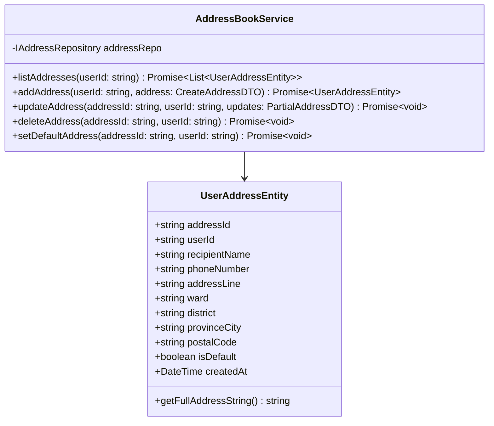

---

### 3.23. Gói 23: Vòng Đời Đổi Trả, Hủy Đơn & Mua Lại (Order Cancellation, Refunds & Re-Order)
Quản trị toàn vẹn chu trình sau mua hàng: Khách tự hủy đơn hàng trước khi xưởng in thực hiện bế khuôn, gửi yêu cầu bồi hoàn/đổi trả kèm ảnh lỗi in ấn và tính năng 1-Click mua lại đơn cũ.

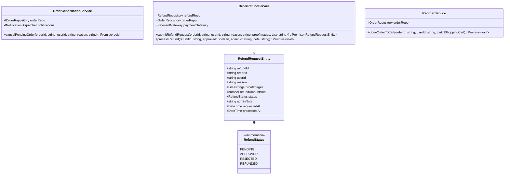

---

### 3.24. Gói 24: Bản Tin Newsletter, Form Liên Hệ & Khách Vãng Lai (Newsletter & Guest Contact)
Thu thập tệp khách hàng tiềm năng qua ô đăng ký nhận tin (Newsletter Subscribe) ở Footer và tiếp nhận giải đáp thắc mắc từ Form Liên hệ (Contact Us) mà không bắt buộc đăng nhập.

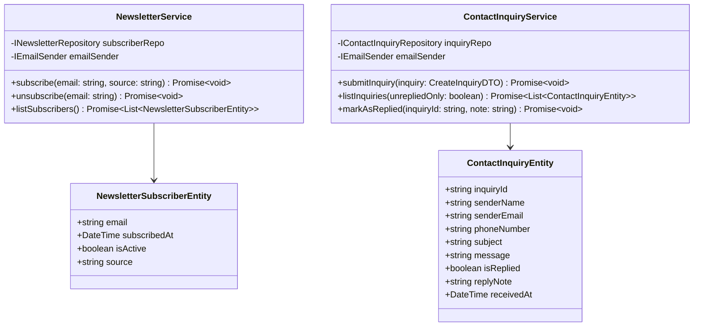

---

### 3.25. Gói 25: Cộng Tác Thiết Kế & Phân Quyền Nhóm (Project Team Collaboration & Sharing)
Cho phép chủ shop hoặc nhà thiết kế mời thành viên trong nhóm (đồng nghiệp, thợ in, khách hàng) cùng xem, nhận xét hoặc trực tiếp chỉnh sửa hộp quà theo các cấp quyền `VIEWER`, `EDITOR`, `ADMIN`.

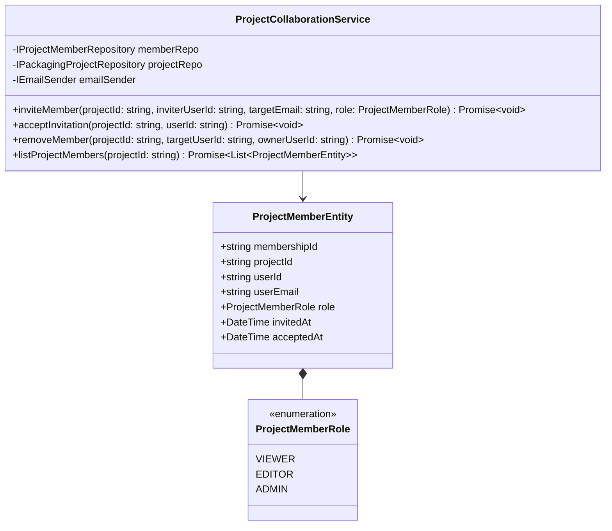

---

### 3.26. Gói 26: Quản Trị Banner Slider, Trang Tĩnh & Cấu Hình Web (CMS Banners & Web Config)
Hệ thống CMS quản lý Banner quảng cáo trang chủ (Hero Slider), cấu hình đường dây nóng Hotline, thông tin văn phòng, liên kết mạng xã hội và chuyển đổi tiền tệ / chế độ bảo trì toàn hệ thống.

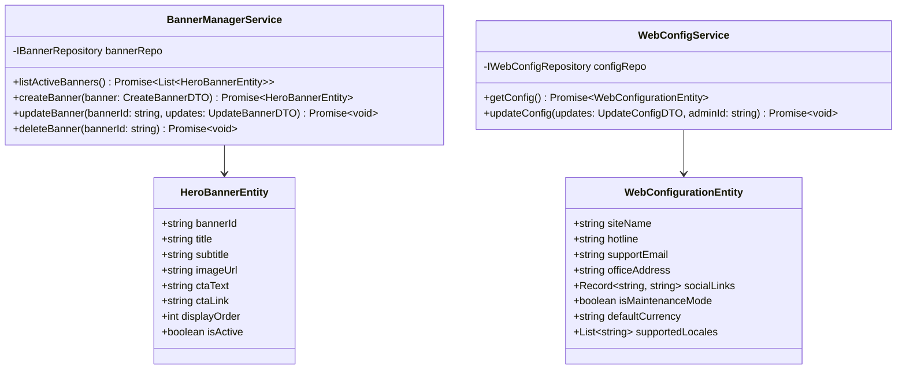

---

## 4. ĐẶC TẢ 28 LUỒNG NGHIỆP VỤ XUYÊN SUỐT VÒNG ĐỜI (END-TO-END SYSTEM & SEQUENCE FLOWS)

*(Các Luồng 1 đến 23 đã được trình bày chi tiết tại các phần trước: Dieline CAD, 2D Canvas, 3D Folding, FitCheck Preflight, Snapshot, Public Showcase, PDF CMYK 300 DPI, Cloud Mockup, Unboxing QR, Login/OAuth, Wishlist/Collections, Archival/Trash 30 days, Admin Governance, Forgot Password, Subscription Billing, Shopping Cart Checkout, Notifications, Support Ticket, 2FA TOTP, Coupon/Referral, Faceted Search, Device Sessions/GDPR).*

---

> **Quy ước chung cho các luồng (NestJS)**: Mọi request từ giao diện đi vào **Controller** → qua **Guard** (`JwtAuthGuard`, `RolesGuard`...) → **ValidationPipe** kiểm tra DTO → gọi **Application Service**. Email/thông báo luôn được đẩy vào hàng đợi BullMQ `mail` để không làm chậm phản hồi HTTP.

### Luồng 24: Quản Lý Sổ Địa Chỉ Giao Hàng Đa Điểm (Address Book Flow)

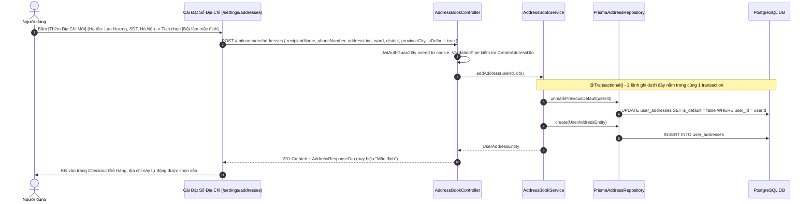

---

### Luồng 25: Hủy Đơn Hàng & Yêu Cầu Hoàn Tiền Tự Động (Cancel & Refund Flow)

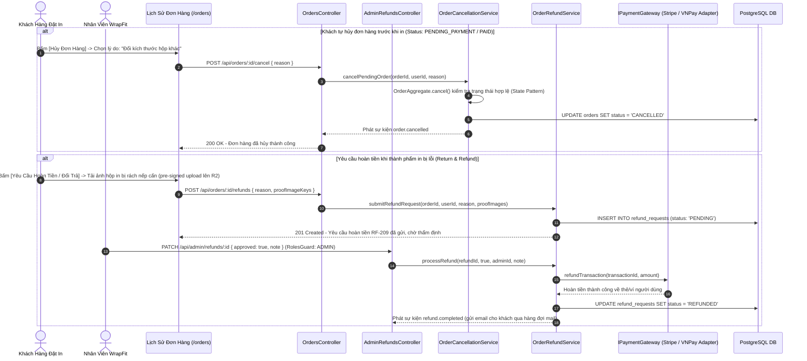

---

### Luồng 26: Khách Vãng Lai Đăng Ký Newsletter & Gửi Form Liên Hệ (Guest Engagement Flow)

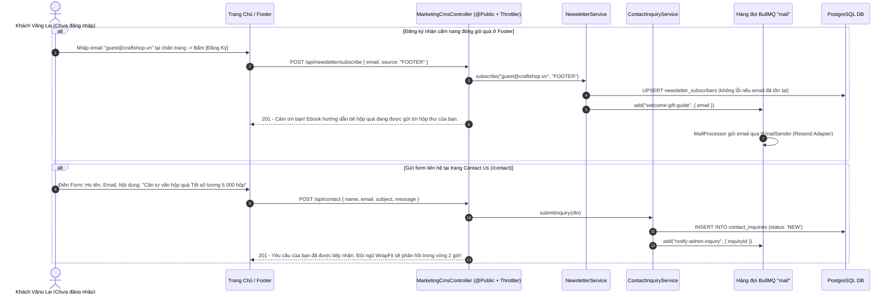

---

### Luồng 27: Mời Thành Viên Cùng Cộng Tác Chỉnh Sửa Hộp Quà (Team Collaboration Flow)

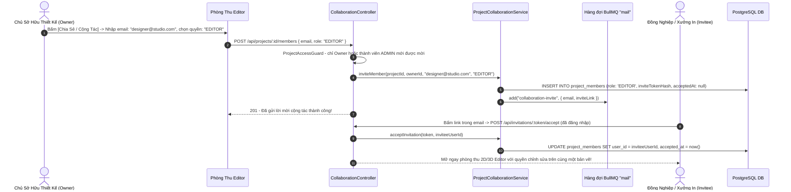

> Sau khi có tính năng cộng tác, `ProjectOwnerGuard` (tài liệu 07) được mở rộng thành `ProjectAccessGuard` với decorator `@ProjectRole('EDITOR')`: VIEWER chỉ được `GET`, EDITOR được sửa `canvasState`, chỉ Owner/ADMIN được đổi quyền riêng tư, xóa dự án hoặc mời thành viên.

---

### Luồng 28: Admin Quản Trị Banner Trang Chủ & Cấu Hình Website (CMS & Web Config Flow)

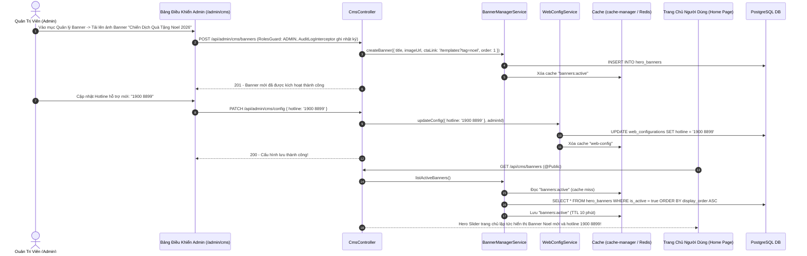

---

## 5. BẢNG TRA CỨU CÁC DESIGN PATTERNS ÁP DỤNG

| Nhóm Pattern | Tên Design Pattern | Vị trí áp dụng trong hệ thống | Hiện thực trong NestJS / Codebase | Lợi ích kiến trúc mang lại |
| :--- | :--- | :--- | :--- | :--- |
| **Structural** | **Facade Pattern** | `AdminDashboardFacade`, `AuthServiceFacade` | Service `@Injectable()` gom nhiều service con, Controller chỉ gọi Facade | Cung cấp giao diện đơn giản hóa cho các phân hệ phức tạp bên dưới. |
| **Structural** | **Proxy / Guard Pattern** | `JwtAuthGuard`, `RolesGuard` (thay cho `AdminRoleGuard`), `SubscriptionTierGuard`, `ProjectAccessGuard` | Class implements `CanActivate`, kết hợp decorator `@Roles()`, `@RequireTier()`, `@ProjectRole()` và `Reflector` | Bảo vệ các route API nhạy cảm theo mô hình RBAC. |
| **Structural** | **Decorator / Interceptor** | `AuditLogInterceptor`, `TransformResponseInterceptor`, `LoggingInterceptor` | Class implements `NestInterceptor`, gắn bằng `@UseInterceptors()` hoặc toàn cục | Bổ sung hành vi xuyên suốt (ghi nhật ký admin, chuẩn hóa response) mà không sửa Controller. |
| **Structural** | **Adapter Pattern** | `StripePaymentGateway`, `GhtkShippingAdapter`, `ResendEmailAdapter` | Custom provider `{ provide: PAYMENT_GATEWAY, useClass: StripePaymentGatewayAdapter }` | Chuẩn hóa giao tiếp với các dịch vụ bên thứ ba (Thanh toán, Giao hàng, Email). |
| **Behavioral** | **Strategy Pattern** | `IPaymentGateway` (Stripe, VNPay, MoMo), `IAuthProvider` | Payment: provider `useFactory` chọn adapter theo cấu hình/request. Auth: chính là Passport Strategy (`GoogleStrategy`, `JwtStrategy`, `LocalStrategy`) | Linh hoạt hoán đổi các cổng thanh toán và phương thức đăng nhập lúc runtime. |
| **Behavioral** | **Policy Pattern** | `TrashLifecyclePolicy`, `VolumeDiscountPolicy` | Class TS thuần trong `domain/`, được `TrashPurgeTask` (`@Cron`) và service sử dụng | Đóng gói các quy tắc kinh doanh (Chiết khấu số lượng, Vòng đời thùng rác 30 ngày). |
| **Behavioral** | **Observer / Channel Pattern** | `NotificationDispatcher` & `INotificationChannel` | `@nestjs/event-emitter`: `eventEmitter.emit('order.placed', payload)` → listener `@OnEvent('order.placed')` trong `NotificationsModule` | Phân phối thông báo đồng thời qua nhiều kênh (In-app, Email, WebPush) mà không phụ thuộc lẫn nhau. |
| **Behavioral** | **Producer–Consumer (Queue)** | Xuất file in, render mockup, gửi email | `@nestjs/bullmq`: `@InjectQueue('export')` + `queue.add()` / `@Processor('export')` chạy trong process `worker` | Tác vụ nặng không chặn request HTTP, có retry & theo dõi trạng thái job. |
| **Creational** | **Factory Method & Abstract Factory** | `BoxGeneratorFactory`, `PrepressExporterFactory` | `BoxGeneratorFactory` nằm trong `@wrapfit/shared/parametric`; `PrepressExporterFactory` là provider trong `ExportModule` | Mở rộng kiểu hộp hoặc định dạng xuất file mà không sửa code cũ. |
| **Creational** | **Builder Pattern** | `PdfCmykExporter`, `DxfCncExporter` | Class TS thuần trong `@wrapfit/shared/exporter`, được `ExportProcessor` gọi | Xây dựng tài liệu xuất bản đa lớp phức tạp (Cut, Crease, Spot UV). |
| **Behavioral** | **State Pattern** | `PackagingProjectAggregate` & `ProjectState` | Trong `projects/domain/` (TS thuần); service gọi `project.archive()`, `project.moveToTrash()` thay vì gán `status` trực tiếp | Quản lý chuyển đổi trạng thái dự án an toàn, nhất quán. |
| **Behavioral** | **Command Pattern** | `CommandManager`, `ICommand`, `IFixAction` | Undo/Redo chạy phía `fe/`; phía BE có thể dùng `@nestjs/cqrs` (`CommandBus`) nếu nghiệp vụ phức tạp lên | Cung cấp khả năng Hoàn tác (Undo/Redo) và Tự động sửa lỗi FitCheck. |
| **Structural** | **Composite Pattern** | `CanvasElement` (Text, Logo, Barcode, Pattern) | Kiểu dữ liệu trong `@wrapfit/shared/types`, thao tác ở `fe/`; BE chỉ validate & lưu `canvasState` | Xử lý nhóm và thao tác đồng bộ các đối tượng đồ họa. |
| **Enterprise** | **Aggregate Root (DDD)** | `PackagingProject`, `User`, `Order`, `SupportTicket`, `Collection` | Mỗi Aggregate có đúng 1 Repository Port + 1 `PrismaXxxRepository`; chỉ ghi dữ liệu qua Aggregate Root | Đảm bảo tính toàn vẹn dữ liệu cho từng ranh giới ngữ cảnh (Bounded Context). |
| **Enterprise** | **Dependency Injection / IoC** | Toàn bộ Backend | NestJS IoC Container: `@Module({ providers })`, `@Inject(TOKEN)` | Lắp ghép các tầng lỏng lẻo, dễ mock khi test. |

---

## 6. MA TRẬN TUÂN THỦ NGUYÊN TẮC SOLID

- **S (Single Responsibility Principle)**:
  - `AddressBookService` chỉ quản lý danh sách địa chỉ, không can thiệp vào logic tính tiền hay giao hàng.
  - `OrderRefundService` chỉ quản lý chu trình yêu cầu hoàn tiền, việc chuyển tiền thực tế do `IPaymentGateway` thực hiện.
  - Trong NestJS: Controller chỉ nhận request/trả response, xác thực do Guard, kiểm tra dữ liệu do Pipe, nghiệp vụ do Service.
- **O (Open/Closed Principle)**:
  - Thêm phương thức thanh toán mới hoặc đơn vị giao hàng mới: Chỉ cần cài đặt Adapter mới và đăng ký provider, không cần chỉnh sửa service cũ.
  - Thêm kênh thông báo mới: Chỉ cần viết class kế thừa `INotificationChannel` hoặc thêm một listener `@OnEvent`.
- **L (Liskov Substitution Principle)**:
  - Tất cả các cổng thanh toán (`Stripe`, `VNPay`, `MoMo`) đều có thể thay thế cho nhau một cách trong suốt đối với `SubscriptionBillingManager`.
- **I (Interface Segregation Principle)**:
  - Tách bạch giao diện: `IAddressBookService` hoàn toàn độc lập với `IOrderFulfillmentService`, `INewsletterService` không bị phụ thuộc vào `IAuthService`.
  - Mỗi NestJS Module chỉ `exports` đúng những provider mà module khác cần.
- **D (Dependency Inversion Principle)**:
  - Toàn bộ tầng Domain Core và Application Services chỉ phụ thuộc vào các Abstraction Ports, hạ tầng CSDL PostgreSQL hay S3 Storage chỉ là các chi tiết triển khai ở tầng Infrastructure.
  - Hiện thực bằng NestJS DI: Port = interface + injection token (`Symbol`), Adapter được gắn qua `{ provide: TOKEN, useClass: Impl }` (xem Mục 1.2).

---

## 7. ÁNH XẠ 26 GÓI PHÂN HỆ SANG NESTJS MODULES

Cột **Ưu tiên** khớp với Milestone trong tài liệu 07 (WBS). Các gói đánh dấu **Sau MVP** chưa có trong WBS hiện tại; nên triển khai sau khi hoàn thành CP4.

| Gói | Phân hệ | NestJS Module (`be/src/<module>/`) | Route chính (`/api/...`) | Ghi chú kỹ thuật | Ưu tiên |
| :--- | :--- | :--- | :--- | :--- | :--- |
| 1 | Vòng đời Dự án & Aggregate Root | `projects` | `/projects`, `/projects/:id/snapshots` | State Pattern trong `domain/`, `ProjectOwnerGuard` | CP3 |
| 2 | Động cơ Toán Hình Học CAD | *(không phải module — thư viện `@wrapfit/shared/parametric`)* | — | `projects` gọi để validate kích thước / tái tính dieline khi đổi kích thước | CP2 |
| 3 | Phòng thu Vector 2D | *(phía `fe/`)* | — | BE chỉ validate & lưu `canvasState` (JSON) theo schema trong `@wrapfit/shared` | CP3 |
| 4 | WebGL 3D & Gập Động Học | *(phía `fe/`)* | — | Không có thành phần Backend | CP3 |
| 5 | FitCheck™ Preflight | `projects` (`PreflightAuditService`) | *(chạy nội bộ khi xuất file / đăng Template)* | Chạy lại `@wrapfit/shared/fitcheck` phía server, không tin điểm do client gửi lên; lưu kết quả vào `fitcheckState` | CP3 |
| 6 | Xuất bản Công nghiệp & Render Đám mây | `export` | `/projects/:id/exports`, `/exports/:jobId` | `@Processor('export')` (BullMQ) trong process `worker` | CP4 |
| 7 | Public Showcase & Unboxing | `public-showcase`, `unboxing` | `/public/projects/:slug`, `/projects/:id/unboxing`, `/public/unboxing/:slug` | `@Public()`, `@nestjs/throttler` cho like/fork, sinh QR bằng `qrcode` | CP4 |
| 8 | Xác thực & RBAC | `auth`, `users` | `/auth/*`, `/users/me` | Passport Google + JWT cookie, `RolesGuard` | CP2 |
| 9 | Wishlist & Collections | `collections` (+ like trong `public-showcase`) | `/collections`, `/public/projects/:slug/like` | CRUD gọn 3 lớp | CP3 |
| 10 | Lưu trữ, Thùng rác 30 ngày & Quota S3 | `storage` (`@Global`) + `TrashPurgeTask` trong `projects` | `/storage/presigned-upload` | `@Cron` 02:00 hằng ngày; kiểm tra quota theo `subscriptionTier` trước khi cấp pre-signed URL | CP3 |
| 11 | Quản trị Nền tảng & Audit Log | `admin` | `/admin/*` | `@Roles(Role.ADMIN)` ở cấp Controller, `AuditLogInterceptor` | Sau MVP |
| 12 | Bảo mật Tài khoản & Mật khẩu | `auth` | `/auth/password/forgot`, `/auth/password/reset` | Token đặt lại mật khẩu lưu dạng băm, hết hạn 30 phút, gửi qua hàng đợi `mail` | Sau MVP |
| 13 | Thanh toán & Thuê bao | `billing` | `/billing/*`, `/webhooks/stripe`, `/webhooks/vnpay`, `/webhooks/momo` | Webhook cần raw body: `NestFactory.create(AppModule, { rawBody: true })`; xác minh chữ ký; xử lý idempotent | Sau MVP |
| 14 | Giỏ hàng, Đặt hàng & Vận chuyển | `cart`, `orders`, `shipping` | `/cart`, `/orders` | `IShippingProvider` (GHTK/GHN Adapter) | Sau MVP |
| 15 | Thông báo Đa kênh | `notifications` | `/notifications` | `@OnEvent` listener; realtime tùy chọn bằng `@WebSocketGateway` (Socket.IO) | CP4 (in-app cơ bản) |
| 16 | Hỗ trợ Khách hàng & Ticket | `support` | `/support/tickets` | Đính kèm ảnh qua pre-signed upload | Sau MVP |
| 17 | Tìm kiếm, Lọc & Phân trang | `common/dto` (`PaginationQueryDto`, `PaginatedResponseDto<T>`) | *(dùng chung)* | PostgreSQL full-text search / `pg_trgm` cho tìm theo tên, tag | CP3 |
| 18 | Mã giảm giá & Tiếp thị liên kết | `promotions` | `/coupons/validate`, `/referrals` | Dùng `User.referralCode`, `referredById` sẵn có | Sau MVP |
| 19 | 2FA TOTP & Phiên thiết bị | `auth` | `/auth/2fa/*`, `/users/me/sessions` | `otplib`; danh sách phiên lấy từ bảng `refresh_tokens` | Sau MVP |
| 20 | Đánh giá, Blog CMS & SEO | `reviews`, `blog` | `/reviews`, `/blog/posts` | SEO render phía `fe/` (Next.js metadata); BE cung cấp dữ liệu | Sau MVP |
| 21 | Rate Limiting & GDPR | `ThrottlerModule` (toàn cục) + `privacy` | `/users/me/export-data`, `DELETE /users/me` | Xuất dữ liệu cá nhân qua hàng đợi, xóa tài khoản cascade + xóa file S3 | CP2 (rate limit) / Sau MVP (GDPR) |
| 22 | Sổ Địa chỉ | `address-book` | `/users/me/addresses` | Ví dụ mẫu 4 tầng tại Mục 1.1 – 1.2 | Sau MVP |
| 23 | Hủy đơn, Hoàn tiền & Mua lại | `orders` (`RefundsController`, `AdminRefundsController`) | `/orders/:id/cancel`, `/orders/:id/refunds`, `/orders/:id/reorder`, `/admin/refunds/:id` | Gọi `IPaymentGateway.refundTransaction` | Sau MVP |
| 24 | Newsletter & Liên hệ | `newsletter`, `contact` | `/newsletter/subscribe`, `/contact` | `@Public()` + Throttler chặt (chống spam), email qua hàng đợi `mail` | Sau MVP |
| 25 | Cộng tác Thiết kế & Phân quyền Nhóm | `collaboration` | `/projects/:id/members`, `/invitations/:token/accept` | Nâng `ProjectOwnerGuard` thành `ProjectAccessGuard` (VIEWER / EDITOR / ADMIN) | Sau MVP |
| 26 | Banner Slider & Cấu hình Web | `cms` | `/cms/banners`, `/cms/config`, `/admin/cms/*` | `@nestjs/cache-manager`, xóa cache khi Admin cập nhật | Sau MVP |

---

> 🎯 **Kết luận nghiệm thu v7.1**: Hệ thống Class Diagram WrapFit bao quát **26 gói phân hệ** và **28 luồng nghiệp vụ tuần tự**, nay được hiện thực hóa trên **NestJS**: mỗi gói phân hệ ánh xạ thành một NestJS Module, Clean Architecture được đảm bảo bằng Dependency Injection với injection token, bảo mật bằng Guards, và các tác vụ nặng (xuất file in CMYK, render, email) chạy bất đồng bộ qua BullMQ — liên kết chặt chẽ giữa công nghệ lõi CAD/3D đặc thù (tham chiếu Pacdora.com) và các tính năng tiêu chuẩn của một nền tảng Web thương mại điện tử & SaaS.
