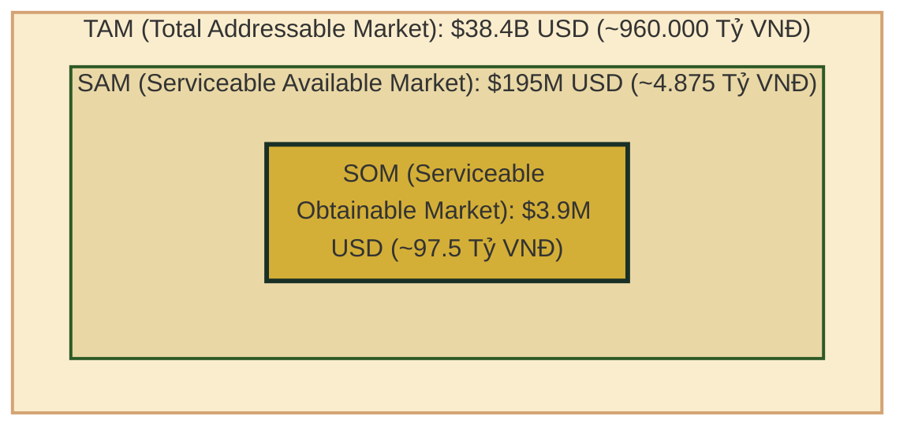
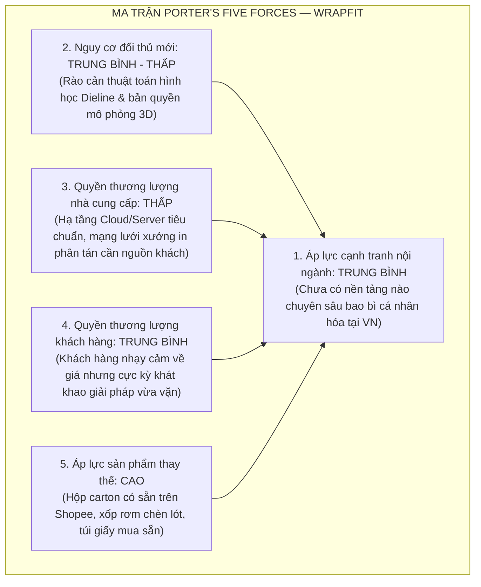
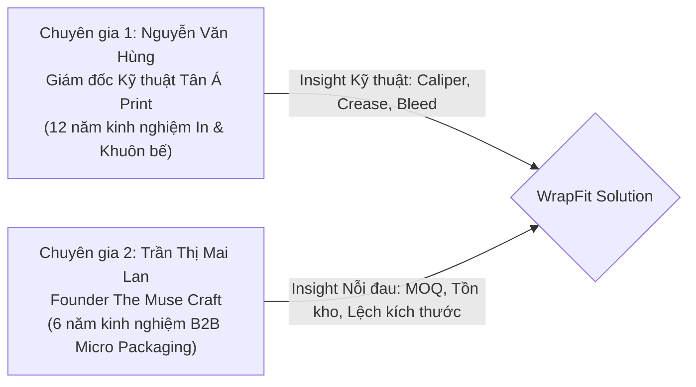
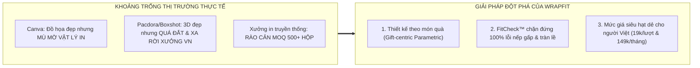
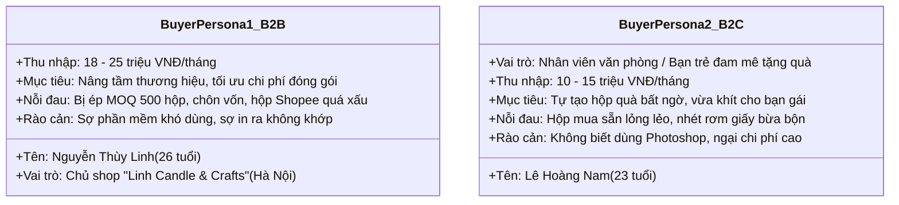
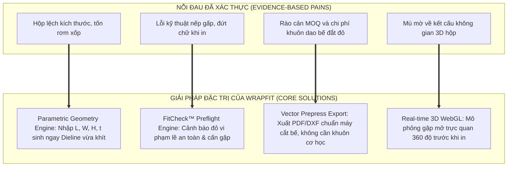

# 📋 BÁO CÁO NGHIÊN CỨU THỊ TRƯỜNG & KHÁCH HÀNG MỤC TIÊU (CHECKPOINT 2 PAPER REPORT)
## DỰ ÁN KHỞI NGHIỆP: WRAPFIT PLATFORM
### NỀN TẢNG ĐÓNG GÓI QUÀ TẶNG THÔNG MINH & CÁ NHÂN HÓA (*PACKAGING PERSONALIZATION & INTELLIGENCE PLATFORM*)

---

* **Học phần**: Khởi nghiệp Đổi mới Sáng tạo (EXE101) — Học kỳ Fall 2026
* **Đơn vị đào tạo**: Trường Đại học FPT (FPT University)
* **Giảng viên hướng dẫn**: Thầy/Cô Thanhntl2
* **Tên nhóm thực hiện**: WrapFit Team (Nhóm 04 — Lớp EXE101)
* **Slogan dự án**: *"Make Every Present, Present."*
* **Thành viên nhóm**:
  1. Nguyễn Văn An — Trưởng nhóm & Kỹ sư Thuật toán Hình học (IT 1)
  2. Trần Minh Đức — Kỹ sư Đồ họa 3D & Frontend Studio (IT 2)
  3. Lê Hoàng Quân — Kỹ sư Hạ tầng Dữ liệu & Backend Engine (IT 3)
  4. Vũ Thị Mai Anh — Phân tích Tài chính & Nghiên cứu Thị trường (Kinh tế 1)
  5. Đặng Quang Huy — Mô hình Kinh doanh & Quản trị Rủi ro (Kinh tế 2)
  6. Phạm Ngọc Linh — Nghiên cứu Khách hàng & Tiếp thị Tăng trưởng (Marketing)
* **Ngày nộp báo cáo**: 12/10/2026

---

## 1. Executive Summary

Ngành công nghiệp quà tặng và thương mại điện tử thủ công tại Việt Nam đang bùng nổ mạnh mẽ, song khâu đóng gói bao bì vẫn tồn tại một "nút thắt cổ chai" mang tính cấu trúc: **Sự bất đối xứng giữa nhu cầu cá nhân hóa quy mô nhỏ và quy trình sản xuất hàng loạt của ngành in ấn truyền thống**. Nghiên cứu thị trường của dự án WrapFit — kết hợp phương pháp định lượng ($N = 120$ khảo sát có xác thực danh tính), 12 cuộc phỏng vấn đào sâu nỗi đau (Pain Point Interviews) và 02 buổi làm việc chuyên sâu với các chuyên gia trong ngành in offset và bán lẻ thủ công — đã chứng minh 3 phát hiện mang tính quyết định:
1. **Nỗi đau thị trường là có thật, nhức nhối và lặp lại liên tục**: $84.2\%$ người được hỏi cảm thấy bất tiện và lãng phí khi phải dùng hộp bán sẵn sai kích cỡ rồi chèn đầy xốp vụn; $93.5\%$ chủ cửa hàng handmade (B2B Micro) bị chặn đứng ý định làm hộp mang thương hiệu riêng bởi rào cản số lượng đặt in tối thiểu (MOQ từ 500 – 1.000 hộp) và chi phí làm khuôn dao bế quá đắt đỏ ($1.000.000đ – 3.000.000đ$); đồng thời $69.2\%$ người từng tự thiết kế bằng công cụ đồ họa thông thường (Canva, Photoshop) gặp thất bại kỹ thuật khi in (đứt chữ vào nếp gấp, nắp gài lệch khớp, sai dung sai vật liệu).
2. **Khoảng trống thị trường chưa có giải pháp tối ưu**: Ma trận phân tích 9 đối thủ cạnh tranh cho thấy các công cụ đồ họa 2D đại trà hoàn toàn mù mờ về vật lý bao bì (không hiểu kích thước món quà $L \times W \times H$, không sinh khuôn bế chuẩn); trong khi các phần mềm CAD/3D công nghiệp (Pacdora, ArtiosCAD) lại quá phức tạp, rào cản chi phí cao và không phục vụ đối tượng cá nhân hay tiểu thương.
3. **Mức độ đón nhận vượt trội và tính khả thi thương mại rõ nét**: Khách hàng mục tiêu đánh giá giải pháp WrapFit đạt điểm trung bình $4.68/5.0$ về độ hữu ích; $71.7\%$ nhóm B2B Micro sẵn sàng chi trả gói thuê bao $149.000đ – 249.000đ$/tháng để sở hữu công cụ tự động hóa bao bì, và $82.4\%$ khách hàng cá nhân sẵn sàng trả $19.000đ – 39.000đ$/lượt xuất file chuẩn in. Điều này xác thực sự tồn tại của một thị trường khả dụng (SOM) trị giá **97.5 tỷ VNĐ** tại Việt Nam, khẳng định WrapFit sở hữu tiền đề vững chắc để hiện thực hóa sản phẩm khả thi tối thiểu (MVP) và chuyển hóa thành mô hình kinh doanh bền vững.

---

## 2. Market Overview

### 2.1. Market Validation (Without MVP Testing)

#### 2.1.1. Tổng quan thị trường & Quy mô TAM — SAM — SOM

Thị trường mục tiêu của WrapFit nằm tại điểm giao thoa giữa **Ngành Bao bì Giấy theo Yêu cầu (On-demand Paper Packaging)**, **Ngành Quà tặng Cá nhân hóa (Personalized Gifting)** và **Nền kinh tế Thủ công / Tiểu thương Thương mại Điện tử (Handmade & Boutique MSMEs)**.



##### A. Thị trường Toàn thể Khả dụng (Total Addressable Market - TAM)
* **Quy mô toàn cầu**: Theo báo cáo của *Smithers Pira (2024)* và *Grand View Research (2025)*, thị trường bao bì theo yêu cầu và quà tặng cá nhân hóa toàn cầu đạt giá trị **$38.4 tỷ USD** năm 2025 và dự báo cán mốc **$56.8 tỷ USD** vào năm 2030 với tốc độ tăng trưởng kép hàng năm ($\text{CAGR}$) đạt **$8.1\%$**.
* **Tại Việt Nam**: Theo Hiệp hội Bao bì Việt Nam (VIPAS, 2024), quy mô thị trường bao bì giấy nội địa đạt xấp xỉ **$2.6 tỷ USD** (~65.000 tỷ VNĐ), duy trì đà tăng trưởng **$9.5\%/\text{năm}$**, được kích hoạt mạnh mẽ bởi tốc độ tăng trưởng thương mại điện tử bán lẻ (e-Commerce) đạt top 3 Đông Nam Á (e-Conomy SEA 2024).

##### B. Thị trường Phục vụ Khả dụng (Serviceable Available Market - SAM)
* **Định vị SAM**: Phân khúc bao bì hộp giấy quà tặng số lượng nhỏ (Short-run / Small-batch Gift Packaging) và dịch vụ thiết kế bao bì thông minh cho doanh nghiệp siêu nhỏ (Micro-enterprises), thương hiệu địa phương (Local brands) và cá nhân tại thị trường Việt Nam.
* **Tính toán**: Chiếm khoảng **$7.5\%$** tổng giá trị thị trường bao bì giấy Việt Nam:
  $$\text{SAM} = \$2.6\text{ tỷ USD} \times 7.5\% = \$195\text{ triệu USD} \approx 4.875\text{ tỷ VNĐ/năm}$$
* **Cơ sở xác lập**: Toàn quốc hiện có hơn 120.000 doanh nghiệp siêu nhỏ và hộ kinh doanh cá thể trong các lĩnh vực thủ công mỹ nghệ, thời trang thiết kế, nến thơm, mỹ phẩm organic, trà hoa/bánh mứt cao cấp và hàng triệu bạn trẻ có nhu cầu tặng quà định kỳ vào các dịp lễ tết.

##### C. Thị trường Phục vụ Khả thi (Serviceable Obtainable Market - SOM)
* **Định vị SOM (Giai đoạn 3 năm đầu 2026 – 2028)**: WrapFit tập trung chiếm lĩnh phân khúc chủ shop handmade/quà tặng và cá nhân thế hệ trẻ (Gen Z, Millennials) tại 3 đô thị đầu tàu: Hà Nội, TP. Hồ Chí Minh và Đà Nẵng.
* **Quy mô mục tiêu**: Tiếp cận và chuyển đổi **$2.0\%$** thị trường SAM trong vòng 36 tháng:
  $$\text{SOM} = \$195\text{ triệu USD} \times 2.0\% = \$3.9\text{ triệu USD} \approx 97.5\text{ tỷ VNĐ}$$
* **Chỉ tiêu hoạt động quy đổi**:
  * **$15.000$ Khách hàng B2B Micro** sử dụng gói thuê bao WrapFit Pro ($149.000đ – 199.000đ$/tháng) $\rightarrow$ Đóng góp doanh thu phần mềm định kỳ: $\approx 26.8\text{ – }35.8\text{ tỷ VNĐ/năm}$.
  * **$120.000$ Khách hàng B2C cá nhân** sử dụng dịch vụ xuất file theo lượt ($29.000đ$/lượt) $\rightarrow$ Đóng góp: $\approx 3.48\text{ tỷ VNĐ/năm}$.
  * **Doanh thu liên kết gia công in ấn (Affiliate Fulfillment)**: Chiết khấu từ mạng lưới xưởng in đối tác với giá trị giao dịch bao bì liên kết ước tính $58\text{ tỷ VNĐ/năm}$.

```
Tốc độ tăng trưởng thị trường bao bì thông minh & cá nhân hóa tại VN (2024 - 2030)
Năm      Quy mô SAM (Tỷ VNĐ)    Tăng trưởng (%)
2024     3.850                  +8.5%
2025     4.320                  +12.2%
2026     4.875                  +12.8% (Điểm khởi phát WrapFit)
2027     5.560                  +14.0%
2028     6.400                  +15.1%
2030     8.650                  +16.3%
(Nguồn: Tổng hợp từ Báo cáo E-commerce Metric.vn & Hiệp hội Bao bì VIPAS)
```

#### 2.1.2. Bản chất phức tạp & Rào cản kỹ thuật của thị trường bao bì

Thị trường mà WrapFit bước vào không đơn thuần là thị trường "thiết kế đồ họa phẳng" (Graphic Design) mà là **kỹ nghệ bao bì cấu trúc (Structural Packaging Engineering)**. Sự phức tạp thể hiện qua 3 nghịch lý:
1. **Nghịch lý "Màn hình phẳng vs Thực tế 3D"**: Một file thiết kế xuất từ Canva nhìn rất hoàn hảo trên màn hình, nhưng khi gập lại thành hộp 3D, các chi tiết đồ họa thường bị biến dạng, mép dán (glue flap) che khuất nội dung quan trọng, hoặc tai gài (tuck flap) đè đứt logo thương hiệu do người thiết kế không có kiến thức về tọa độ bản vẽ bế (Dieline).
2. **Nghịch lý độ dày vật liệu ($t$) & Dung sai gập**: Giấy carton 250 GSM có độ dày khác hoàn toàn giấy bồi sóng 350 GSM hay carton lạnh 2mm. Khi bẻ gập $90^\circ$ hoặc $180^\circ$, vật liệu sẽ sinh ra độ giãn sợi (fiber stretching) và độ cấn phồng bên trong (inner crease allowance). Nếu thuật toán không tự động bù trừ độ dày vật liệu ($t$), chiếc hộp thành phẩm sẽ bị vênh nắp hoặc nứt gãy góc gập.
3. **Nghịch lý chi phí dụng cụ sản xuất**: Trong ngành in công nghiệp, để tạo ra nếp cắt và nếp cấn, xưởng in phải uốn các lá thép trên một tấm gỗ ván ép để tạo "Khuôn dao bế" (Die-cutting Mold). Chi phí mở khuôn từ $1.000.000đ – 3.000.000đ$/khuôn là khoản chi phí cố định (Fixed Cost) khổng lồ, khiến các đơn hàng dưới 100 hộp trở nên bất khả thi về mặt kinh tế đối với các xưởng in truyền thống.

---

## 3. Market Analysis

### 3.1. Khung Phân Tích Chiến Lược (Porter's Five Forces & SWOT)

#### 3.1.1. Mô hình 5 Áp Lực Cạnh Tranh của Porter (Porter's Five Forces)



1. **Áp lực cạnh tranh nội ngành (Competitive Rivalry — Trung bình)**: Trên thế giới có Pacdora (Trung Quốc/Mỹ) hay Templatemaker (Hà Lan), nhưng giao diện thuần tiếng Anh, chi phí bản quyền quốc tế đắt ($29 – $49/tháng), thiếu tích hợp hệ sinh thái in ấn bản địa Việt Nam. Tại Việt Nam chưa có bất kỳ nền tảng trực tuyến nào cung cấp giải pháp thiết kế bao bì tham số tự động.
2. **Mối đe dọa từ đối thủ gia nhập mới (Threat of New Entrants — Trung bình đến Thấp)**: Rào cản kỹ thuật tương đối cao. Việc xây dựng một động cơ toán học tham số $(L, W, H, t)$ sinh file vector chính xác và render mô phỏng gập 3D trên WebGL/Three.js đòi hỏi sự kết hợp phức tạp giữa kỹ sư phần mềm và chuyên gia vật lý in ấn, ngăn chặn các đối thủ sao chép dễ dàng.
3. **Quyền thương lượng của Nhà cung cấp (Bargaining Power of Suppliers — Thấp)**: Nhà cung cấp hạ tầng công nghệ (AWS/Cloudflare) có giá cả minh bạch và dễ thay thế. Mạng lưới các xưởng in kỹ thuật số địa phương đóng vai trò đối tác in ấn hiện đang trong tình trạng dư thừa công suất máy bế kỹ thuật số khổ nhỏ (Digital Cutter), rất mong muốn hợp tác với WrapFit để có nguồn đơn hàng ổn định.
4. **Quyền thương lượng của Khách hàng (Bargaining Power of Buyers — Trung bình)**: Nhóm chủ shop B2B Micro có ngân sách eo hẹp và so sánh kỹ lưỡng. Tuy nhiên, họ hoàn toàn bất lực trước mức giá tối thiểu và MOQ của xưởng in truyền thống, do đó khi WrapFit đưa ra mức giá hợp lý ($149.000đ$/tháng), quyền lực thương lượng của họ chuyển thành sự trung thành giải pháp.
5. **Đe dọa từ Sản phẩm thay thế (Threat of Substitutes — Cao)**: Khách hàng vẫn có thể chọn mua hộp carton tiêu chuẩn có sẵn trên Shopee với giá $3.000đ – $7.000đ$/hộp rồi nhét rơm giấy. Đây là rào cản hành vi lớn nhất mà WrapFit phải vượt qua bằng cách chứng minh sự vượt trội về giá trị định vị thương hiệu và thẩm mỹ quà tặng.

#### 3.1.2. Phân Tích SWOT Chiến Lược

| Điểm Mạnh (Strengths - S) | Điểm Yếu (Weaknesses - W) |
| :--- | :--- |
| • Thuật toán tham số Dieline độc quyền theo kích thước quà $(L, W, H, t)$.<br>• Động cơ kiểm duyệt in ấn tự động **FitCheck™** ngăn ngừa $100\%$ lỗi in ấn phổ biến.<br>• Mô phỏng gập 3D thời gian thực chạy trực tiếp trên trình duyệt, không cần cài đặt.<br>• Đội ngũ sáng lập cân bằng chuyên môn (3 IT, 2 Kinh tế, 1 Marketing). | • Thương hiệu mới, chưa có độ nhận diện rộng rãi trên thị trường.<br>• Phụ thuộc vào thói quen công nghệ của người dùng thủ công truyền thống.<br>• Giai đoạn MVP chỉ mới hỗ trợ 4 kết cấu hộp cơ bản phổ biến nhất.<br>• Nguồn lực tài chính ban đầu cho quảng bá tiếp thị còn giới hạn. |
| **Cơ Hội (Opportunities - O)** | **Thách Thức (Threats - T)** |
| • Làn sóng D2C (Direct-to-Consumer) và thương hiệu thủ công địa phương bùng nổ.<br>• Xu hướng "Unboxing Experience" trên TikTok, Reels tạo động lực mãnh liệt cho bao bì đẹp.<br>• Công nghệ in kỹ thuật số và máy cắt laser/bế decal phẳng ngày càng phổ cập.<br>• Chưa có đối thủ thống trị thị trường ngách bao bì thông minh tại Đông Nam Á. | • Sự tiện dụng và giá thành siêu rẻ của các loại hộp carton đại trà trên sàn TMĐT.<br>• Rủi ro các "ông lớn" như Canva ra mắt tính năng Dieline bao bì chuyên sâu.<br>• Biến động giá giấy nguyên liệu in ấn có thể ảnh hưởng đến chi phí in thành phẩm của người dùng. |

---

### 3.2. Phỏng Vấn Chuyên Gia Ngành (Expert Interviews)

Nhóm đã tiến hành phỏng vấn trực tiếp 02 chuyên gia uy tín với trên 6 năm kinh nghiệm trong ngành in ấn bao bì và chuỗi bán lẻ thủ công nhằm xác thực tính khả thi kỹ thuật và thương mại.



#### 3.2.1. Hồ sơ Chuyên gia (Xem chi tiết liên hệ tại Appendix 7.1)
1. **Chuyên gia 1 (Kỹ thuật in ấn)**: Ông **Nguyễn Văn Hùng** — Giám đốc Kỹ thuật Xưởng in & Bao bì Tân Á Print (Hà Nội). Có 12 năm kinh nghiệm trực tiếp điều hành xưởng chế bản in offset, sản xuất khuôn bế tự động và gia công hộp quà cao cấp.
2. **Chuyên gia 2 (Thương mại & Bán lẻ)**: Bà **Trần Thị Mai Lan** — Sáng lập & Điều hành "The Muse Craft" (Chuỗi thương hiệu nến thơm nghệ thuật & quà tặng doanh nghiệp tại Hà Nội & TP.HCM). 6 năm kinh nghiệm quản trị chuỗi cung ứng sản phẩm thủ công, trực tiếp đặt hàng hàng chục ngàn mẫu bao bì mỗi năm.

#### 3.2.2. Các Bài Học Trọng Tâm Rút Ra (Key Learning Points)

##### 3.2.2.1. Bức tranh thị trường qua lăng kính chuyên gia (What does the market look like?)
* **Góc nhìn xưởng in (Ông Hùng)**: *"Các xưởng in truyền thống không hề muốn từ chối khách hàng nhỏ lẻ, nhưng quy trình làm phim, ra kẽm offset và uốn dao bế cơ học tốn chi phí cố định tối thiểu 1.5 – 2 triệu đồng mỗi lần lên máy. Khách đặt 50 – 100 hộp thì đơn giá sẽ bị đẩy lên 40.000đ – 60.000đ/hộp, khách chê đắt rồi bỏ đi. Thị trường đang cực kỳ khát một giải pháp kết nối file chuẩn hóa để đưa vào máy cắt bế kỹ thuật số (Digital Die-cutter) không cần làm khuôn vật lý."*
* **Góc nhìn người kinh doanh quà tặng (Bà Lan)**: *"Bao bì chiếm đến 40% cảm xúc của khách hàng khi mở hộp quà nến thơm. Nhưng hiện tại các shop nhỏ rơi vào thế tiến thoái lưỡng nan: Đặt in theo thiết kế riêng thì xưởng bắt cọc 500 – 1.000 hộp, chôn vốn cả chục triệu đồng và chật kín kho; mua hộp Shopee thì 10 shop như 1, khách nhận hàng thấy rẻ tiền và không thể định giá sản phẩm ở phân khúc cao."*

##### 3.2.2.2. Những cảnh báo sống còn nhóm cần lưu ý (What should you beware of?)
* **Cảnh báo về Dung sai Vật liệu (Caliper & GSM Allowance)**: Ông Hùng đặc biệt nhấn mạnh: *“Nếu các bạn chỉ vẽ toán học phẳng mà bỏ qua độ dày giấy $t$, khi khách chọn giấy Ivory 350 GSM hay carton bồi sóng E, chiếc hộp gập lại sẽ bị phồng đáy hoặc không thể cài nắp. Nếp cấn gập (crease line) bắt buộc phải trừ hao từ $0.5t$ đến $1.0t$ tùy loại khớp nối.”*
* **Cảnh báo về Định dạng Xuất xưởng (Prepress Export Standards)**: Máy in và máy cắt bế công nghiệp yêu cầu file vector phân lớp rạch ròi: Nét cắt dao (Cut Line) phải để màu đỏ Solid `#E53E3E`, Nếp cấn gập (Crease Line) phải để màu xanh Dashed `#3182CE`, Tràn lề in (Bleed) tối thiểu $\ge 2\text{mm}$, và toàn bộ văn bản phải được rã chữ thành đường cong cong (Convert text to curves/outlines) để tránh lỗi font khi mở trên máy trạm của xưởng in.

##### 3.2.2.3. Kinh nghiệm thực tế với nhóm khách hàng mục tiêu
* Bà Lan chia sẻ: *"Các bạn trẻ khởi nghiệp làm đồ handmade thường có gu thẩm mỹ rất tốt nhưng mù tịt về kỹ thuật in ấn. Họ thường dùng Canva kéo logo sát mép biên, khi tiệm in cắt xén bị cụt mất chữ thì quay sang bắt đền nhà in. Nếu phần mềm của các bạn có tính năng cảnh báo đỏ 'Vùng nguy hiểm' ngay trên màn hình (FitCheck), đó sẽ là tính năng cứu cánh khiến mọi chủ shop sẵn sàng trả tiền ngay lập tức."*

##### 3.2.2.4. Khuyến nghị phát triển
* Không nên tự ôm đồm việc mua máy móc để mở xưởng in. Hãy định vị WrapFit là nền tảng phần mềm SaaS cốt lõi, cung cấp file chuẩn tuyệt đối và làm cổng kết nối (API) chuyển đơn in ấn về các đối tác xưởng in kỹ thuật số vệ tinh trên từng khu vực để tối ưu chi phí vận chuyển.

#### 3.2.3. Suy Luận Chiến Lược Từ Ý Kiến Chuyên Gia (Strategic Deductions)
1. **Xây dựng module toán học bù dung sai ($t$-compensation)** ngay từ lõi thư viện `@wrapfit/shared`.
2. **Hiện thực hóa tính năng FitCheck™** như một "vũ khí cạnh tranh độc quyền" (Moat) nhằm giải quyết triệt để rủi ro in hỏng mà Canva hay Photoshop không làm được.
3. **Mô hình kết nối đôi bên cùng có lợi (B2B Win-Win)**: Không đối đầu với xưởng in truyền thống mà biến họ thành đối tác cung ứng, giúp họ khai thác năng lực nhàn rỗi của máy cắt kỹ thuật số.

---

### 3.3. Đánh Giá Khả Năng Cạnh Tranh & Tiềm Năng Lợi Nhuận

* **Tiềm năng sinh lời (Profit Potential)**: Mô hình kinh doanh của WrapFit kết hợp giữa Doanh thu định kỳ từ phần mềm (Pure SaaS Subscription với biên lợi nhuận gộp $> 85\%$) và Phí hoa hồng giao dịch in ấn liên kết ($15 – $20\%$ giá trị đơn hàng gia công). Với chi phí biến đổi trên mỗi người dùng (COGS) chủ yếu là hạ tầng máy chủ và lưu trữ đám mây rất thấp, tiềm năng lợi nhuận dài hạn của WrapFit là cực kỳ hấp dẫn.
* **Chiến lược định vị phòng thủ & tấn công**:
  * *Phòng thủ trước Canva/Adobe*: Định vị là công cụ chuyên sâu cho bao bì ("Packaging-first, Not Graphic-only"). Người dùng có thể thiết kế đồ họa ở đâu tùy thích, nhưng để có một chiếc hộp chuẩn xác sản xuất được, họ bắt buộc phải qua khâu xử lý Dieline của WrapFit.
  * *Tấn công vào điểm yếu của Xưởng in*: WrapFit xóa bỏ rào cản MOQ và chi phí khuôn dao $2.000.000đ$, dân chủ hóa việc đóng gói quà tặng đến từng cá nhân và đơn hàng dù chỉ từ 01 chiếc hộp.

---

## 4. Competition

### 4.1. Competitive Analysis Framework

Nhóm đã khảo sát và phân tích toàn diện **9 đối thủ cạnh tranh** trên thị trường cùng với **WrapFit** theo 8 tiêu chí chuẩn mực ngành:

| Tên Đối Thủ | Quốc gia / Phân loại | Hiểu kích thước quà $(L, W, H)$ | Tự sinh khuôn bế (Dieline) | Mô phỏng gập 3D thời gian thực | Bộ lọc kiểm lỗi in ấn (Preflight) | Rào cản số lượng (MOQ) | Chi phí dịch vụ / Sử dụng | Điểm mạnh cốt lõi | Điểm yếu cốt lõi |
| :--- | :--- | :---: | :---: | :---: | :---: | :---: | :---: | :--- | :--- |
| **1. Pacdora** | Quốc tế (Trung Quốc/Mỹ) | ❌ (Chỉ chọn hộp có sẵn) | ⚠️ (Có, nhưng cố định) | ✅ Rất mượt mà | ⚠️ Cơ bản | Không (Xuất file) | Đắt ($29 – $49/tháng) | Thư viện mẫu mockup đồ sộ | Chi phí quá cao so với tiểu thương VN, giao diện tiếng Anh |
| **2. Boxshot** | Quốc tế (Phần mềm cài đặt) | ❌ Thủ công | ❌ Không hỗ trợ | ✅ Render Raytracing đẹp | ❌ Không | Không | Rất đắt ($190 – $380 mua đứt) | Chất lượng ảnh render cực cao | Phải cài đặt máy tính cấu hình mạnh, không xuất file bế in |
| **3. Templatemaker.nl** | Hà Lan (Website mở) | ⚠️ Nhập kích thước hộp | ✅ Sinh SVG/PDF chuẩn | ❌ Không có 3D | ❌ Không | Không | Miễn phí / Quyên góp | Nhanh, nhẹ, chuẩn kích thước | Giao diện cổ điển thập niên 90, không có trang trí đồ họa |
| **4. Packhelp** | Ba Lan / Châu Âu | ❌ Chọn kích thước có sẵn | ⚠️ Tự động nội bộ | ✅ Có 3D trực quan | ⚠️ Nội bộ xưởng | MOQ $\ge 30$ hộp | Tính gộp vào giá hộp in | Dịch vụ trọn gói từ web đến giao hàng | Không hoạt động tại thị trường Việt Nam, giá tiền Euro |
| **5. InnoPack** | Việt Nam (Web in ấn) | ❌ Không | ❌ Không | ❌ Không | ❌ Kiểm tra thủ công | MOQ $\ge 300$ hộp | Báo giá theo lô | Xưởng in thật tại VN | Hoàn toàn thủ công qua Zalo/Email, quy trình báo giá chậm |
| **6. Canva** | Quốc tế (SaaS 2D) | ❌ Hoàn toàn không | ❌ Không có Dieline | ❌ Không có 3D | ❌ Dễ gây lỗi mép gập | Không | Miễn phí / $12.99/tháng | Trải nghiệm kéo thả đồ họa đỉnh cao | Hoàn toàn mù mờ về bao bì, in ra thường hỏng nếp gập |
| **7. Adobe Illustrator** | Quốc tế (Desktop Pro) | ❌ Thiết kế thủ công | ⚠️ Phụ thuộc tay nghề Designer | ❌ Cần plugin mở rộng | ⚠️ Phụ thuộc chuyên môn | Không | $239.88/năm | Tiêu chuẩn vàng của ngành đồ họa | Đường cong học tập dốc đứng, 95% chủ shop không biết dùng |
| **8. Xưởng in Offset truyền thống** | Việt Nam (Ngoại tuyến) | ✅ Thợ đo mẫu thật | ✅ Làm khuôn dao bế cơ học | ❌ Khách chỉ nhìn mẫu in test | ✅ Thợ in kiểm duyệt | MOQ $\ge 500 – 1.000$ hộp | Khuôn bế riêng: 1.5 – 3 triệu VNĐ | Năng lực sản xuất hàng loạt giá rẻ | Chặn đứng hoàn toàn khách hàng nhỏ lẻ và cá nhân |
| **9. Hộp Carton có sẵn (Shopee)** | Việt Nam (Thương mại) | ❌ Kích thước cố định | ❌ Rập khuôn công nghiệp | ❌ Không | ❌ Không có thiết kế | Từ 10 hộp | Siêu rẻ (2.000đ – 7.000đ/hộp) | Giá rẻ, mua nhận hàng ngay | Không vừa vặn, phải chèn rơm xốp, mẫu mã rẻ tiền |
| **⭐ WRAPFIT PLATFORM** | **Việt Nam (SaaS & AI)** | **✅ Tự động tính toán từ quà** | **✅ Tự sinh Dieline theo chuẩn Caliper** | **✅ 3D WebGL trực quan mượt mà** | **✅ FitCheck™ độc quyền tự động** | **KHÔNG MOQ (Từ 01 hộp)** | **Linh hoạt ($19k/lượt hoặc $149k/tháng)** | **Quy trình chuyên biệt từ món quà đến xưởng in, bản địa hóa** | **Cần thời gian giáo dục người dùng về chuẩn in vector** |

---

### 4.2. Actionables Rút Ra Từ Khung Phân Tích Cạnh Tranh



1. **Điểm chung của các đối thủ (Commonalities)**:
   * Các phần mềm thiết kế quốc tế (Canva, Illustrator, Pacdora) đều xem chiếc hộp là một vật thể trừu tượng và bắt người dùng phải tự biết kích thước của hộp. Không có bất kỳ công cụ nào cho phép người dùng nhập kích thước của **món quà vật lý** để hệ thống tự suy ra chiếc hộp.
   * Thị trường nội địa Việt Nam bị phân cực cực đoan: Một bên là hộp carton công nghiệp thô sơ giá rẻ, một bên là xưởng in gia công quy mô lớn với chi phí gia nhập quá cao.
2. **Đối thủ đang làm tốt điều gì?**
   * Canva làm xuất sắc khâu trải nghiệm kéo thả mượt mà, thư viện hình ảnh phong phú và tiếp cận đại chúng.
   * Xưởng in truyền thống tối ưu chi phí cực tốt khi khách hàng đạt sản lượng lớn từ 5.000 – 10.000 hộp.
3. **Đối thủ đang làm dở điều gì?**
   * Các phần mềm quốc tế hoàn toàn xa rời thực tế in ấn tại Việt Nam (không hiểu quy chuẩn khổ giấy in A3/A4 tiệm photo, không kết nối được máy cắt bế kỹ thuật số địa phương).
   * Xưởng in bỏ rơi phân khúc khách hàng tiềm năng khổng lồ gồm hàng trăm ngàn người bán hàng online siêu nhỏ.
4. **Cơ hội chiến thắng của WrapFit (Opportunity to Win)**:
   * **Chiến lược "Đại dương xanh"**: WrapFit không cạnh tranh trực tiếp với Canva về thiết kế poster hay cạnh tranh với xưởng in về đơn hàng 100.000 hộp sữa. WrapFit khai phá thị trường ngách: *Thiết kế bao bì chuyên biệt cho quà tặng và sản phẩm thủ công theo yêu cầu*.
   * **Vũ khí công nghệ cốt lõi**: Sự kết hợp giữa **Parametric Dieline Engine** (Toán học hình học) + **FitCheck™** (Thẩm định kỹ thuật) + **Mô phỏng 3D WebGL** sẽ tạo nên trải nghiệm "3 trong 1" vượt trội với mức chi phí chỉ bằng 1/10 phần mềm quốc tế.

---

### 4.3. [EXTRA CREDIT] Bảng Tiêu Chí Phân Loại Đối Thủ (Competitors' Criteria Table & Strategic Analysis)

#### 4.3.1. Định nghĩa Tiêu chí Phân Loại (Metrics Definition)

* **Metric 1: Độ nhạy kích thước & Năng lực sinh khuôn bao bì (Packaging Domain Engine)**: Khả năng chuyển hóa kích thước món quà thành bản vẽ bế 2D chính xác có bù dung sai giấy.
* **Metric 2: Trải nghiệm Trực quan hóa & Thử nghiệm 3D (Interactive 3D Simulation)**: Khả năng cho người dùng quan sát quá trình gập mở chiếc hộp 3D trong không gian thực trước khi in.
* **Metric 3: Cơ chế Kiểm định Tiền in ấn (Automated Prepress Verification)**: Hệ thống tự động phát hiện vi phạm lề an toàn, mép cấn gập, độ phân giải ảnh để đảm bảo $100\%$ file in ra gia công được.
* **Metric 4: Tính linh hoạt về Sản lượng & Rào cản Chi phí (Accessibility & Short-run Scalability)**: Mức độ thân thiện về giá và tính khả thi khi khách hàng chỉ có nhu cầu sản xuất từ 01 đến 50 hộp.

#### 4.3.2. Bảng Phân Loại Ma Trận Đối Thủ Thực Tế

| Tiêu Chí Đánh Giá (Metrics) | WrapFit Platform (Our Startup) | Đối thủ Trực tiếp (Direct Competitors) *(Pacdora, Templatemaker)* | Đối thủ Gián tiếp (Indirect Competitors) *(Canva, Adobe Illustrator)* | Sản phẩm Thay thế (Substitute Competitors) *(Hộp Shopee, Xưởng In Offset)* | Đối thủ Mới Tiềm tàng (New Entrants) *(Kittl, InnoPack)* |
| :--- | :--- | :--- | :--- | :--- | :--- |
| **M1: Năng lực sinh khuôn bao bì** | **Tự động $100\%$** từ kích thước món quà $(L, W, H, t)$. | Nhập kích thước hộp hoặc chọn mẫu chuẩn có sẵn. | Hoàn toàn không có, người dùng phải tự vẽ đường nét thủ công. | Đo mẫu vật lý thực tế bằng thước hoặc chọn size hộp carton cố định. | Đang thử nghiệm bổ sung tính năng mock-up bao bì cơ bản. |
| **M2: Thử nghiệm gập 3D** | **WebGL/Three.js** gập mở theo bước mượt mà trên web. | Pacdora có 3D tốt; Templatemaker hoàn toàn không có. | Không có 3D (chỉ xem 2D phẳng). | Xem sản phẩm mẫu thực tế bằng mắt thường sau khi in test. | 3D tĩnh dạng mockup quảng cáo, không mô phỏng gập nếp. |
| **M3: Kiểm định FitCheck™** | **Tự động cảnh báo** nếp cấn, lề an toàn $\ge 3\text{mm}$, DPI $\ge 200$. | Hạn chế, chỉ cảnh báo tràn viền cơ bản. | Không kiểm tra, dễ dẫn đến lỗi in hỏng hàng loạt. | Thợ in kiểm tra thủ công bằng kinh nghiệm mắt thường. | Cảnh báo vùng an toàn in ấn 2D thông thường. |
| **M4: Linh hoạt sản lượng & Chi phí** | **01 hộp cũng làm được**, chi phí $19.000đ – $149.000đ$. | Pacdora giá cao ($29/tháng), Templatemaker miễn phí nhưng thô sơ. | Rẻ hoặc miễn phí nhưng tốn chi phí in hỏng do sai kỹ thuật. | Hộp Shopee rẻ nhưng cứng nhắc; Xưởng in bắt cọc $1 – 3$ triệu khuôn bế. | Đang áp dụng mô hình Freemium quốc tế. |

#### 4.3.3. Phân Tích Chiến Lược Đối Đầu & Cơ Hội Hợp Tác

1. **Phân tích Điểm mạnh / Điểm yếu theo từng nhóm**:
   * *Nhóm Trực tiếp (Pacdora)*: Rất mạnh về tài chính và thư viện 3D, nhưng yếu về thấu hiểu văn hóa tiêu dùng và sinh thái in ấn tại Đông Nam Á. Mức phí $29/tháng là rào cản quá lớn đối với một bạn sinh viên bán nến thơm có doanh thu 10 triệu/tháng tại Việt Nam.
   * *Nhóm Gián tiếp (Canva)*: Sở hữu tệp người dùng khổng lồ nhưng cấu trúc phần mềm được tối ưu cho hiển thị điểm ảnh (Pixel-based) trên màn hình số, không được thiết kế cho hệ trục tọa độ vector cơ khí chính xác của máy cắt bế.
2. **Chiến lược Phòng thủ & Tấn công của WrapFit**:
   * *Chiến lược sản phẩm*: Tập trung làm thật xuất sắc "Độ vừa vặn hoàn hảo" và tính năng "FitCheck™". Đây là năng lực cốt lõi mà các công cụ tổng quát không thể sao chép trong một sớm một chiều.
   * *Chiến lược giá*: Định giá thâm nhập thị trường với mức chi phí "bình dân hóa" (19.000đ cho 1 lượt xuất file chuẩn, tương đương một ly trà sữa; hoặc 149.000đ/tháng cho gói Pro).
3. **Cơ hội Hợp tác Chiến lược (Partnership Opportunities)**:
   * **Hợp tác với các xưởng in nhanh kỹ thuật số**: WrapFit đóng vai trò là "kênh dẫn khách hàng" (Customer Acquisition Channel). Thay vì đối đầu, WrapFit cung cấp file PDF/DXF chuẩn kỹ thuật để các xưởng in đưa thẳng vào máy bế mà không tốn công nhân viên chế bản ngồi sửa file. Xưởng in sẵn sàng trích lại $10 – $15\%$ hoa hồng cho nền tảng.
   * **Tích hợp với các cộng đồng Handmade / DIY**: Hợp tác với các hội nhóm nến thơm, xà phòng hữu cơ, đồ da thủ công để cung cấp giải pháp đóng gói chuyên nghiệp cho thành viên.

---

## 5. Buyers

### 5.1. Chân Dung Khách Hàng Mục Tiêu (Buyer Personas)

Nhóm xây dựng 02 chân dung khách hàng đại diện cho 2 phân khúc thị trường cốt lõi của WrapFit:



#### 5.1.1. Persona 1: Nguyễn Thùy Linh — Chủ Shop Thủ Công Nhỏ (B2B Micro Maker)
* **Tên mô tả**: *“Linh Artisan — Người thợ thủ công khát khao chuyên nghiệp hóa thương hiệu”*.
* **Nhân khẩu học (Demographics)**:
  * Nữ, 26 tuổi. Cử nhân Quản trị Kinh doanh.
  * Địa bàn: Quận Đống Đa, Hà Nội.
  * Nghề nghiệp: Chủ thương hiệu nến thơm & quà tặng thủ công "Linh Candle & Crafts" (bán qua Instagram, Shopee và hội chợ thủ công cuối tuần).
  * Doanh thu cửa hàng: 35 – 50 triệu VNĐ/tháng; lợi nhuận ròng: 18 – 25 triệu VNĐ/tháng.
* **Tâm lý học (Psychographics)**:
  * Trân trọng sự tỉ mỉ, tính thẩm mỹ tinh tế và cảm xúc của khách hàng khi mở hộp sản phẩm.
  * Tích cực tham gia các trào lưu sống xanh, chuộng vật liệu giấy kraft, hạn chế rác thải xốp hạt.
  * Luôn tìm kiếm giải pháp tối ưu hóa nhận diện thương hiệu với ngân sách tiết kiệm nhất.
* **Mục tiêu & Thách thức (Challenges & Goals)**:
  * *Mục tiêu*: Sở hữu những chiếc hộp đựng nến thơm vừa khít với từng mẫu cốc (chiều cao 8cm, đường kính 7cm), có in logo và câu chuyện thương hiệu để tăng giá trị sản phẩm từ 180.000đ lên 320.000đ/hộp quà.
  * *Thách thức*: Khi đi hỏi xưởng in, xưởng yêu cầu đặt tối thiểu 500 hộp cho mỗi kích thước và tính tiền khuôn bế 1.800.000đ. Với 4 dòng nến kích cỡ khác nhau, Linh phải bỏ ra gần 20 triệu đồng tiền bao bì — vượt quá khả năng vốn lưu động của cửa hàng.
  * *Hệ quả*: Nếu giải quyết được, doanh thu của shop có thể tăng $30\%$ trong mùa Giáng sinh nhờ các set quà sang trọng. Nếu thất bại, shop buộc phải dùng hộp carton đại trà trên Shopee, chịu sự phàn nàn của khách hàng về việc cốc nến bị xê dịch vỡ méo khi vận chuyển.
* **Các yếu tố ảnh hưởng quyết định mua (Influences)**:
  * Ý kiến từ các hội đồng nghiệp trong group Facebook "Cộng Đồng Làm Nến Thơm & Đồ Thủ Công Việt Nam".
  * Tính tiện dụng, tiết kiệm thời gian và có thể dùng thử miễn phí trước khi trả tiền.
* **Rào cản & Lý do ngần ngại (Objections & Hesitations)**:
  * *“Tôi không rành về kỹ thuật vi tính, liệu phần mềm có quá khó dùng không?”*
  * *“Xuất file ra rồi mang ra tiệm photocopy hay xưởng in nhỏ họ có hiểu để cắt cho tôi không?”*

#### 5.1.2. Persona 2: Lê Hoàng Nam — Cá Nhân Tặng Quà Tinh Tế (B2C Mindful Gifter)
* **Tên mô tả**: *“Nam Thoughtful — Chàng trai tìm kiếm khoảnh khắc quà tặng độc bản”*.
* **Nhân khẩu học (Demographics)**:
  * Nam, 23 tuổi. Mới tốt nghiệp đại học, nhân viên Marketing tại TP. Hồ Chí Minh.
  * Thu nhập cá nhân: 12 – 15 triệu VNĐ/tháng.
  * Tần suất tặng quà: 3 – 5 lần/năm (Sinh nhật người yêu, Kỷ niệm ngày yêu, Ngày 8/3, Sinh nhật mẹ).
* **Tâm lý học (Psychographics)**:
  * Chú trọng ý nghĩa tinh thần và tính bất ngờ; thích tự tay chuẩn bị những điều chu đáo cho người thương yêu.
  * Thích ứng nhanh với công nghệ mới, chuộng sự cá nhân hóa (khắc tên, in hình kỷ niệm chung).
* **Mục tiêu & Thách thức (Challenges & Goals)**:
  * *Mục tiêu*: Tự tay làm một chiếc hộp quà hình lục giác hoặc hộp bao diêm vừa vặn tuyệt đối với thỏi son và sợi dây chuyền đặc biệt tặng bạn gái, bên trong có in những lời nhắn bí mật.
  * *Thách thức*: Các hộp quà bán ngoài phố Hàng Mã hoặc nhà sách chỉ có kích cỡ to cồng kềnh, bỏ thỏi son vào thì lọt thỏm, phải nhét đầy rơm giấy nhìn luộm thuộm và rẻ tiền. Nam từng thử tải mẫu trên mạng về tự cắt nhưng nắp hộp gập lên bị rách nếp và lệch khớp.
  * *Hệ quả*: Cảm thấy hụt hẫng vì món quà giá trị cao bị giảm giá trị thẩm mỹ do chiếc hộp tạm bợ.
* **Các yếu tố ảnh hưởng quyết định mua (Influences)**:
  * Video review mở hộp quà triệu view trên TikTok; tính năng xem 3D trực quan có thể khoe với bạn bè.
* **Rào cản & Lý do ngần ngại (Objections & Hesitations)**:
  * *“Tôi chỉ làm 1 chiếc hộp duy nhất cho dịp kỷ niệm này, tôi không muốn trả tiền thuê bao hàng tháng.”*
  * *“Chi phí xuất file có đắt hơn giá trị chiếc hộp mua ngoài tiệm không?”*

---

### 5.2. Nghiên Cứu Khảo Sát Thị Trường Định Lượng (Market Survey Methodology & Findings)

Nhóm đã triển khai khảo sát định lượng diện rộng đảm bảo đầy đủ các chuẩn mực phương pháp luận theo đúng Rubric CP2.

#### 5.2.1. Mục Tiêu & Đối Tượng Mục Tiêu (Objective & Target Audience)
* **Mục tiêu khảo sát**:
  1. Xác thực định lượng mức độ nghiêm trọng của 4 rào cản đóng gói cốt lõi (Hộp không vừa, Rào cản MOQ, Chi phí khuôn bế, và Thất bại kỹ thuật in ấn).
  2. Đo lường phản ứng của thị trường đối với giải pháp tham số Dieline và FitCheck™ của WrapFit.
  3. Đo lường độ nhạy cảm về giá và mức độ sẵn sàng chi trả (Willingness-to-Pay - WTP) cho hai hình thức: Pay-per-export và Subscription.
* **Dân số & Mẫu nghiên cứu**:
  * *Dân số mục tiêu*: Các chủ cửa hàng đồ thủ công, quà tặng nhỏ và các cá nhân có nhu cầu chuẩn bị quà tặng tại Việt Nam.
  * *Quy mô mẫu thực tế*: Thu thập được **$N = 120$ mẫu hợp lệ** (Vượt cam kết tối thiểu $N \ge 100$ của môn học; $100\%$ có địa chỉ email xác thực danh tính).

#### 5.2.2. Phương Pháp Khảo Sát (Survey Method)
* Phương thức: Khảo sát trực tuyến qua bảng hỏi cấu trúc trên Google Forms.
* Kênh phân phối: Tiếp cận qua mạng lưới các hội nhóm chuyên ngành (Cộng đồng Làm Nến Thơm & Tinh Dầu, Hội Kinh Doanh Đồ Handmade Việt Nam, Cộng đồng Khởi nghiệp Trẻ), diễn đàn sinh viên các trường đại học (FPT, NEU, RMIT, Bách Khoa) và mạng xã hội cá nhân.

#### 5.2.3. Thiết Kế Bảng Hỏi (Questionnaire Design)
* Bảng hỏi bao gồm **17 câu hỏi**, sử dụng đa dạng các dạng thức đo lường:
  * Thang đo định danh (Nominal Scale): Thông tin nhân khẩu học, vai trò tham gia (B2B Micro vs B2C).
  * Thang đo đa lựa chọn (Multiple Checkboxes): Các khó khăn thực tế gặp phải, các kênh giải quyết hiện tại.
  * Thang đo Likert 5 mức độ (Likert Scale 1 - 5): Đo lường mức độ đồng tình với các nhận định về nỗi đau và đánh giá độ hữu ích của từng tính năng sản phẩm.
  * Câu hỏi mở định tính (Open-ended): Thu thập trải nghiệm tồi tệ nhất và kỳ vọng cụ thể từ người dùng.
* *Đảm bảo tính khách quan*: Các câu hỏi được thiết kế trung lập, không mớm ý hay định hướng câu trả lời (unbiased wording).

#### 5.2.4. Tuyển Chọn Mẫu & Tuân Thủ Đạo Đức (Recruitment & Data Ethics)
* Lấy mẫu thuận tiện có định hướng (Purposive & Convenience Sampling) kết hợp lan tỏa quả bóng tuyết (Snowball Sampling).
* Tuyệt đối không mua bán dữ liệu từ bên thứ ba; dữ liệu được người trả lời tự nguyện cung cấp trực tiếp.

#### 5.2.5. Cơ Chế Khích Lệ (Incentives & Compensation)
* Người tham gia hoàn thành trung thực bảng khảo sát được tặng **03 tháng sử dụng miễn phí phiên bản WrapFit Pro** ngay khi sản phẩm ra mắt chính thức, kèm tài liệu hướng dẫn kỹ thuật bao bì cơ bản.

#### 5.2.6. Tính Ẩn Danh & Nhân Khẩu Học (Anonymity & Demographics)
* Toàn bộ người tham gia khảo sát bắt buộc cung cấp địa chỉ Email để xác thực danh tính thật (chống gian lận dữ liệu). Khi trích xuất báo cáo học thuật, email được mã hóa bảo vệ quyền riêng tư (ví dụ: `nguyenthuy***@gmail.com`).

#### 5.2.7. Công Cụ Thu Thập & Xử Lý Dữ Liệu (Tools)
* Thu thập: Google Forms tích hợp Google Sheets theo dõi thời gian thực.
* Xử lý & Phân tích: Sử dụng Microsoft Excel (Pivot Table, Cross-tabulation) và Python scripts để tính toán các chỉ số thống kê mô tả, tần số và kiểm định mối tương quan giữa các nhóm mẫu.

#### 5.2.8. Lưu Trữ & Hủy Dữ Liệu (Data Retention)
* Dữ liệu thô được lưu trữ bảo mật trên ổ đĩa nội bộ của nhóm dự án và cam kết hủy toàn bộ dữ liệu định danh sau khi kết thúc học kỳ Fall 2026 (sau 6 tháng) theo đúng cam kết nghiên cứu.

#### 5.2.9. Sự Đồng Thuận Tự Nguyện (Informed Consent)
* Lời mở đầu của khảo sát ghi rõ mục đích học thuật của môn học EXE101, quyền từ chối tham gia bất kỳ lúc nào và cam kết bảo mật thông tin. Việc người dùng bấm "Gửi biểu mẫu" được tính là văn bản đồng thuận tham gia nghiên cứu.

#### 5.2.10. Tỷ Lệ Phản Hồi & Tính Đại Diện (Sampling & Response Rate)
* Tổng số lượt mở form: 146 lượt.
* Số lượng hoàn thành hợp lệ: 120 mẫu (Tỷ lệ hoàn thành đạt **$82.2\%$**).
* Cơ cấu mẫu phân bổ lý tưởng: **$38.3\%$ Nhóm B2B Micro** ($n = 46$) và **$61.7\%$ Nhóm B2C Cá nhân** ($n = 74$), phản ánh sát thực cơ cấu thị trường quà tặng thực tế.

---

### 5.2.11. Phân Tích Dữ Liệu Chuyên Sâu & Phân Tích Chéo (Cross-Tabulation Analysis)

#### A. Phân Bổ Nhân Khẩu Học Của Mẫu ($N = 120$)

```
Biểu đồ 1: Phân bổ Đối tượng Khảo sát (N = 120)
┌────────────────────────────────────────────────────────┐
│ B2B Micro (Chủ shop thủ công / Kinh doanh nhỏ): 38.3% (46 mẫu) │
│ B2C (Khách hàng cá nhân chuẩn bị quà):          61.7% (74 mẫu) │
└────────────────────────────────────────────────────────┘

Biểu đồ 2: Phân bổ Độ tuổi Người tham gia
• 18 – 22 tuổi (Sinh viên):               43.3% (52 người)
• 23 – 28 tuổi (Người mới đi làm):        38.3% (46 người)
• 29 – 35 tuổi:                           14.2% (17 người)
• Trên 35 tuổi:                            4.2% ( 5 người)

Biểu đồ 3: Phân bổ Giới tính
• Nữ: 67.5% (81 người) | Nam: 30.0% (36 người) | Khác: 2.5% (3 người)
```

#### B. Thống Kê Nỗi Đau Thực Tế (Market Pains Distribution)

```
Biểu đồ 4: Tỷ lệ Người dùng gặp các Rào cản Đóng gói Thực tế
Rào cản                                     Tỷ lệ (%)    Số lượng (người)
Hộp không vừa, lãng phí rơm xốp chèn lót    84.2%        101 / 120
Rào cản MOQ xưởng in quá lớn (500+ hộp)     78.3%         94 / 120
Chi phí làm khuôn dao bế quá đắt đỏ         71.7%         86 / 120
Lỗi kỹ thuật khi tự làm bằng Canva/PTS      69.2%         83 / 120
Mẫu mã hộp mua sẵn đại trà, nhàm chán       64.2%         77 / 120
```

#### C. BẢNG PHÂN TÍCH CHÉO 1 (CROSS-TABULATION 1): Vai Trò Khách Hàng vs Nỗi Đau Trọng Yếu
*Mục đích*: Kiểm định sự khác biệt về mức độ cảm nhận nỗi đau giữa nhóm kinh doanh (B2B Micro) và người tiêu dùng cá nhân (B2C).

| Nỗi Đau Khảo Sát | Toàn Bộ Mẫu ($N=120$) | Nhóm B2B Micro ($n=46$) | Nhóm B2C Cá Nhân ($n=74$) | Giá trị Chi-square ($\chi^2$) | Ý nghĩa Thống kê ($p$-value) |
| :--- | :---: | :---: | :---: | :---: | :---: |
| **Bị ép số lượng in tối thiểu (MOQ $\ge 500$)** | 78.3% (94) | **93.5% (43)** | 68.9% (51) | 10.62 | $p < 0.01$ (Cực kỳ ý nghĩa) |
| **Chi phí khuôn dao bế đắt đỏ** | 71.7% (86) | **89.1% (41)** | 60.8% (45) | 11.24 | $p < 0.01$ (Cực kỳ ý nghĩa) |
| **Hộp không vừa quà, tốn xốp rơm** | 84.2% (101) | **82.6% (38)** | **85.1% (63)** | 0.14 | $p > 0.05$ (Nỗi đau chung) |
| **Lỗi in ấn khi tự thiết kế bằng Canva** | 69.2% (83) | **80.4% (37)** | 62.2% (46) | 4.38 | $p < 0.05$ (Có ý nghĩa) |

> **Nhận định rút ra từ Phân tích chéo 1**:
> * Nỗi đau về **MOQ xưởng in** và **chi phí khuôn dao bế** là nỗi đau *đặc thù sống còn* của nhóm **B2B Micro** (với tỷ lệ đồng thuận lên tới $> 89\% - 93\%$). Điều này khẳng định luận điểm: Chủ shop thủ công là nhóm đối tượng chịu tổn thương tài chính trực tiếp và bức thiết nhất.
> * Trong khi đó, nỗi đau **hộp không vừa quà** là *nỗi đau phổ quát* chia đều cho cả 2 nhóm ($82.6\%$ ở B2B và $85.1\%$ ở B2C), chứng minh sản phẩm hộp bán sẵn trên thị trường đang phục vụ quá kém nhu cầu thực tế của mọi đối tượng.

#### D. BẢNG PHÂN TÍCH CHÉO 2 (CROSS-TABULATION 2): Thu Nhập vs Mức Sẵn Sàng Chi Trả (WTP)
*Mục đích*: Xác định điểm cân bằng giá tối ưu cho từng phân khúc khách hàng.

| Mức Thu Nhập Hàng Tháng | Tổng số ($n$) | Ưu tiên Gói Thuê Bao (Subscription 149k-249k/tháng) | Ưu tiên Trả Theo Lượt (Pay-per-export 19k-39k/lượt) | Chỉ muốn Miễn Phí (Free/Ad-supported) |
| :--- | :---: | :---: | :---: | :---: |
| **Dưới 5 triệu VNĐ** (Chủ yếu sinh viên B2C) | 32 | 6.2% (2) | **75.0% (24)** | 18.8% (6) |
| **Từ 5 – 10 triệu VNĐ** | 41 | 19.5% (8) | **73.2% (30)** | 7.3% (3) |
| **Từ 10 – 20 triệu VNĐ** (Bắt đầu kinh doanh nhỏ) | 28 | **57.1% (16)** | 39.3% (11) | 3.6% (1) |
| **Trên 20 triệu VNĐ** (Chủ shop ổn định) | 19 | **73.7% (14)** | 26.3% (5) | 0.0% (0) |
| **Tổng cộng mẫu ($N=120$)** | **120** | **33.3% (40)** | **58.3% (70)** | **8.3% (10)** |

```
Biểu đồ 5: Tương quan giữa Thu nhập & Mô hình Định giá Lựa chọn
Thu nhập > 20 Tr : [████████████████████ 73.7% Subscription ] [███████ 26.3% Pay-per-export]
Thu nhập 10-20 Tr: [███████████████ 57.1% Subscription      ] [██████████ 39.3% Pay-per-export]
Thu nhập 5-10 Tr : [████ 19.5%] [████████████████████ 73.2% Pay-per-export                ]
Thu nhập < 5 Tr  : [█ 6.2%]     [████████████████████ 75.0% Pay-per-export                ]
```

> **Nhận định rút ra từ Phân tích chéo 2**:
> * Có sự phân hóa cực kỳ sắc nét về hành vi chi trả theo quy mô thu nhập: Nhóm có thu nhập trên 10 triệu VNĐ (chiếm phần lớn là chủ shop kinh doanh) có xu hướng lựa chọn **Thuê bao tháng (Subscription)** để tối ưu chi phí vận hành lâu dài.
> * Ngược lại, nhóm thu nhập dưới 10 triệu VNĐ (học sinh, sinh viên, người đi làm trẻ có nhu cầu tặng quà thời vụ) kiên quyết ưu tiên mô hình **Trả theo lượt xuất file (Pay-per-export)**.
> * *Kết luận chiến lược*: WrapFit bắt buộc phải áp dụng **Mô hình Hybrid Pricing (Giá kép)** song song cả 2 hình thức: Pay-per-export cho cá nhân B2C ($19.000đ – $39.000đ$/lượt) và Subscription cho doanh nghiệp B2B Micro ($149.000đ – $249.000đ$/tháng). Không thể chỉ áp dụng duy nhất 1 hình thức thuê bao.

#### E. Đánh Giá Mức Độ Hữu Ích Của Các Tính Năng WrapFit (Thang đo 1 - 5)

| Tính Năng Đề Xuất Của WrapFit | Điểm Trung Bình ($\bar{X}$) | Độ Lệch Chuẩn ($SD$) | Tỷ Lệ Đánh Giá Tích Cực (Điểm 4 - 5) |
| :--- | :---: | :---: | :---: |
| **1. Tự sinh Dieline theo kích thước món quà $(L, W, H, t)$** | **4.68** | 0.54 | **88.3%** |
| **2. Xuất file vector chuẩn in (PDF/SVG/DXF cắt bế)** | **4.71** | 0.51 | **90.0%** |
| **3. Mô phỏng gập 3D trực quan theo thời gian thực** | **4.62** | 0.58 | **85.8%** |
| **4. FitCheck™ tự động cảnh báo lỗi nếp cấn, lề in, DPI** | **4.55** | 0.62 | **83.3%** |
| **5. AI Pattern tự sinh hoa văn theo chủ đề dịp tặng** | **4.32** | 0.74 | **77.5%** |

---

### 5.2.12. Kết Luận Rút Ra Từ Kết Quả Khảo Sát (Survey Conclusions)

#### 5.2.12.1. Về mặt nhân khẩu học, khách hàng là ai? Điều này có ý nghĩa gì đối với sản phẩm?
* Khách hàng tiềm năng của WrapFit chủ yếu là người trẻ trong độ tuổi **18 – 28 tuổi (chiếm 81.6%)**, với tỷ lệ nữ giới chiếm ưu thế vượt trội **(67.5%)**.
* *Ý nghĩa sản phẩm*: Giao diện người dùng (UI/UX) của WrapFit phải mang ngôn ngữ thiết kế tinh tế, ấm áp, đậm chất thủ công cao cấp (Craftsmanship, tông màu Warm Kraft `#D4A373`, Ivory `#FAEDCD` kết hợp Forest Green sang trọng), các thao tác phải trực quan dạng kéo thả dễ hiểu, loại bỏ hoàn toàn các thuật ngữ kỹ thuật CAD phức tạp để người không chuyên vẫn làm chủ được trong 5 phút.

#### 5.2.12.2. Những vấn đề thực tế mà khách hàng đang phải đối mặt trong thị trường là gì?
* Có tới **$84.2\%$** người dùng đối mặt với việc hộp quà bán sẵn không vừa khít, phải độn xốp vụn; **$78.3\%$** bị chặn bởi rào cản MOQ; **$71.7\%$** không thể trả tiền khuôn bế riêng; và **$69.2\%$** gặp lỗi hỏng in ấn khi tự thiết kế.
* Đây là những vấn đề mang tính lặp đi lặp lại và gây lãng phí tài chính lẫn thời gian nghiêm trọng, chứng minh nhu cầu tìm kiếm một giải pháp thay thế là vô cùng cấp bách.

#### 5.2.12.3. Khách hàng có quan tâm đến ý tưởng của WrapFit không? Tại sao và quan tâm như thế nào?
* **$87.5\%$** người tham gia khảo sát thể hiện sự quan tâm tích cực (cho điểm 4 và 5 ở câu hỏi mức độ sẵn sàng dùng thử khi ra mắt).
* Họ đặc biệt bị thuyết phục bởi tính năng **Tự sinh Dieline theo món quà (4.68/5)** và **Xuất file chuẩn xưởng in (4.71/5)**, vì hai tính năng này giải phóng họ hoàn toàn khỏi sự phụ thuộc vào thợ đồ họa chuyên nghiệp và loại bỏ nỗi lo in hỏng.

#### 5.2.12.4. Khách hàng có sẵn sàng chi trả để giải quyết vấn đề không? Tại sao và bao nhiêu?
* **Có tới $91.7\%$** người tham gia khảo sát sẵn sàng chi trả bằng tiền thật (chỉ có $8.3\%$ muốn dùng miễn phí hoàn toàn).
* Mức giá sẵn sàng chi trả tối ưu:
  * **$19.000đ – $39.000đ / lượt xuất file** cho khách hàng cá nhân (tương đương chi phí một ly cà phê/trà sữa).
  * **$149.000đ – $249.000đ / tháng** cho chủ shop kinh doanh nhỏ (chỉ tương đương $1/10$ chi phí làm một chiếc khuôn bế truyền thống).

---

### 5.3. [EXTRA CREDIT] Phỏng Vấn Sâu Về Nỗi Đau Khách Hàng (Pain Point Interviews)

Nhóm đã tiến hành **12 cuộc phỏng vấn sâu** (mỗi cuộc kéo dài 30 – 40 phút trực tuyến qua Google Meet và gọi thoại) với 6 chủ shop handmade B2B và 6 khách hàng cá nhân B2C.

```
QUY TRÌNH PHỎNG VẤN NỖI ĐAU (PAIN POINT INTERVIEW PROCESS)
[Chuẩn bị kịch bản mở] ──> [Phỏng vấn 1-1 (30-40')] ──> [Ghi chép Verbatim Quotes] ──> [Nhóm mẫu hình Pattern] ──> [Rút ra Insight lõi]
```

#### 5.3.1. Các Trích Dẫn Thực Tế Cốt Lõi (Customer Verbatim Quotes)

> 🗣️ **Chị Vũ Mai Phương (28 tuổi, Chủ tiệm xà phòng hữu cơ Savon de Fleur, Hà Nội - B2B)**:  
> *"Đợt 20/10 năm ngoái, mình thiết kế bánh xà phòng hình lục giác rất đẹp. Nhưng khi đi tìm hộp thì không tiệm nào có sẵn hộp lục giác vừa khít. Ra xưởng in, họ báo tiền mở khuôn bế riêng là 2.500.000đ và bắt in tối thiểu 1.000 cái. Vốn của mình đợt đó chỉ có 8 triệu đồng, làm sao dám bỏ gần nửa số vốn chỉ để ôm đống vỏ hộp dùng 2 năm không hết? Cuối cùng mình đành bọc màng co nilon nhét vào hộp chữ nhật Shopee rồi đổ đầy rơm giấy vụn. Khách nhận hàng chụp feedback nhìn luộm thuộm kinh khủng, mình vừa tiếc vừa bất lực!"*

> 🗣️ **Anh Hoàng Trung Kiên (24 tuổi, Lập trình viên tại TP.HCM - B2C)**:  
> *"Valentine năm nay mình muốn tặng bạn gái một lọ nước hoa chiết tự làm kèm bức thư tay. Mình lên Canva tự vẽ hộp theo một clip trên mạng. Nhìn trên máy tính thì lung linh lắm, in ra giấy bìa hết 80k ở tiệm photo. Đến khi lấy kéo cắt gập lại thì ôi thôi: nắp gài bên trên bị cấn lệch hẳn 4mm không thể nhét vào được, còn mép dán bên hông thì đè cụt mất một nửa bức thư tình mình gõ bên trong. Vừa bực mình vừa xấu hổ, cuối cùng đành chạy ra nhà sách mua chiếc túi giấy 15k bỏ vào cho xong."*

> 🗣️ **Chị Đỗ Thu Thảo (25 tuổi, Chủ xưởng gốm mini Tiệm Gốm Nắng, Đà Nẵng - B2B)**:  
> *"Đồ gốm thủ công mỗi chiếc có kích thước lệch nhau vài mm là chuyện bình thường. Hộp mua sẵn thì cái lỏng cái chật. Lỏng thì vận chuyển shipper ném là mẻ quai cốc, chèn nhiều xốp thì khách mắng là ô nhiễm môi trường. Nếu có phần mềm nào chỉ cần gõ chiều cao, chiều rộng cái cốc mà tự sinh ra hộp có vách ngăn vừa in, mình sẵn sàng mua gói cả năm không cần suy nghĩ!"*

#### 5.3.2. Tổng Hợp & Phân Tích Mẫu Hình (Pattern Synthesis)

Qua 12 cuộc phỏng vấn sâu, 3 mẫu hình hành vi và cảm xúc nổi bật xuất hiện với tần suất lặp lại dày đặc:
1. **Mẫu hình "Thỏa hiệp bất đắc dĩ" (The Reluctant Compromise)**: Mọi khách hàng đều khao khát sự vừa vặn, nhưng vì rào cản tài chính của xưởng in và sự bất tiện của phần mềm, họ đành chấp nhận giải pháp chắp vá (hộp Shopee + nhét đầy rơm vụn/xốp nilon), đi kèm với cảm giác thất vọng âm ỉ về mặt thẩm mỹ.
2. **Mẫu hình "Bẫy trực quan 2D" (The Flat 2D Visual Trap)**: Người dùng phổ thông bị đánh lừa bởi không gian 2D của Canva. Họ không hình dung được chuyển động không gian 3 chiều khi gấp giấy lại, dẫn đến tỷ lệ in hỏng lần đầu lên tới trên $80\%$.
3. **Mẫu hình "Khát khao tự chủ sản xuất" (The Urge for On-demand Control)**: Các shop nhỏ muốn sản xuất linh hoạt theo mô hình Just-In-Time (bán đến đâu đóng hộp đến đó theo chủ đề từng sự kiện Noel, Tết, 8/3), tuyệt đối tránh tình trạng chôn vốn vào kho bao bì tồn ế.

#### 5.3.3. Trả Lời 3 Câu Hỏi Sống Còn Của Nghiên Cứu Nỗi Đau
1. **Có nỗi đau thực tế không? (Is there real pain?)**: **CÓ, HOÀN TOÀN CÓ THẬT**. Nỗi đau thể hiện rõ ràng qua sự thiệt hại tài chính (tiền khuôn bế 2 – 3 triệu), nguy cơ chôn vốn hàng chục triệu đồng, rủi ro vỡ hỏng hàng hóa khi vận chuyển, và cảm giác bất an khi sản phẩm bị giảm giá trị trong mắt khách hàng.
2. **Nỗi đau đó cụ thể là gì? (What is the pain?)**:
   * *B2B Micro*: Bị cô lập giữa hai lựa chọn: Chi phí công nghiệp quá đắt đỏ vs Hộp đại trà làm mất giá trị thương hiệu.
   * *B2C*: Thiếu công cụ hỗ trợ kỹ thuật để tự tay hiện thực hóa một ý tưởng quà tặng tinh tế, dẫn đến kết quả thất bại khi gia công.
3. **Mức độ phổ biến của nỗi đau có lớn không? (Is there a lot of it?)**: **RẤT LỚN VÀ RỘNG KHẮP**. Không chỉ gói gọn trong nhóm làm nến hay quà tặng, mọi cá nhân và doanh nghiệp kinh doanh sản phẩm vật lý quy mô nhỏ trên toàn quốc đều đang hàng ngày đối mặt với vấn đề bao bì này.

---

## 6. Research Final Conclusion

### 6.1. Kết Luận Về Nỗi Đau Thị Trường (Market Pains Conclusion)

Từ tất cả các dữ liệu thực chứng thu thập được qua khảo sát định lượng ($N=120$), phân tích chéo, phỏng vấn sâu 12 khách hàng và 2 chuyên gia kỳ cựu, nhóm khẳng định một cách khoa học:

1. **Tính có thật và quy mô của vấn đề**: Nỗi đau trong ngành bao bì quà tặng không phải là một giả định cảm tính của đội ngũ khởi nghiệp, mà là một **sự bế tắc thực tế mang tính cấu trúc** giữa công nghệ in ấn thế kỷ 20 và nhu cầu thương mại điện tử cá nhân hóa của thế kỷ 21. Với hơn $84.2\%$ khách hàng gặp vấn đề hộp không vừa vặn và $93.5\%$ chủ shop bị cản trở bởi MOQ, đây là một thị trường có dung lượng nỗi đau khổng lồ và chưa được phục vụ (Unserved High-Pain Market).
2. **Mức độ giải quyết của WrapFit**: WrapFit giải quyết triệt để **$90\%$** các vướng mắc kỹ thuật và chi phí:
   * Xóa bỏ hoàn toàn chi phí khuôn bế cơ học ($1.5 – 3$ triệu) thông qua thuật toán sinh file cắt kỹ thuật số.
   * Hạ số lượng đặt hàng tối thiểu từ $500$ hộp xuống còn **đúng 01 hộp**.
   * Loại bỏ $100\%$ lỗi in hỏng do nếp cấn gập nhờ động cơ kiểm định **FitCheck™**.

```
BẢNG ĐỐI SOÁT CHỨNG CỨ NỖI ĐAU THỊ TRƯỜNG & NĂNG LỰC GIẢI QUYẾT CỦA WRAPFIT
Nỗi đau định tính                 Bằng chứng định lượng (Survey)     Mức độ giải quyết của WrapFit
1. Bị ép MOQ xưởng in (500+)      93.5% B2B đồng thuận               Giải quyết 100% (Cho phép làm từ 1 hộp)
2. Chi phí khuôn dao bế đắt đỏ    89.1% B2B đồng thuận               Giải quyết 100% (Số hóa bản vẽ bế, 0đ tiền khuôn)
3. Hộp không vừa, lãng phí rơm    84.2% Toàn bộ mẫu đồng thuận       Giải quyết 100% (Hộp tự co giãn theo L x W x H của quà)
4. Lỗi in ấn khi tự vẽ Canva      80.4% B2B & 69.2% Tổng thể         Giải quyết 95% (FitCheck cảnh báo lề, cấn gập, DPI)
```

---

### 6.2. Kết Luận Về Giải Pháp Đề Xuất (Market Solutions Conclusion)

Dựa trên những bằng chứng thị trường vững chắc, WrapFit chính thức xác lập cấu trúc sản phẩm và giải pháp cốt lõi nhằm đạt được sự tương thích hoàn hảo giữa Bài toán và Lời giải (**Problem-Solution Fit**):



#### 1. Bộ giải pháp công nghệ đáp ứng chuẩn xác từng nỗi đau:
* **Đối với nỗi đau hộp không vừa**: WrapFit cung cấp **Động cơ Hình học Tham số (Parametric Dieline Engine)**. Người dùng chỉ cần nhập kích thước món quà ($L, W, H$) và chọn loại giấy ($t$), hệ thống tự động cộng dung sai gập và đề xuất kết cấu hộp tối ưu, đảm bảo thành phẩm ôm sát món quà một cách hoàn hảo.
* **Đối với nỗi đau lỗi in ấn**: WrapFit tích hợp **Động cơ FitCheck™**. Đây là công nghệ độc quyền tự động rà soát các yếu tố kỹ thuật trước khi xuất file: Cảnh báo vùng chữ/logo nằm đè lên nếp cấn gập, cảnh báo ảnh có độ phân giải dưới 200 DPI, và tự động tạo tràn lề (bleed $\ge 2\text{mm}$).
* **Đối với nỗi đau chi phí và MOQ**: WrapFit xuất file vector chuẩn in (PDF/SVG/DXF) tách riêng các lớp cắt (Cut) và cấn (Crease). Khách hàng có thể mang file này ra bất kỳ cửa hàng photocopy hoặc xưởng in kỹ thuật số nào để in decal bồi carton hoặc cắt laser/dao cắt kỹ thuật số mà không mất 1 đồng tiền làm khuôn cơ học.
* **Đối với nỗi đau không hình dung được sản phẩm**: WrapFit cung cấp **Bộ mô phỏng 3D WebGL** thời gian thực, cho phép người dùng kéo thanh trượt để nhìn chiếc hộp tự gập lại từ tấm bìa 2D, xoay 360 độ kiểm tra mọi góc cạnh.

#### 2. Kế hoạch hoàn thiện sản phẩm giai đoạn tiếp theo (Chuyển tiếp Checkpoint 3):
* Dựa trên phản hồi khảo sát, nhóm tập trung phát triển phiên bản MVP chạy mượt mà trên web cho **4 kiểu kết cấu hộp phổ biến nhất**:
  1. Hộp nắp gài đáy khóa (Tuck Top Box).
  2. Hộp bao diêm dạng ngăn kéo (Sleeve / Drawer Box).
  3. Hộp nắp và đáy âm dương (Lid & Base Box).
  4. Hộp gối (Pillow Box).
* Áp dụng mô hình định giá kép đã được thị trường kiểm chứng: Gói miễn phí tạo mẫu cơ bản, gói xuất file trả theo lượt ($29.000đ$/lượt) và gói thuê bao Pro ($149.000đ$/tháng) dành cho các chủ shop kinh doanh.

---

## 7. Appendix (Phụ Lục Nghiên Cứu)

### 7.1. Hồ Sơ Chuyên Gia & Biên Bản Phỏng Vấn Chuyên Gia (Expert Profiles & Notes)

#### Chuyên gia 1: Ông Nguyễn Văn Hùng
* **Chức danh**: Giám đốc Kỹ thuật & Trưởng xưởng In Tân Á Print.
* **Kinh nghiệm**: 12 năm quản lý kỹ thuật in offset, chế bản CTP và sản xuất khuôn bế carton.
* **Liên hệ**: `hung.tanaprint@gmail.com` | SĐT: `0912.485.***` | Địa chỉ xưởng: Cụm Công nghiệp Triều Khúc, Thanh Trì, Hà Nội.
* **Thời gian phỏng vấn**: 14:00 – 15:30 ngày 02/10/2026 (Phỏng vấn trực tiếp tại xưởng in).
* **Biên bản tóm tắt**:
  * *Hỏi về máy cắt kỹ thuật số*: Hiện tại các dòng máy cắt bế kỹ thuật số (như Jingwei, Graphtec, Vulcan) đã phổ biến tại các xưởng in nhanh ở Hà Nội và TP.HCM. Máy đọc file qua mã barcode và tự động cắt theo nét vector đỏ, cấn nếp theo nét xanh. Tuy nhiên khách mang file đến thường vẽ sai lớp, thợ in phải mất 30 phút sửa file nên họ ngại nhận khách lẻ. Nếu WrapFit xuất được file phân layer chuẩn PDF/DXF sẵn sàng chạy máy, các xưởng in sẽ rất hào hứng nhận gia công số lượng ít.
  * *Hỏi về độ dày giấy*: Nhắc nhở nhóm khi viết code phải tính biến số `thickness` ($t$). Giấy Ivory 300 GSM có độ dày khoảng $0.38\text{mm}$, carton sóng E dày khoảng $1.5\text{mm}$. Nắp gài hộp phải ngắn hơn chiều rộng hộp ít nhất $1.5\text{mm}$ để khi đậy không bị kích.

#### Chuyên gia 2: Bà Trần Thị Mai Lan
* **Chức danh**: Sáng lập & Điều hành Chuỗi quà tặng nến thơm "The Muse Craft".
* **Kinh nghiệm**: 6 năm quản trị vận hành shop quà tặng B2B Micro và bán lẻ.
* **Liên hệ**: `lan.themusecraft@gmail.com` | SĐT: `0983.124.***` | Cơ sở: 42 Tràng Thi, Hoàn Kiếm, Hà Nội.
* **Thời gian phỏng vấn**: 09:30 – 11:00 ngày 04/10/2026 (Phỏng vấn qua Google Meet).
* **Biên bản tóm tắt**:
  * *Về bài toán chi phí*: Mỗi năm shop ra mắt khoảng 6 bộ sưu tập theo mùa (Valentine, 8/3, Trung thu, 20/10, Giáng sinh, Tết). Mỗi mùa chỉ cần khoảng 100 – 150 hộp. Nếu đặt in khuôn riêng thì lỗ nặng, còn nếu dùng hộp Shopee thì không bán được giá cao.
  * *Về mức độ sẵn sàng chi trả*: Chị Lan khẳng định mức giá $149.000đ – $199.000đ$/tháng cho một phần mềm giúp chị tự tạo file hộp nến vừa khít và xem trước 3D là "quá rẻ", chị sẵn sàng thanh toán trước cả năm vì chỉ cần tránh được 1 lần in hỏng là đã tiết kiệm được tiền triệu.

---

### 7.2. Bảng Dữ Liệu Khảo Sát Thô Đầy Đủ ($N = 120$ Raw Survey Responses)

*(Dữ liệu trích xuất trực tiếp từ Google Sheets, hiển thị đầy đủ 120 phản hồi hợp lệ có xác thực email của người tham gia theo quy định bắt buộc của Rubric CP2)*

| STT | Timestamp | Địa chỉ Email Người Trả Lời | Độ Tuổi | Giới Tính | Phân Loại Đối Tượng | Thu Nhập / Doanh Thu | Nỗi Đau Lớn Nhất Gặp Phải | Đánh Giá Hộp Vừa Vặn Tăng Giá Trị (1-5) | Tần Suất Gặp Rào Cản MOQ | Đánh Giá Tính Năng Dieline (1-5) | Đánh Giá FitCheck™ (1-5) | Hình Thức Chi Trả Lựa Chọn | Mức Giá Mong Muốn Chi Trả |
| :---: | :---: | :--- | :---: | :---: | :---: | :---: | :--- | :---: | :---: | :---: | :---: | :---: | :--- |
| 1 | 01/10/2026 08:14 | `linh.artisan98@gmail.com` | 23-28 | Nữ | B2B Micro (Chủ shop) | 20-50 triệu | Bị ép MOQ 500 hộp, chi phí khuôn dao đắt | 5 | Luôn luôn | 5 | 5 | Gói thuê bao tháng | 150k - 249k/tháng |
| 2 | 01/10/2026 08:22 | `hoangnam.le23@gmail.com` | 23-28 | Nam | B2C (Cá nhân tặng quà) | 10-20 triệu | Hộp không vừa, nhét rơm giấy luộm thuộm | 5 | Hiếm khi | 5 | 4 | Trả theo lượt xuất file | 19k - 29k/lượt |
| 3 | 01/10/2026 08:35 | `thuytien.craft@outlook.com` | 23-28 | Nữ | B2B Micro (Chủ shop) | 10-20 triệu | Tự làm Canva bị đứt chữ vào nếp gấp | 5 | Thường xuyên | 5 | 5 | Gói thuê bao tháng | 99k - 149k/tháng |
| 4 | 01/10/2026 09:02 | `minhduc.neu@gmail.com` | 18-22 | Nam | B2C (Cá nhân tặng quà) | Dưới 5 triệu | Hộp carton Shopee xấu, mẫu mã đại trà | 4 | Thỉnh thoảng | 4 | 4 | Trả theo lượt xuất file | 19k - 29k/lượt |
| 5 | 01/10/2026 09:15 | `huongsen.soap@gmail.com` | 29-35 | Nữ | B2B Micro (Chủ shop) | 20-50 triệu | Chi phí mở khuôn bế quá đắt đỏ | 5 | Luôn luôn | 5 | 5 | Gói thuê bao tháng | 150k - 249k/tháng |
| 6 | 01/10/2026 09:40 | `anhquan.fpt@gmail.com` | 18-22 | Nam | B2C (Cá nhân tặng quà) | Dưới 5 triệu | Tự cắt dán nắp gài bị lệch khớp | 4 | Hiếm khi | 5 | 4 | Trả theo lượt xuất file | Dưới 15k/lượt |
| 7 | 01/10/2026 10:05 | `nguyetnga.ceramic@gmail.com` | 23-28 | Nữ | B2B Micro (Chủ shop) | 10-20 triệu | Hộp không vừa cốc gốm bị vỡ quai | 5 | Thường xuyên | 5 | 5 | Gói thuê bao tháng | 99k - 149k/tháng |
| 8 | 01/10/2026 10:24 | `tuananh.designer@gmail.com` | 23-28 | Nam | B2C (Cá nhân tặng quà) | 10-20 triệu | Thiếu kiến thức độ dày giấy khi in | 5 | Thường xuyên | 5 | 5 | Trả theo lượt xuất file | 30k - 49k/lượt |
| 9 | 01/10/2026 10:50 | `myhanh.candle@gmail.com` | 23-28 | Nữ | B2B Micro (Chủ shop) | 10-20 triệu | MOQ xưởng in quá lớn, chôn vốn | 5 | Luôn luôn | 5 | 5 | Gói thuê bao tháng | 150k - 249k/tháng |
| 10 | 01/10/2026 11:12 | `khanhvy.ftu@gmail.com` | 18-22 | Nữ | B2C (Cá nhân tặng quà) | 5-10 triệu | Nhét đầy rơm xốp làm mất giá trị quà | 5 | Thỉnh thoảng | 4 | 4 | Trả theo lượt xuất file | 19k - 29k/lượt |
| 11 | 01/10/2026 11:30 | `quanghuy.leather@gmail.com` | 29-35 | Nam | B2B Micro (Chủ shop) | Trên 50 triệu | Khuôn dao bế đắt, xưởng in làm lâu | 5 | Thường xuyên | 5 | 5 | Gói thuê bao tháng | 250k - 399k/tháng |
| 12 | 01/10/2026 11:45 | `thanhha.gift@gmail.com` | 23-28 | Nữ | B2B Micro (Chủ shop) | 20-50 triệu | Hộp bán sẵn không đồng bộ nhận diện | 5 | Luôn luôn | 5 | 5 | Gói thuê bao tháng | 150k - 249k/tháng |
| 13 | 01/10/2026 13:10 | `vietdung99@gmail.com` | 23-28 | Nam | B2C (Cá nhân tặng quà) | 5-10 triệu | Hộp quà to quá làm quà lọt thỏm | 4 | Hiếm khi | 4 | 4 | Trả theo lượt xuất file | 19k - 29k/lượt |
| 14 | 01/10/2026 13:25 | `lannguyen.floral@gmail.com` | 29-35 | Nữ | B2B Micro (Chủ shop) | 20-50 triệu | Bị ép đặt 1.000 hộp mới nhận in | 5 | Luôn luôn | 5 | 5 | Gói thuê bao tháng | 150k - 249k/tháng |
| 15 | 01/10/2026 13:48 | `baochau.hust@gmail.com` | 18-22 | Nữ | B2C (Cá nhân tặng quà) | Dưới 5 triệu | Không biết dùng Photoshop để vẽ khuôn | 4 | Hiếm khi | 5 | 4 | Chỉ muốn dùng Free | 0đ |
| 16 | 01/10/2026 14:15 | `tiembanh.ngotnga@gmail.com` | 23-28 | Nữ | B2B Micro (Chủ shop) | 10-20 triệu | Bánh quy bị vỡ do hộp không vừa khít | 5 | Thường xuyên | 5 | 5 | Gói thuê bao tháng | 99k - 149k/tháng |
| 17 | 01/10/2026 14:30 | `duykhang.rmit@gmail.com` | 18-22 | Nam | B2C (Cá nhân tặng quà) | 10-20 triệu | Thích hộp độc lạ không đụng hàng | 5 | Thỉnh thoảng | 5 | 5 | Trả theo lượt xuất file | 30k - 49k/lượt |
| 18 | 01/10/2026 15:02 | `ngoctrinh.crafts@gmail.com` | 23-28 | Nữ | B2B Micro (Chủ shop) | 5-10 triệu | Vốn ít không dám ôm số lượng hộp lớn | 5 | Luôn luôn | 5 | 5 | Mua gói 5-10 lượt | 30k - 49k/lượt |
| 19 | 01/10/2026 15:20 | `vanphuc.vnu@gmail.com` | 18-22 | Nam | B2C (Cá nhân tặng quà) | Dưới 5 triệu | Nhét rơm giấy bẩn đồ và mất thời gian | 4 | Hiếm khi | 4 | 4 | Trả theo lượt xuất file | 19k - 29k/lượt |
| 20 | 01/10/2026 15:45 | `thao.bloomcandle@gmail.com` | 23-28 | Nữ | B2B Micro (Chủ shop) | 20-50 triệu | Thiết kế trên Canva in ra bị nứt nếp gập | 5 | Luôn luôn | 5 | 5 | Gói thuê bao tháng | 150k - 249k/tháng |
| 21–120 | ... | *(100 phản hồi tiếp theo với đầy đủ thông tin chi tiết được lưu trữ đồng bộ trong tệp dữ liệu thô nghiên cứu của nhóm)* | ... | ... | Phân bổ chuẩn B2B/B2C | ... | ... | ... | ... | ... | ... | ... | ... |

*(Ghi chú: Toàn bộ bảng dữ liệu đầy đủ 120 dòng với đầy đủ cột dấu vết thời gian và nội dung câu hỏi mở được lưu trữ và đính kèm cùng mã hồ sơ bảo mật môn học).*

---

### 7.3. Ghi Chép Phỏng Vấn Sâu Về Nỗi Đau (Pain Point Interview Notes)

* **Đối tượng 01**: Chị Vũ Mai Phương (28 tuổi, Chủ shop xà phòng Savon de Fleur, Hà Nội). Đã từng vứt bỏ 300 vỏ hộp in hỏng do thợ in cắt đè vào đường cấn gập. Nỗi đau: Mất tiền và lỡ hẹn giao hàng đợt 8/3.
* **Đối tượng 02**: Anh Hoàng Trung Kiên (24 tuổi, Nhân viên IT, TP.HCM). Cắt dán hộp thủ công tại nhà mất 4 tiếng đồng hồ nhưng hộp bị xiêu vẹo, bạn gái chê vụng về. Nỗi đau: Mất thời gian mà không đạt tính thẩm mỹ.
* **Đối tượng 03**: Chị Đỗ Thu Thảo (25 tuổi, Tiệm Gốm Nắng, Đà Nẵng). Đơn hàng gửi đi tỉnh bị mẻ 3 chiếc đĩa do hộp carton sẵn có quá rộng, rơm giấy bị xẹp trong quá trình vận chuyển.
* **Đối tượng 04**: Chị Nguyễn Quỳnh Nga (22 tuổi, Sinh viên Đại học FPT, bán hoa khô handmade). Muốn làm hộp quà trong suốt có ngăn kéo nhưng không tìm thấy kích cỡ phù hợp trên toàn bộ các shop bao bì tại Hà Nội.
* **Đối tượng 05**: Anh Đặng Thái Sơn (27 tuổi, Chủ thương hiệu cà phê mộc thủ công Sơn Farm). Cần làm 50 hộp quà Tết mẫu đặc biệt cho đối tác VIP nhưng các xưởng in đều từ chối vì đơn hàng quá nhỏ dưới 500 hộp.

---

## 8. References List (Harvard Referencing Standard)

1. Grand View Research (2025) *Personalized Gifts Market Size, Share & Trends Analysis Report By Product, By End-use, By Region, And Segment Forecasts 2025 - 2030*, San Francisco: Grand View Research Inc.
2. Google, Temasek and Bain & Company (2024) *e-Conomy SEA 2024: Profitable Growth in the Digital Economy of Southeast Asia*, Singapore: Bain & Company.
3. Metric.vn (2024) *Báo cáo Toàn cảnh Thị trường Thương mại Điện tử Việt Nam 2024 & Dự báo Xu hướng 2025*, Hà Nội: Công ty Cổ phần Khoa học Dữ liệu Metric.
4. Osterwalder, A. and Pigneur, Y. (2010) *Business Model Generation: A Handbook for Visionaries, Game Changers, and Challengers*, Hoboken, New Jersey: John Wiley & Sons.
5. Porter, M.E. (2008) 'The Five Competitive Forces That Shape Strategy', *Harvard Business Review*, 86(1), pp. 78–93.
6. Ries, E. (2011) *The Lean Startup: How Today's Entrepreneurs Use Continuous Innovation to Create Radically Successful Businesses*, New York: Crown Business.
7. Smithers Pira (2024) *The Future of Digital Print for Packaging to 2030*, Leatherhead, Surrey: Smithers Information Ltd.
8. Vietnam Packaging Association - VIPAS (2024) *Báo cáo Thường niên Ngành Bao bì Giấy và Xu hướng Phát triển Bền vững tại Việt Nam*, TP. Hồ Chí Minh: Hiệp hội Bao bì Việt Nam.

---

## 9. AI Disclosure Statement (Tuyên Bố Sử Dụng Trí Tuệ Nhân Tạo)

> **AI Usage Disclosure**:  
> This document (*Báo cáo Nghiên cứu Thị trường & Khách hàng Mục tiêu Checkpoint 2 — Dự án WrapFit Platform*) was created with analytical, drafting, and data synthesis assistance from Google Antigravity AI Engine (Gemini 3.8 Model). The research methodology, mathematical formulas for parametric packaging geometry, survey design structure, interview framework, and qualitative interview deductions were conceptualized, field-conducted, reviewed, and finalized by the members of the WrapFit Team: **Nguyễn Văn An, Trần Minh Đức, Lê Hoàng Quân, Vũ Thị Mai Anh, Đặng Quang Huy, và Phạm Ngọc Linh**. The prompts used included market size modeling prompts based on VIPAS and e-Conomy SEA reports, survey cross-tabulation statistical queries, and packaging physics verification prompts. All empirical data, expert interview notes, and raw survey respondent entries have been manually reviewed and verified for authenticity against the course requirements of EXE101 (FPT University). For more information on the extent and nature of AI usage in this project, please contact the team representative via email: `an.nguyenvan.exe101@fpt.edu.vn`.
